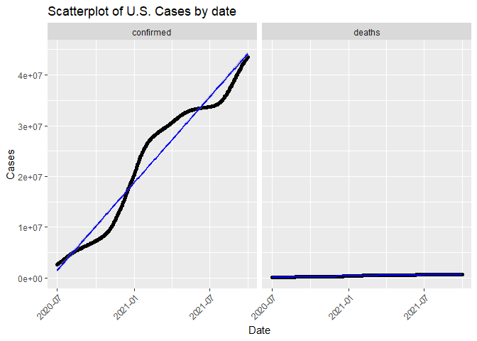
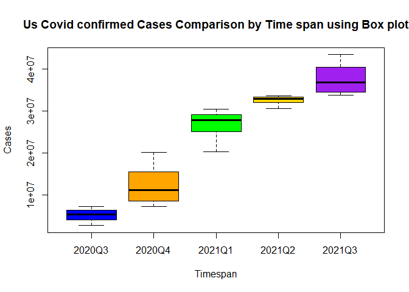
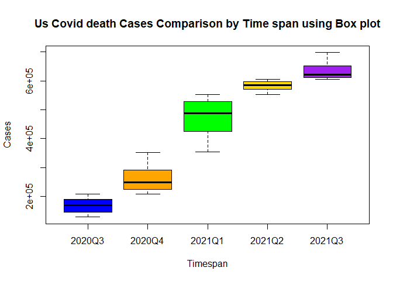
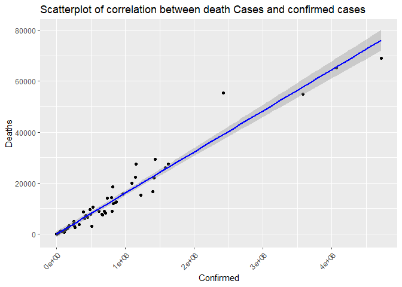
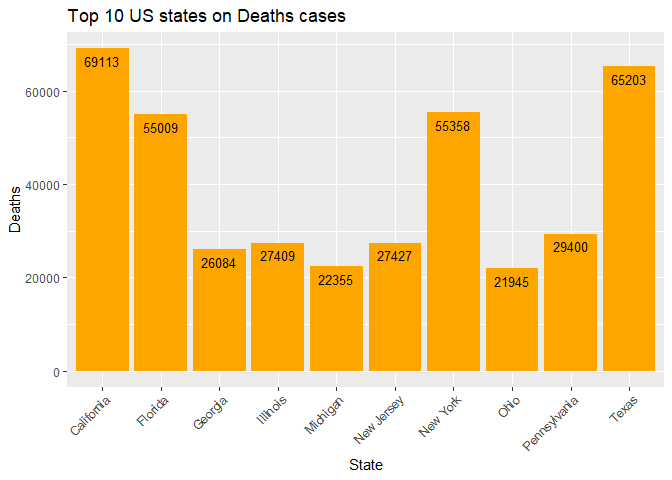
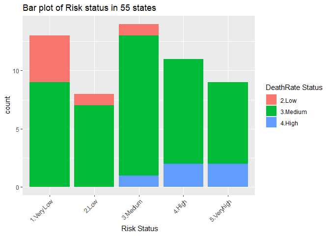
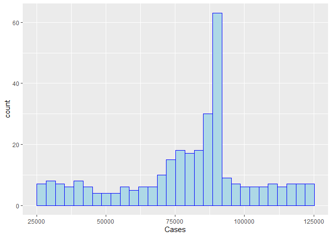
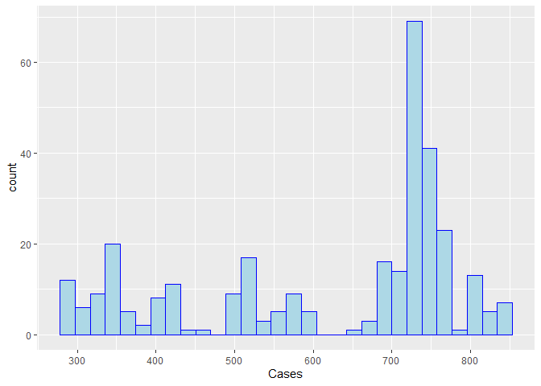

covid-vignette-api
================
Min-Jung Jung
9/20/2021

-   [Reqired pakages](#reqired-pakages)
-   [Functions to contact the Covid19 Data
    API](#functions-to-contact-the-covid19-data-api)
    -   [Base url](#base-url)
    -   [`countryName`](#countryname)
    -   [`covidSummary`](#covidsummary)
    -   [`confirmedCases`](#confirmedcases)
    -   [`deathCases`](#deathcases)
    -   [`recoveredCases`](#recoveredcases)
    -   [`confirmedCasesState`](#confirmedcasesstate)
    -   [`deathsCasesState`](#deathscasesstate)
    -   [`liveConfirmedCases`](#liveconfirmedcases)
    -   [`dateManipulation`](#datemanipulation)
    -   [`riskStatusManipulation`](#riskstatusmanipulation)
-   [Exploratory Data Analysis](#exploratory-data-analysis)

This project is to create a vignette about contacting an API. I created
functions to download data via interacting endpoints. I will show this
process with COVID API.

# Reqired pakages

I used following packages to set up function, data manipulation, and
analysis with COVID API: \* [`ggplot2`](https://ggplot2.tidyverse.org/):
for creating graphics.

-   [`tidyverse`](https://www.tidyverse.org/): for data manipulation and
    visualization.
-   [`jsonlite`](https://cran.r-project.org/web/packages/jsonlite/): to
    pull data from the Covid 19 APIs.
-   [`knitr`](https://cran.r-project.org/web/packages/knitr/index.html):
    to generate tables.  
-   [`httr`](https://cran.r-project.org/web/packages/httr/vignettes/quickstart.html):
    to map closely to the underlying http protocol.
-   [`lubridate`](https://cran.r-project.org/web/packages/lubridate/index.html):
    for date conversion.

# Functions to contact the Covid19 Data API

To access the [Covid
Data](https://documenter.getpostman.com/view/10808728/SzS8rjbc), we need
to get a URL with the name of the table and attributes we want to pull
from it.

Here is the base URL that I am going to use through out defining the
functions.

## Base url

``` r
base_url = "https://api.covid19api.com"
```

I wrote one function for set up,Contacting Covid19 API via different
endpoints.

## `countryName`

This function is to generate `data.frame` of country name and Slug. In
order to import different country dataset, I need to type the correct
country name in URL. COVID19 AIP uses Slug instead of country name.
Therefore, I can use the this table to find the correct name of the
country for the URL.

``` r
countryName <- function(){
  full_url = paste0(base_url,"/countries")
  country <- content(GET(url=full_url),"text")
  countrylist <- fromJSON(country)
  countrylist1 <- as_tibble(data.frame(Country = countrylist$Country,
                                       Slug = countrylist$Slug))
  return(countrylist1)
}
# This table will guide users to find specific country and slug.
countryName <- countryName()
```

    ## No encoding supplied: defaulting to UTF-8.

## `covidSummary`

This function interacts with the `Summary` endpoint. It returned a
`list` of 5 variables showing like world total confirmed case numbers,
and world total deaths case numbers. One of the variable was the
country, which I called it out and returned a `data.frame` with most
recent data of confirmed cases, death cases, recovered cases for each
country.

``` r
covidSummary <- function(){
   full_url = paste0(base_url,"/summary")
   covid_summary_text <- content(GET(url=full_url),"text")
   covid_cases_summary_json <- fromJSON(covid_summary_text)
   # Select Country variable from json output. 
   covid_cases_summary1 <- data.frame(covid_cases_summary_json$Countries) 
   return(covid_cases_summary1)
}
```

## `confirmedCases`

This function interacts with the `By Country Total` endpoint. This
function returns a `data.frame` of daily confirmed cases number by
specific country during the specified dates (7/01/2020 - 09/30/2021).
Users can select country to get different country dataset. I choose only
4 variables to display, which I am going to mainly use. Users can use
the countryName table to find countries you want to look up.

``` r
confirmedCases <- function(country){
  # If you type in country name as slug, it will return the data correctly. 
  if(country %in% countryName$Slug){
    full_url = paste0(base_url,"/total/country/",country,"/status/confirmed?from=2020-07-01T00:00:00Z&to=2021-09-30T00:00:00Z")
    confirmed_cases_text = content(GET(url=full_url),"text")
    confirmed_cases_json = fromJSON(confirmed_cases_text)
  # I choose 4 columns to display.
    covid_confirmed_cases <- confirmed_cases_json %>% 
                           select(Country, Cases, Status, Date)  
  return(covid_confirmed_cases)
  }
  # Otherwise, it will throw an error.
  else {
    message <- paste("ERROR: Argument for country was not found in the Slug.", 
                    "Look up countryName to find the country you are looking",
                    "for and use Slug.")
    stop(message)
  }
}

# 1.User(s) can select different countries.
confirmed_cases <- confirmedCases("united-states")
```

## `deathCases`

This function interacts with the `By Country Total` endpoint with
modification of status changed to deaths. This function returns a
`data.frame` of daily deaths cases number by specific country during the
specified dates (7/01/2020 - 09/30/2021). Users can select country to
get different country dataset. I choose only 4 variables to display,
which I am going to mainly use. Users can use the countryName table to
find countries you want to look up.

``` r
deathCases <- function(country){
  # If you type in country name as slug, it will return the data correctly. 
  if(country %in% countryName$Slug){
    full_url = paste0(base_url,"/total/country/",country,"/status/deaths?from=2020-07-01T00:00:00Z&to=2021-09-30T00:00:00Z")
    deaths_cases_text = content(GET(url=full_url),"text")
    deaths_cases_json = fromJSON(deaths_cases_text)
    covid_deaths_cases <- deaths_cases_json  %>% select(Country, Cases, Status, Date) 
  return(covid_deaths_cases)
  }
  # Otherwise, it will throw an error.
  else {
    message <- paste("ERROR: Argument for country was not found in the Slug.", 
                     "Look up countryName to find the country you are looking",
                     "for and use Slug.")
    stop(message)
  }
}

# 2. User(s) can select different countries.
death_cases <- deathCases("united-states")
```

## `recoveredCases`

This function interacts with the `By Country Total` endpoint with
modification of status changed to recovered.This function returns a
`data.frame` of daily recovered cases number by specific country during
the specified dates (7/01/2020 - 09/30/2021). Users can select country
to get different country dataset. I choose only 4 variables to display,
which I am going to mainly use. Users can use the countryName table to
find countries you want to look up.

``` r
recoveredCases <- function(country){
  # If you type in country name as slug, it will return the data correctly. 
  if(country %in% countryName$Slug){
    full_url = paste0(base_url,"/total/country/", country,"/status/recovered?from=2020-07-01T00:00:00Z&to=2021-09-30T00:00:00Z")
    recovered_cases_text = content(GET(url=full_url),"text")
    recovered_cases_json = fromJSON(recovered_cases_text)
    covid_recovered_cases <- recovered_cases_json  %>% 
                             select(Country, Cases, Status, Date)
  return(covid_recovered_cases)
  }
  # Otherwise, it will throw an error.
  else {
      message <- paste("ERROR: Argument for country was not found in the Slug.", 
                       "Look up countryName to find the country you are looking",
                       "for and use Slug.")
      stop(message)
  }
}

# 3.User(s) can select different countries.
recovered_cases <- recoveredCases("united-states")
```

``` r
# Data manipulation

# 4.I created one dataset with two data.frame datasets by row merging.
us_all_cases <- rbind(confirmed_cases, death_cases)
```

## `confirmedCasesState`

This function interacts with the `Day One Live` endpoint with
modification of status changed to confirmed. This function returns a
`data.frame` of daily confirmed cases number by specific state from
11/22/2020 to present. Users can select state name to get different
state dataset. I choose only 6 variables to display, which I am going to
mainly use.

``` r
confirmedCasesState <- function(state_name){
  # There are state name with one words and more than two words. 
  # For one word state name, I set it up to be lower case.  
  state_name <- tolower(state_name)
  two_word_states = list("new hampshire", "new jersey", "new mexico",
                         "new york","north carolina","north dakota",
                         "south carolina","south dakota", 
                         "distrct of columbia", "puerto rico",
                         "Northern Mariana Islands", "Virgin Islands", 
                         "Rhode Island")
  # For two or more words state name, user will type two words state name with space.   
  # I set it the function to insert %20 automatically using URLendoe().
  if (state_name %in% two_word_states){
    full_url = paste0(base_url,"/dayone/country/united-states/status/confirmed/live?province=",state_name)
  # This function will insert %20 in the space between two words or more state name.
    URLencode(full_url)
    covid_cases_by_states_text = content(GET(url=URLencode(full_url)),"text")
    covid_cases_by_states_json = fromJSON(covid_cases_by_states_text)
  }
  # Otherwise, one word state name will work. 
  else{
    full_url = paste0(base_url,"/dayone/country/united-states/status/confirmed/live?province=",state_name)
    covid_cases_by_states_text = content(GET(url=full_url),"text")
    covid_cases_by_states_json = fromJSON(covid_cases_by_states_text)
  }
    covid_cases_by_states <- covid_cases_by_states_json %>% 
                           select(Country, Province, City, Cases, Status, Date) 
  return(covid_cases_by_states)
}

# 5.User(s) can select different state names.
nc_confirmedData <- confirmedCasesState("North Carolina")

# 5-1.Last row was the sum of all confirmed case number of 55 states.
# I deleted the last row to keep the state level data only.
nc_confirmedData1 <- nc_confirmedData %>% filter(row_number() <= n()-1)
```

## `deathsCasesState`

This function interacts with the `Day One Live` endpoint with
modification of status changed to deaths. This function returns a
`data.frame` of daily deaths cases number by specific state from
11/22/2020 to present. Users can select state name to get different
state dataset. I choose only 6 variables to display, which I am going to
mainly use.

``` r
deathsCasesState <- function(state_name){
  # There are state name with one words and more than two words. 
  # For one word state name, I set it up to be lower case.  
  state_name <- tolower(state_name)
  # For two or more words state name, user will type two words state name with space. 
  # I set it the function to insert %20 automatically using URLendoe().
  two_word_states = list("new hampshire", "new jersey", "new mexico",
                         "new york","north carolina","north dakota",
                         "south carolina","south dakota", 
                         "distrct of columbia", "puerto rico",
                         "Northern Mariana Islands", "Virgin Islands", 
                         "Rhode Island")

  if (state_name %in% two_word_states){
     full_url = paste0(base_url,"/dayone/country/united-states/status/deaths/live?province=",state_name)
     URLencode(full_url)
    covid_cases_by_states_text = content(GET(url=URLencode(full_url)),"text")
    covid_cases_by_states_json = fromJSON(covid_cases_by_states_text)
  }
    else{
    full_url = paste0(base_url,"/dayone/country/united-states/status/deaths/live?province=",state_name)
    covid_cases_by_states_text = content(GET(url=full_url),"text")
    covid_cases_by_states_json = fromJSON(covid_cases_by_states_text)
    }
     covid_cases_by_states <- covid_cases_by_states_json %>% select(Country, Province, City, Cases, Status, Date) 
  return(covid_cases_by_states)
}

# 6.User(s) can select different state names.
nc_deathData <- deathsCasesState("North Carolina")

# 6-1.Last row was the sum of all confirmed case number of 55 states.
# I deleted the last row to keep the state level data only.
nc_deathData1 <- nc_deathData %>% filter(row_number() <= n()-1)
```

``` r
# Data loading

# 7.I created this dataset with two data.frame datasets by row merging.
nc_all_cases <- rbind(nc_confirmedData1, nc_deathData1)
```

## `liveConfirmedCases`

This function interacts with the `Live By Country And Status After Date`
endpoint of modification of date as 07/01/2021. This function returns a
`data.frame` of daily confirmed cases of specified country from set date
to present. Users can select country name to get different country
dataset. I choose only 6 variables to display, which I am going to
mainly use.

``` r
liveConfirmedCases <- function(country){
  # If you type in country name as slug, it will return the data correctly. 
  if(country %in% countryName$Slug){
    full_url = paste0(base_url,"/live/country/",country,"/status/confirmed/date/2021-07-01T00:00:00Z")
    covid_cases_live_text = content(GET(url=full_url),"text")
    covid_cases_live_json = fromJSON(covid_cases_live_text)
    covid_state_cases <- covid_cases_live_json %>% 
                         select(Country, Province, Confirmed, Deaths, Active, Date) 
    return(covid_state_cases)
  }
  # Otherwise, it will throw an error.
  else {
      message <- paste("ERROR: Argument for country was not found in the Slug.", 
                       "Look up countryName to find the country you are looking",
                       "for and use Slug.")
      stop(message)
  }
}

# 8.User(s) can select different countries.
us_liveCases <- liveConfirmedCases("united-states")
```

## `dateManipulation`

This function helps to manipulate date column(character format) to date
formation and create one variable with time span with every quarter.

``` r
dateManipulation <- function(dataset){
  dataset$Date <- as.Date(dataset$Date)
  dataset <- dataset %>% 
    mutate("Time_span" = if_else(Date <= as.Date("2020-09-30"), "2020Q3",
                          if_else(Date <= as.Date("2020-12-31"), "2020Q4",
                           if_else(Date <= as.Date("2021-03-31"), "2021Q1", 
                            if_else(Date <= as.Date("2021-06-30"), "2021Q2", 
                             if_else(Date <=   as.Date("2021-09-30"),"2021Q3","2021Q4")))))
    )
  dataset$Time_span <- as.factor(dataset$Time_span)
  return(dataset)
}              

# 9.data manipulation using `dateManipulation` function
# confirmed case data
confirmed_month <- dateManipulation(confirmed_cases)
# 10.US all cases (confirmed and death) data
us_all_cases_month <- dateManipulation(us_all_cases)
# 11.NC all cases (confirmed and death) data
nc_all_cases_month <- dateManipulation(nc_all_cases)
```

## `riskStatusManipulation`

This function helps to manipulate data with creating three variables.
Death rate, death rate status and risk status are the three variables.
US [death rates](https://coronavirus.jhu.edu/data/mortality) is about
1.6 %. I wanted to check how US states display its death rate. Also, I
created Death Rate status variable based on the death rate into 4
categories. Lastly, I created risk status variable based on the
confirmed cases number in state level.

``` r
#I created this function for data summaries and visualization.
riskStatusManipulation <- function(dataset){
  dataset <- dataset %>% 
    mutate("DeathRate"= (Deaths/Confirmed)*100, 
           "DeathRateStatus"= if_else(DeathRate > 2, "4.High",
                               if_else(DeathRate > 1, "3.Medium", 
                                if_else(DeathRate >0.5, "2.Low", "1.Very low"))), 
           "RiskStatus" = if_else(Confirmed > 1250000, "5.Veryhigh",
                           if_else(Confirmed > 750000, "4.High", 
                            if_else(Confirmed > 350000, "3.Medium", 
                             if_else(Confirmed > 150000, "2.Low", "1.Very Low"))))
    )            
  return(dataset)
}
```

``` r
# I filtered date to 10/01/2021 to only view the date's information.
us_newlive <- us_liveCases %>% filter(Date == "2021-10-01T00:00:00Z")

# 12.US live data using riskStatusManipulation function.
us_newlive_risk <- riskStatusManipulation(us_newlive) %>% as_tibble()
us_live_risk <- dateManipulation(us_newlive_risk)
```

# Exploratory Data Analysis

I pulled the several data using functions I created interacting with
endpoints. After using manipulation function and merging different
dataset, I mainly selected four data sets for the exploratory analysis.
\* `us_live_risk` (Confirmed and death cases by 55 states on
10/01/2021), \* `nc_all_cases_month` (Confirmed cases in 101 NC Counties
from 11/22/2020 to present), \* `confirmed_month`(US confirmed cases
from 07/01/2020 to 09/30/2021), \* `us_all_cases_month`(US confirmed and
death cases merged from 07/01/2020 to 09/30/2021).

Let’s talk about the Covid-19 pandemic in the U.S and how the confirmed
cases and death cases changes over time. In order to see the change
patterns of both confirmed and death cases, I created scatterplot by
date In the confirmed scatter plot, we see that the case increased
rapidly at the end of 2020 and beginning of 2021 and then it slowed it
down. However, it is rapidly increasing again since August of 2021. It
may have been related to mask policy, vaccination, seasonal changes, but
the fact is covid cases are increasing. Compared to confirmed cases,
death cases seems increasing slowly in the plot. However, it is not
really good comparison because the y axis scale is fitted to the
confirmed cases. I will need to look at the confirmed plots and death
plots separately.

``` r
# Scatter plot for US
ggplot(data = us_all_cases_month, aes(x = Date, y = Cases))+
  geom_point() + facet_wrap(~ Status) + theme(axis.text.x = element_text(angle = 45,hjust=1)) + 
  ggtitle("Scatterplot of U.S. Cases by date") + geom_smooth(method = lm, color = "blue")  
```

<!-- -->

Therefore, I wanted to see how the confirmed cases are increasing by
every quarter using side by side box plot. Similar to the scatter plot
of confirmed cases, the median line of 2021 quarter 1 is a lot higher
than 2020 quater 4. Also, the interquartile range of 2020 quarter 4 is
big, which means that during 2020 quarter 4, case numbers are rapidly
increased.

``` r
# Box plot
us_confirmed_states<- us_all_cases_month %>% filter(Status == "confirmed") 
#Box plot for confirmed cases by time line.
boxplot(Cases~Time_span,data=us_confirmed_states, main="Us Covid confirmed Cases Comparison by Time span using Box plot",xlab="Timespan", ylab="Cases",col=(c("blue","orange","green","gold","purple")))
```

<!-- -->

Now, let’s look at how death cases are increasing by every quarter. I
also created side by side box plot for the deaths cases and death cases
increased rapidly between last quarter of 2020 and first quarter of
2021.

``` r
#Setting the data set with only deaths status
us_deaths_states<- us_all_cases_month %>% filter(Status == "deaths") #Box plot for death cases by timeline
boxplot(Cases~Time_span,data=us_deaths_states, main="Us Covid death Cases Comparison by Time span using Box plot",xlab="Timespan", ylab="Cases",col=(c("blue","orange","green","gold","purple")))
```

<!-- -->

Now, let’s move down to the state level. I want to begin with discussing
about some summary statistics. First, `us_bystate` summary table using
`us_live_risk` data shows interesting information. The difference
between minimum (269) and maximum (4,718,816) scores are extremely big.
Therefore, I had to look at the median scores where the state with
median score is located. Median score is 508494, which I cannot assume
where majority of states are located. Mean and IQR score help me to
understand where the majority states are located and states with minimum
and maximum scores are less likely to observe. The next summary table
explain better understanding current state data.

``` r
#Summary table for us states
us_bystate <- us_live_risk %>% summarise(Min = min(Confirmed), Max = max(Confirmed), Avg = mean(Confirmed), Med = median(Confirmed), IQR = IQR(Confirmed))
us_bystate
```

    ## # A tibble: 1 x 5
    ##     Min     Max     Avg    Med    IQR
    ##   <int>   <int>   <dbl>  <int>  <dbl>
    ## 1   269 4718816 790137. 508494 753095

`Summary_us_risk` table shows the average, median, and IQR score of each
risk staus. I created a variable called RiskStatus based on the mean and
median score. Five status set points of the number of confirmed cases
are from “Very Low” (under 150,000 cases) to “Very High”(higher than
1,250,000 cases). Similar to first summary table, this table also shows
interesting results on very how status scores. The average score is
significantly higher than median scores and IQR score in very high
category is also large, which means that states with confirmed cases
higher than 1,250,000 are more spread up, but majority are still round
median scores.

``` r
#two categorical variables
Summary_us_risk <- us_live_risk %>% group_by(RiskStatus) %>% summarise(Avg = mean(Confirmed), Med = median(Confirmed), IQR = IQR(Confirmed)) 
Summary_us_risk
```

    ## # A tibble: 5 x 4
    ##   RiskStatus      Avg      Med      IQR
    ##   <chr>         <dbl>    <dbl>    <dbl>
    ## 1 1.Very Low   78554.   89989    86058 
    ## 2 2.Low       231486.  246742.   80623.
    ## 3 3.Medium    556041.  520417   206788.
    ## 4 4.High      959810.  866776   303044 
    ## 5 5.Veryhigh 2471329. 1627508  2152867

`state_highrisk` contingency table shows where the top 10 most confirmed
cases state are belong to in terms of their risk status. Nine out of 10
states are in very high risk status and North Carolina is one of the
high risk status state. One thing we should remember is that this risk
status is not based on the population. It straightly looking at the
confirmed cases only. Therefore, if considering state population, risk
status may change.

``` r
us_live_risk1 <- us_live_risk %>% arrange(desc(Confirmed))
top10states <- us_live_risk1[1:10,]
#Top10 states by risk status
state_highrisk <- table(top10states$Province, top10states$RiskStatus)
state_highrisk
```

    ##                 
    ##                  4.High 5.Veryhigh
    ##   California          0          1
    ##   Florida             0          1
    ##   Georgia             0          1
    ##   Illinois            0          1
    ##   New York            0          1
    ##   North Carolina      0          1
    ##   Ohio                0          1
    ##   Pennsylvania        0          1
    ##   Tennessee           1          0
    ##   Texas               0          1

While state\_highrisk contingency table shows where each states belong
to in terms of risk status category, bar plot shows the number of
confirmed cases. We now know that California is the top state with the
most confirmed cases followed by Texas, Florida, and New york.

``` r
#Bar plot for top 10 states

ggplot(data=top10states, aes(x=Province, y=Confirmed)) +
  geom_bar(stat="identity", fill="orange") +
  labs(x = "State", title = "Top 10 US states on Confirmed caseS") + geom_text(aes(label=Confirmed), vjust=1.6, color="black", size=3.5) +
  theme(axis.text.x = element_text(angle = 45, hjust=1))
```

<!-- -->

Now, let’s look at the both confirmed cases and deaths cases and it’s
relationship. Is deaths cases higher in the higher confirmed cases
states? We cam use correlation score to see the relationship.
Correlation score between confirmed cases and deaths cases is 0.975,
which is really high close to 1. The scatter plot shows the pattern of
the relationship as well. Based on the results, the top 10 confirmed
case states are more like to show higher death cases.

``` r
#correlation summary
corr_us <- cor(us_live_risk$Confirmed, us_live_risk$Deaths)
corr_us
```

    ## [1] 0.975353

``` r
#Scatter plot: confirmed cases by death cases
ggplot(data = us_live_risk, aes(x = Confirmed, y = Deaths))+
  geom_point() + theme(axis.text.x = element_text(angle = 45,hjust=1)) + 
  ggtitle("Scatterplot of correlation between death Cases and confirmed cases") + geom_smooth(method = lm, color = "blue")  
```

<!-- -->

Below bar plot shows the top 10 states on deaths cases. As the
prediction of the correlation between confirmed cases and death cases,
California is again the top state showing the highest deaths cases
followed by Texas, Florida, and New York. Interestingly, Death cases in
New York is similar to Florida, which infers that death rate in New York
is higher. Let’s move on to see the death rate of the top 10 states.

``` r
# Subsetting top 10 states of deaths cases
us_live_death1 <- us_live_risk %>% arrange(desc(Deaths))
top10statesdeath <- us_live_death1[1:10,]

#Bar plot for 10 10 states by death cases
ggplot(data=top10statesdeath, aes(x=Province, y=Deaths)) +
  geom_bar(stat="identity", fill="orange") +
  labs(x = "State", title = "Top 10 US states on Deaths cases") + geom_text(aes(label=Deaths), vjust=1.6, color="black", size=3.5) +
  theme(axis.text.x = element_text(angle = 45, hjust=1))
```

<!-- -->
`top10statesDeathRate` table shows top 10 states with death rates.
Surprisingly, California and Texas is not one the top 10 list, but New
Jersey, Massachusetts, and New York states ranked top 3. This results
shows more dynamics of confirmed cases and deaths cases and the death
rates are not always going by the number of cases. Then, it will be
interesting to see the relationship between deathrate and confirmed
cases. I created `DeathRateStatus` variable to see how many states are
in high, medium low death rate group. Therefore, instead of directly
comparing the two numbers, I would like to use categorical variables
(RiskStatus and DeathRateStatus) to see how many states are belong to
where in the contingency table.

``` r
# Subsetting top 10 states of death rate
us_live_deathrate <- us_live_risk %>% arrange(desc(DeathRate))
top10statesDeathRate <- us_live_deathrate[1:10,] %>% select (Province, DeathRate)
kable(top10statesDeathRate)
```

| Province             | DeathRate |
|:---------------------|----------:|
| New Jersey           |  2.375516 |
| Massachusetts        |  2.294104 |
| New York             |  2.281221 |
| Connecticut          |  2.210609 |
| Pennsylvania         |  2.056030 |
| Mississippi          |  1.965626 |
| Maryland             |  1.961528 |
| Michigan             |  1.943805 |
| District of Columbia |  1.919775 |
| New Mexico           |  1.897449 |

When looking at the contingency table with confirmed cases Risk status
and death rate status, it still shows the consistent results. The very
high risk group in terms of confirmed cases continue to in the medium
and high death rate group. Similarly, very low and low risk group in
terms of the confirmed cases shows low and medium death rate group.

``` r
# Contingency table 
#United Status
usDeathRate_status <- table(us_live_risk$RiskStatus, us_live_risk$DeathRateStatus)
usDeathRate_status
```

    ##             
    ##              2.Low 3.Medium 4.High
    ##   1.Very Low     4        9      0
    ##   2.Low          1        7      0
    ##   3.Medium       1       12      1
    ##   4.High         0        9      2
    ##   5.Veryhigh     0        7      2

This bar plot shows the contingency table more visually. You will see
that the low death rate states are mainly in medium to low and very low
risk status (low confirmed cases) and high death rate states are in
medium to high and very high risk status(high confirmed cases).

``` r
#Bar plot of risk status in 55 states

ggplot(data = us_live_risk, aes(x=RiskStatus)) +
  geom_bar(aes(fill = as.factor(DeathRateStatus))) + labs(x = " Risk Status", title = "Bar plot of Risk status in 55 states") + theme(axis.text.x = element_text(angle = 45, hjust=1)) + scale_fill_discrete(name = "DeathRate Status")
```

<!-- -->

Lastly, I wanted to see how confirmed cases and death cases are changing
in wake county. Looking at the multi-panel scatter plot, confirmed
scatterplot reveals that beginning of 2021 the cases increased rapidly
and then the cases are increasing fast again since September. Again, it
is hard to look at the pattern of deaths cases, so I will need to create
separate scatter plot for the deaths cases.

``` r
# subsetting rows by two counties
Wake_cases <- nc_all_cases_month %>% filter(City=="Wake") 

# Scatter plots for wake and Meck country
ggplot(data = Wake_cases, aes(x = Date, y = Cases))+
  geom_point() + facet_wrap(~ Status) + theme(axis.text.x = element_text(angle = 45,hjust=1)) + 
  ggtitle("Scatterplot of  Wake county Cases by date") + geom_smooth(method = lm, color = "blue")  
```

<!-- -->

These histograms can also show how confirmed and deaths cases are
changing slowly or quickly by frequency of same case numbers.  
in other words, in confirmed histogram, there are most 80,000s cases. So
the time period when the confirmed cases are in their 80,000 are most
frequent and changed slowly during earlier month of this year. However,
confirm cases are rapidly increasing again seeing that the frequencies
of cases of smaller ranges are less likely to happen. In deaths
histogram, death cases were stagnated when they were between 730 and
750. In other words, death case is slowly increasing later months of
2021. It is good to know that in the midst of fast increasing of
confirmed cases, the deaths cases are slowing down in Wake county.

``` r
# Histogram plot

#need to change title and name of the x axis

ncst_confirmed_cases <- nc_all_cases_month %>% filter(Status == "confirmed") %>% filter(City == "Wake")
ncst_deaths_cases <- nc_all_cases_month %>% filter(Status == "deaths") %>% filter(City == "Wake")

ggplot(ncst_confirmed_cases, aes(Cases)) + geom_histogram(color = "blue", fill = "lightblue")
```

<!-- -->

``` r
ggplot(ncst_deaths_cases, aes(Cases)) + geom_histogram(color = "blue", fill = "lightblue")
```

<!-- --> \# Wrap-Up

In this vignette, I built several functions to interact with some of the
COVID19 API’s endpoints to retrieve data for the exploratory analysis. I
used tables, numerical summaries, and four different types of graphs to
explain what I found. With an analysis, I found that Covid confirm cases
are still increasing with death cases, but there are variations between
states in the U.S. Sadly, North Carolina is one of the top 10 states of
confirmed cases. Also, confirmed cases are increasing fast in wake
county.

I selectively focused on the US cases in this vignette because US is top
country of all the confirmed cases, but it will be very interesting to
see how other countries are doing navigating functions I created here.
