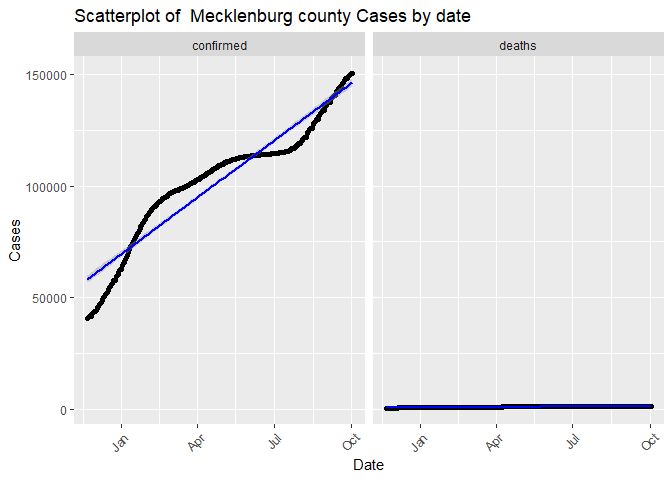
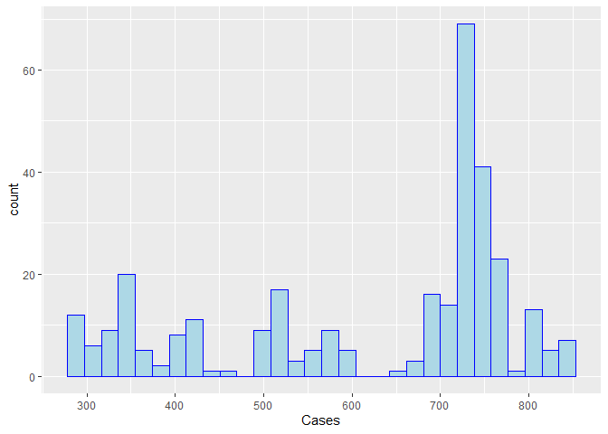

covid-vignette-api
================
Min-Jung Jung
9/20/2021

-   [Reqired pakages](#reqired-pakages)
-   [JSON Data](#json-data)
-   [Packages used for reading JSON data in
    R](#packages-used-for-reading-json-data-in-r)
-   [Contact the Covid Data API](#contact-the-covid-data-api)
-   [Base url](#base-url)
    -   [country name](#country-name)
    -   [Summary data](#summary-data)
    -   [confirmed cases](#confirmed-cases)
-   [Death cases](#death-cases)
-   [Recovered cases](#recovered-cases)
    -   [Us confirmed cases by state](#us-confirmed-cases-by-state)
    -   [Us Death cases by state](#us-death-cases-by-state)
    -   [live cases by country](#live-cases-by-country)
    -   [Date manipulation](#date-manipulation)

This project is to create a vignette about contacting an API. I created
functions to download data via interacting endpoints. I will show this
process with COVID API.

# Reqired pakages

I used following packages to set up function, data manipulation, and
analysis with COVID API:

-   `knitr`: to generate pretty tables of date using the `kable()`
    function.  
-   `tidyverse`: to manipulate data, generate plots (via `ggplot2`), and
    to use piping/chaining.
-   `rmarkdown`: to knit output files manually using the `render()`
    function.  
-   `jsonlite`: to pull data from various endpoints of the Covid 19
    APIs.

# JSON Data

JSON, also known as [*Java Script Object
Notation*](https://www.json.org/json-en.html) is a text based format for
storing and/or transporting data. JSON is used across the internet and
databases because of its text based format for storing data. In
addition, JSON can represent 2D data, [hierarchical
data](https://en.wikipedia.org/wiki/Hierarchical_database_model), and
use key-value pairs.

Since JSON is a text based format, we need to load in R packages that
can handle the text based format.

# Packages used for reading JSON data in R

Here are R packages that can be used to work with JSON data:

-   `rjson`
-   `RJSONIO`
-   `jsonlite`

For this project, `rjson` and `jsonlite` is used.

Couple resources for understanding the functionality of `rjson` and
`jsonlite`:

1.  <https://cran.r-project.org/web/packages/rjson/rjson.pdf>

2.  <https://cran.r-project.org/web/packages/jsonlite/jsonlite.pdf>

# Contact the Covid Data API

To access the [Covid
Data](https://documenter.getpostman.com/view/10808728/SzS8rjbc), we need
to get a URL with the name of the table and attributes we want to pull
from it.

In addition, I wrote 6 more functions that take different endpoints.

# Base url

``` r
base_url = "https://api.covid19api.com"
```

## country name

\#This helper function is to generate data.frame of country name and
Slug.

``` r
country_Name <- function(){
  country <- GET("https://api.covid19api.com/countries")
  countrylist <- fromJSON(rawToChar(country$content))
  countrylist1 <- as_tibble(data.frame(Country = countrylist$Country, Slug = countrylist$Slug))
  return(countrylist1)
}

countryName <- country_Name()
countryName
```

    ## # A tibble: 248 x 2
    ##    Country                   Slug                     
    ##    <chr>                     <chr>                    
    ##  1 Poland                    poland                   
    ##  2 Comoros                   comoros                  
    ##  3 Djibouti                  djibouti                 
    ##  4 Turks and Caicos Islands  turks-and-caicos-islands 
    ##  5 Bulgaria                  bulgaria                 
    ##  6 Honduras                  honduras                 
    ##  7 San Marino                san-marino               
    ##  8 Niue                      niue                     
    ##  9 Tuvalu                    tuvalu                   
    ## 10 US Minor Outlying Islands us-minor-outlying-islands
    ## # ... with 238 more rows

## Summary data

\#This function interacts with the `Summary` endpoint.

``` r
covid_summary_cases <- function(){
   full_url = paste0(base_url,"/summary")
   covid_summary_text <- content(GET(url=full_url),"text")
   covid_cases_summary_json <- fromJSON(covid_summary_text)
   covid_cases_summary1 <- data.frame(covid_cases_summary_json$Countries) 
   return(covid_cases_summary1)
}

covidSum <- covid_summary_cases()
covidSum
```

    ##                                      ID                       Country CountryCode                        Slug NewConfirmed TotalConfirmed NewDeaths
    ## 1  d7be6ae5-47cd-40c8-97b8-406565761d26                   Afghanistan          AF                 afghanistan            0         155191         0
    ## 2  875258e4-4404-41f3-a442-ad850bc1fc05                       Albania          AL                     albania          467         171794         3
    ## 3  7744cf30-09f6-4540-8677-da5d22e2715c                       Algeria          DZ                     algeria          132         203789         3
    ## 4  dd9a7683-1ebd-44c7-bbb0-9dc6edd79a75                       Andorra          AD                     andorra            0          15222         0
    ## 5  9921f20b-3dce-4c36-a30f-da0265c304c2                        Angola          AO                      angola          340          58943         3
    ## 6  edf19588-4a6b-4df7-81a6-826486f6e905           Antigua and Barbuda          AG         antigua-and-barbuda            0           3403         0
    ## 7  d7686c7f-1df0-4195-9945-1658378395a0                     Argentina          AR                   argentina          386        5259738         6
    ## 8  b790acc5-a3ba-4e1f-bfdf-ccaaa986b675                       Armenia          AM                     armenia          907         264690        18
    ## 9  c34b1122-cacf-4398-8b94-4b7d0e9b7484                     Australia          AU                   australia         1872         111388        13
    ## 10 108bb4ca-030f-4632-a795-0ee587759bfd                       Austria          AT                     austria         2445         748825         5
    ## 11 28ef72f7-b8e7-47b7-ab18-59c4e311f034                    Azerbaijan          AZ                  azerbaijan          712         485987        14
    ## 12 24f49576-99f2-4e4e-90ae-bb3213d77627                       Bahamas          BS                     bahamas            0          21114         0
    ## 13 bbecd99c-8394-40db-ab69-0c7d9bbb7a87                       Bahrain          BH                     bahrain           62         275237         0
    ## 14 3a8bf091-d90a-48c4-ad40-3f9da9adcd7f                    Bangladesh          BD                  bangladesh          617        1557964        18
    ## 15 00764917-5fe6-44a6-84b6-c1e074852ab3                      Barbados          BB                    barbados            0           8792         0
    ## 16 aaf812a3-f887-4194-ba28-94791ac5dfaa                       Belarus          BY                     belarus         1899         543976        14
    ## 17 f11ddece-ceab-4f14-b86f-99c4fad3e598                       Belgium          BE                     belgium            0        1247197         0
    ## 18 db65cdd5-1d6e-4fc6-8a8b-f2e935942e68                        Belize          BZ                      belize            0          21003         0
    ## 19 0c8054cf-f013-4128-b997-c4c91a7441f5                         Benin          BJ                       benin            0          23890         0
    ## 20 26602c60-7598-464b-88c2-afa20318c83f                        Bhutan          BT                      bhutan            7           2608         0
    ## 21 7a582967-ba2f-49f3-ab89-6f7e2cf74930                       Bolivia          BO                     bolivia          356         501179        12
    ## 22 b98a716b-e5bf-4743-b4b6-099445e0aee4        Bosnia and Herzegovina          BA      bosnia-and-herzegovina            0         235536         0
    ## 23 c2f2807c-9027-4c87-9369-34b2983447a8                      Botswana          BW                    botswana            0         179220         0
    ## 24 4e50a041-f751-4455-835e-1235da62d5c4                        Brazil          BR                      brazil        13466       21459117       468
    ## 25 c0af367a-3679-4be6-9daf-d032d5be8674             Brunei Darussalam          BN                      brunei            0           7326         0
    ## 26 073f1dc4-9612-49b8-b766-8b9d66bb228b                      Bulgaria          BG                    bulgaria          513         505994        43
    ## 27 37a4fa78-026d-4a42-a18c-8d996e3494d5                  Burkina Faso          BF                burkina-faso           45          14335         0
    ## 28 87c22326-437b-4fbd-8ac7-32ae81e388af                       Burundi          BI                     burundi            0          18271         0
    ## 29 763f40ae-179d-4083-a6cc-d8d9fe6d2d1e                      Cambodia          KH                    cambodia          199         113256        23
    ## 30 17f4c72e-9abb-44fb-b350-5f66ab8dcb0e                      Cameroon          CM                    cameroon            0          92303         0
    ## 31 63068f71-7f12-4bce-be0f-025af6518a09                        Canada          CA                      canada         1728        1339341        22
    ## 32 24a52c1e-b15d-4f2c-ae7f-ea69f2707f43                    Cape Verde          CV                  cape-verde           23          37658         2
    ## 33 8805b1a8-3d2d-4c48-a59e-b0c819967d1c      Central African Republic          CF    central-african-republic            0          11371         0
    ## 34 a9ad87fc-218d-47e7-8c32-985dd28b96cf                          Chad          TD                        chad            2           5044         0
    ## 35 777a7d38-31b3-4e77-a437-41c1b6727339                         Chile          CL                       chile          813        1655884         8
    ## 36 31a2f7d8-f069-4ef7-84e4-12457c34ed48                         China          CN                       china           33         108528         0
    ## 37 9ce77b21-0abe-4a25-97f8-326981231813                      Colombia          CO                    colombia         1497        4960641        36
    ## 38 93084233-e999-487e-991f-c62b5fe9d8eb                       Comoros          KM                     comoros            8           4155         0
    ## 39 d0765489-9999-4147-b1af-8c6b64e2f6ce           Congo (Brazzaville)          CG           congo-brazzaville            0          14359         0
    ## 40 59288648-da65-46f3-b522-c7de1947895d              Congo (Kinshasa)          CD              congo-kinshasa            0          56997         0
    ## 41 5b3bd2c0-429a-4c20-a0ee-43910860de36                    Costa Rica          CR                  costa-rica            0         533873         0
    ## 42 41ef042e-392a-462b-91e1-db9275da8883                       Croatia          HR                     croatia          944         408699        14
    ## 43 960d6ad1-d37a-4e45-9cc7-e467770cb0ed                          Cuba          CU                        cuba         4097         891447        46
    ## 44 53b4b97b-fdbc-4638-bf84-d01465938e8a                        Cyprus          CY                      cyprus            0         120272         0
    ## 45 b05d593d-c5f4-460a-90d7-87a954cc33a1                Czech Republic          CZ              czech-republic          556        1693790         1
    ## 46 1e0a1660-599c-4dfa-84dc-eb852da48629                 Côte d'Ivoire          CI                cote-divoire           48          60424         4
    ## 47 7a60b4fc-4322-429d-be0b-11766a974124                       Denmark          DK                     denmark            0         361457         0
    ## 48 826b72e4-6e0a-4329-9e1c-30ad87c52865                      Djibouti          DJ                    djibouti            0          12881         0
    ## 49 9ceae7a4-a75d-4231-bf69-97bc56938ea5                      Dominica          DM                    dominica           71           3673         1
    ## 50 71f6843c-66df-4c4b-844c-57e9a349d38f            Dominican Republic          DO          dominican-republic          573         360830         0
    ## 51 e8c42798-1f83-4b69-b53a-e26e87bfb5d9                       Ecuador          EC                     ecuador         1381         510619        29
    ## 52 8efe34d7-76b7-4d2c-95dc-c36a6d0c9572                         Egypt          EG                       egypt          768         306798        37
    ## 53 515dc59a-2410-40cb-89db-b1df3159cc2a                   El Salvador          SV                 el-salvador            0         104348        15
    ## 54 2ee54440-e323-4a73-a1b2-bc9bfadcd9fe             Equatorial Guinea          GQ           equatorial-guinea            0          12362         0
    ## 55 fd06bbc0-fb20-40d8-8e69-b135c8426b45                       Eritrea          ER                     eritrea            0           6722         0
    ## 56 35ea2429-86a3-44f1-9719-c277d8d6ae72                       Estonia          EE                     estonia          629         158357         3
    ## 57 f570008e-7d87-4b56-996d-8e707c6d76fa                      Ethiopia          ET                    ethiopia          697         348669        47
    ## 58 f227ad63-ef8b-4462-b7e0-65a98ab6bf6c                          Fiji          FJ                        fiji           34          51202         1
    ## 59 2cf26a4f-e419-4491-b8dd-a2ae5085c6e2                       Finland          FI                     finland            0         142114         0
    ## 60 1fc36d73-3564-4c5d-8b4b-5a3af474e6db                        France          FR                      france            0        7116415         0
    ## 61 b22255d6-3338-4649-b58f-0a70b07316a5                         Gabon          GA                       gabon            0          30648         0
    ## 62 484527c3-2a90-44fe-9259-381f6e53335f                        Gambia          GM                      gambia            0           9935         0
    ## 63 d66f83fa-387d-4491-ab78-ceb079ea4530                       Georgia          GE                     georgia         1164         617753        33
    ## 64 f70fd3f8-1edb-4ef8-af3d-8f283b8cbf1a                       Germany          DE                     germany         6482        4255543        10
    ## 65 adae9db1-a702-453a-a5c5-1d8638788804                         Ghana          GH                       ghana            0         127482         0
    ## 66 2c917d1c-200c-4225-8ec8-eaa44dace3cd                        Greece          GR                      greece         1142         661308        31
    ## 67 ec284efb-5873-4420-927c-18fb9cf44d6f                       Grenada          GD                     grenada            0           5294         0
    ## 68 a14e427c-e756-4ccd-b810-a0f0519adf30                     Guatemala          GT                   guatemala         4887         570453        30
    ## 69 2406c8c1-c02d-4bbe-b3c4-7d01a9c2daed                        Guinea          GN                      guinea            0          30434         0
    ## 70 f51b9971-3239-442c-a515-6b164f60d17b                 Guinea-Bissau          GW               guinea-bissau            0           6110         0
    ## 71 c290722e-fa39-4dcc-9bb6-cbdd0d871128                        Guyana          GY                      guyana          186          32483         3
    ## 72 e7a241a3-05c6-4e34-93d6-a684d6119ed5                         Haiti          HT                       haiti            0          21916         0
    ## 73 feba83ec-a8f3-4692-abf0-c5728a7ad91d Holy See (Vatican City State)          VA holy-see-vatican-city-state            0             27         0
    ## 74 0f7c840d-384e-40fa-9ea9-19ea114b7628                      Honduras          HN                    honduras            0         367275         0
    ## 75 2a9e5a22-a84f-4882-8aee-66cebbf530a4                       Hungary          HU                     hungary            0         823384         0
    ## 76 6ca05973-8720-473b-89fa-b78a3a38ec59                       Iceland          IS                     iceland            0          11839         0
    ## 77 6098c4dc-2bb5-49e3-8982-d4b6bd093fb0                         India          IN                       india        22842       33813903       244
    ## 78 186590e3-c162-444f-81ab-048fe41d38ec                     Indonesia          ID                   indonesia         1142        4219284        58
    ## 79 2c59b28c-0350-4a1a-a37e-1bff264b616a     Iran, Islamic Republic of          IR                        iran        12428        5624128       229
    ## 80 fb9da818-57ab-4e5b-b42c-6d09dc599182                          Iraq          IQ                        iraq         2451        2009678        21
    ## 81 84d8a931-dcf6-4c60-8edb-4492c6f1cfcd                       Ireland          IE                     ireland         1051         393626         0
    ## 82 218cd4d6-592d-4bc2-bf22-f522b21f60dd                        Israel          IL                      israel         2152        1290129        43
    ## 83 beb2265a-38b1-421f-b137-9b5562602bca                         Italy          IT                       italy         3309        4679067        25
    ##    TotalDeaths NewRecovered TotalRecovered                     Date
    ## 1         7206            0              0 2021-10-04T02:28:23.574Z
    ## 2         2713            0              0 2021-10-04T02:28:23.574Z
    ## 3         5822            0              0 2021-10-04T02:28:23.574Z
    ## 4          130            0              0 2021-10-04T02:28:23.574Z
    ## 5         1577            0              0 2021-10-04T02:28:23.574Z
    ## 6           84            0              0 2021-10-04T02:28:23.574Z
    ## 7       115245            0              0 2021-10-04T02:28:23.574Z
    ## 8         5372            0              0 2021-10-04T02:28:23.574Z
    ## 9         1334            0              0 2021-10-04T02:28:23.574Z
    ## 10       11026            0              0 2021-10-04T02:28:23.574Z
    ## 11        6573            0              0 2021-10-04T02:28:23.574Z
    ## 12         533            0              0 2021-10-04T02:28:23.574Z
    ## 13        1389            0              0 2021-10-04T02:28:23.574Z
    ## 14       27573            0              0 2021-10-04T02:28:23.574Z
    ## 15          79            0              0 2021-10-04T02:28:23.574Z
    ## 16        4188            0              0 2021-10-04T02:28:23.574Z
    ## 17       25612            0              0 2021-10-04T02:28:23.574Z
    ## 18         418            0              0 2021-10-04T02:28:23.574Z
    ## 19         159            0              0 2021-10-04T02:28:23.574Z
    ## 20           3            0              0 2021-10-04T02:28:23.574Z
    ## 21       18762            0              0 2021-10-04T02:28:23.574Z
    ## 22       10635            0              0 2021-10-04T02:28:23.574Z
    ## 23        2368            0              0 2021-10-04T02:28:23.574Z
    ## 24      597723            0              0 2021-10-04T02:28:23.574Z
    ## 25          43            0              0 2021-10-04T02:28:23.574Z
    ## 26       21038            0              0 2021-10-04T02:28:23.574Z
    ## 27         187            0              0 2021-10-04T02:28:23.574Z
    ## 28          38            0              0 2021-10-04T02:28:23.574Z
    ## 29        2383            0              0 2021-10-04T02:28:23.574Z
    ## 30        1459            0              0 2021-10-04T02:28:23.574Z
    ## 31       25264            0              0 2021-10-04T02:28:23.574Z
    ## 32         342            0              0 2021-10-04T02:28:23.574Z
    ## 33         100            0              0 2021-10-04T02:28:23.574Z
    ## 34         174            0              0 2021-10-04T02:28:23.574Z
    ## 35       37484            0              0 2021-10-04T02:28:23.574Z
    ## 36        4849            0              0 2021-10-04T02:28:23.574Z
    ## 37      126372            0              0 2021-10-04T02:28:23.574Z
    ## 38         147            0              0 2021-10-04T02:28:23.574Z
    ## 39         197            0              0 2021-10-04T02:28:23.574Z
    ## 40        1084            0              0 2021-10-04T02:28:23.574Z
    ## 41        6413            0              0 2021-10-04T02:28:23.574Z
    ## 42        8678            0              0 2021-10-04T02:28:23.574Z
    ## 43        7580            0              0 2021-10-04T02:28:23.574Z
    ## 44         552            0              0 2021-10-04T02:28:23.574Z
    ## 45       30478            0              0 2021-10-04T02:28:23.574Z
    ## 46         640            0              0 2021-10-04T02:28:23.574Z
    ## 47        2665            0              0 2021-10-04T02:28:23.574Z
    ## 48         169            0              0 2021-10-04T02:28:23.574Z
    ## 49          22            0              0 2021-10-04T02:28:23.574Z
    ## 50        4055            0              0 2021-10-04T02:28:23.574Z
    ## 51       32791            0              0 2021-10-04T02:28:23.574Z
    ## 52       17436            0              0 2021-10-04T02:28:23.574Z
    ## 53        3277            0              0 2021-10-04T02:28:23.574Z
    ## 54         147            0              0 2021-10-04T02:28:23.574Z
    ## 55          42            0              0 2021-10-04T02:28:23.574Z
    ## 56        1363            0              0 2021-10-04T02:28:23.574Z
    ## 57        5722            0              0 2021-10-04T02:28:23.574Z
    ## 58         633            0              0 2021-10-04T02:28:23.574Z
    ## 59        1078            0              0 2021-10-04T02:28:23.574Z
    ## 60      117578            0              0 2021-10-04T02:28:23.574Z
    ## 61         190            0              0 2021-10-04T02:28:23.574Z
    ## 62         338            0              0 2021-10-04T02:28:23.574Z
    ## 63        9038            0              0 2021-10-04T02:28:23.574Z
    ## 64       93791            0              0 2021-10-04T02:28:23.574Z
    ## 65        1156            0              0 2021-10-04T02:28:23.574Z
    ## 66       14920            0              0 2021-10-04T02:28:23.574Z
    ## 67         154            0              0 2021-10-04T02:28:23.574Z
    ## 68       13730            0              0 2021-10-04T02:28:23.574Z
    ## 69         379            0              0 2021-10-04T02:28:23.574Z
    ## 70         135            0              0 2021-10-04T02:28:23.574Z
    ## 71         799            0              0 2021-10-04T02:28:23.574Z
    ## 72         611            0              0 2021-10-04T02:28:23.574Z
    ## 73           0            0              0 2021-10-04T02:28:23.574Z
    ## 74        9854            0              0 2021-10-04T02:28:23.574Z
    ## 75       30199            0              0 2021-10-04T02:28:23.574Z
    ## 76          33            0              0 2021-10-04T02:28:23.574Z
    ## 77      448817            0              0 2021-10-04T02:28:23.574Z
    ## 78      142173            0              0 2021-10-04T02:28:23.574Z
    ## 79      121109            0              0 2021-10-04T02:28:23.574Z
    ## 80       22365            0              0 2021-10-04T02:28:23.574Z
    ## 81        5249            0              0 2021-10-04T02:28:23.574Z
    ## 82        7821            0              0 2021-10-04T02:28:23.574Z
    ## 83      130998            0              0 2021-10-04T02:28:23.574Z
    ##  [ reached 'max' / getOption("max.print") -- omitted 109 rows ]

## confirmed cases

\#This function interacts with the `By Country Total` endpoint.

``` r
get_confirmed_cases <- function(country){
     if(country %in% countryName$Slug){
  full_url = paste0(base_url,"/total/country/",country,"/status/confirmed?from=2020-07-01T00:00:00Z&to=2021-09-30T00:00:00Z")
  confirmed_cases_text = content(GET(url=full_url),"text")
  confirmed_cases_json = fromJSON(confirmed_cases_text)
      covid_confirmed_cases <- confirmed_cases_json %>% select(Country, Cases, Status, Date) #%>% rename(ConfirmedCases =  Cases) 
  return(covid_confirmed_cases)
     }
        else {
      message <- paste("ERROR: Argument for country was not found in the Slug.", 
                       "Look up countryName to find the country you are looking for and use Slug.")
      stop(message)
    }
}

confirmed_cases <- get_confirmed_cases("united-states")
confirmed_cases
```

    ##                      Country    Cases    Status                 Date
    ## 1   United States of America  2694755 confirmed 2020-07-01T00:00:00Z
    ## 2   United States of America  2751125 confirmed 2020-07-02T00:00:00Z
    ## 3   United States of America  2803742 confirmed 2020-07-03T00:00:00Z
    ## 4   United States of America  2852097 confirmed 2020-07-04T00:00:00Z
    ## 5   United States of America  2902901 confirmed 2020-07-05T00:00:00Z
    ## 6   United States of America  2945635 confirmed 2020-07-06T00:00:00Z
    ## 7   United States of America  3004763 confirmed 2020-07-07T00:00:00Z
    ## 8   United States of America  3064408 confirmed 2020-07-08T00:00:00Z
    ## 9   United States of America  3125361 confirmed 2020-07-09T00:00:00Z
    ## 10  United States of America  3193162 confirmed 2020-07-10T00:00:00Z
    ## 11  United States of America  3254420 confirmed 2020-07-11T00:00:00Z
    ## 12  United States of America  3314447 confirmed 2020-07-12T00:00:00Z
    ## 13  United States of America  3372312 confirmed 2020-07-13T00:00:00Z
    ## 14  United States of America  3439203 confirmed 2020-07-14T00:00:00Z
    ## 15  United States of America  3507141 confirmed 2020-07-15T00:00:00Z
    ## 16  United States of America  3583185 confirmed 2020-07-16T00:00:00Z
    ## 17  United States of America  3654728 confirmed 2020-07-17T00:00:00Z
    ## 18  United States of America  3719067 confirmed 2020-07-18T00:00:00Z
    ## 19  United States of America  3780322 confirmed 2020-07-19T00:00:00Z
    ## 20  United States of America  3840822 confirmed 2020-07-20T00:00:00Z
    ## 21  United States of America  3906368 confirmed 2020-07-21T00:00:00Z
    ## 22  United States of America  3976745 confirmed 2020-07-22T00:00:00Z
    ## 23  United States of America  4045477 confirmed 2020-07-23T00:00:00Z
    ## 24  United States of America  4119112 confirmed 2020-07-24T00:00:00Z
    ## 25  United States of America  4185260 confirmed 2020-07-25T00:00:00Z
    ## 26  United States of America  4241586 confirmed 2020-07-26T00:00:00Z
    ## 27  United States of America  4298445 confirmed 2020-07-27T00:00:00Z
    ## 28  United States of America  4361582 confirmed 2020-07-28T00:00:00Z
    ## 29  United States of America  4430540 confirmed 2020-07-29T00:00:00Z
    ## 30  United States of America  4498479 confirmed 2020-07-30T00:00:00Z
    ## 31  United States of America  4566893 confirmed 2020-07-31T00:00:00Z
    ## 32  United States of America  4625291 confirmed 2020-08-01T00:00:00Z
    ## 33  United States of America  4671745 confirmed 2020-08-02T00:00:00Z
    ## 34  United States of America  4716928 confirmed 2020-08-03T00:00:00Z
    ## 35  United States of America  4772196 confirmed 2020-08-04T00:00:00Z
    ## 36  United States of America  4827722 confirmed 2020-08-05T00:00:00Z
    ## 37  United States of America  4885263 confirmed 2020-08-06T00:00:00Z
    ## 38  United States of America  4945685 confirmed 2020-08-07T00:00:00Z
    ## 39  United States of America  5000791 confirmed 2020-08-08T00:00:00Z
    ## 40  United States of America  5048937 confirmed 2020-08-09T00:00:00Z
    ## 41  United States of America  5094834 confirmed 2020-08-10T00:00:00Z
    ## 42  United States of America  5147207 confirmed 2020-08-11T00:00:00Z
    ## 43  United States of America  5199935 confirmed 2020-08-12T00:00:00Z
    ## 44  United States of America  5251365 confirmed 2020-08-13T00:00:00Z
    ## 45  United States of America  5316662 confirmed 2020-08-14T00:00:00Z
    ## 46  United States of America  5366010 confirmed 2020-08-15T00:00:00Z
    ## 47  United States of America  5405920 confirmed 2020-08-16T00:00:00Z
    ## 48  United States of America  5441722 confirmed 2020-08-17T00:00:00Z
    ## 49  United States of America  5484630 confirmed 2020-08-18T00:00:00Z
    ## 50  United States of America  5529064 confirmed 2020-08-19T00:00:00Z
    ## 51  United States of America  5573641 confirmed 2020-08-20T00:00:00Z
    ## 52  United States of America  5622409 confirmed 2020-08-21T00:00:00Z
    ## 53  United States of America  5666754 confirmed 2020-08-22T00:00:00Z
    ## 54  United States of America  5701239 confirmed 2020-08-23T00:00:00Z
    ## 55  United States of America  5736144 confirmed 2020-08-24T00:00:00Z
    ## 56  United States of America  5776999 confirmed 2020-08-25T00:00:00Z
    ## 57  United States of America  5820948 confirmed 2020-08-26T00:00:00Z
    ## 58  United States of America  5866912 confirmed 2020-08-27T00:00:00Z
    ## 59  United States of America  5913422 confirmed 2020-08-28T00:00:00Z
    ## 60  United States of America  5957630 confirmed 2020-08-29T00:00:00Z
    ## 61  United States of America  5992432 confirmed 2020-08-30T00:00:00Z
    ## 62  United States of America  6025133 confirmed 2020-08-31T00:00:00Z
    ## 63  United States of America  6067946 confirmed 2020-09-01T00:00:00Z
    ## 64  United States of America  6108636 confirmed 2020-09-02T00:00:00Z
    ## 65  United States of America  6152970 confirmed 2020-09-03T00:00:00Z
    ## 66  United States of America  6203641 confirmed 2020-09-04T00:00:00Z
    ## 67  United States of America  6247027 confirmed 2020-09-05T00:00:00Z
    ## 68  United States of America  6278004 confirmed 2020-09-06T00:00:00Z
    ## 69  United States of America  6301844 confirmed 2020-09-07T00:00:00Z
    ## 70  United States of America  6327470 confirmed 2020-09-08T00:00:00Z
    ## 71  United States of America  6362070 confirmed 2020-09-09T00:00:00Z
    ## 72  United States of America  6398009 confirmed 2020-09-10T00:00:00Z
    ## 73  United States of America  6445976 confirmed 2020-09-11T00:00:00Z
    ## 74  United States of America  6487670 confirmed 2020-09-12T00:00:00Z
    ## 75  United States of America  6522112 confirmed 2020-09-13T00:00:00Z
    ## 76  United States of America  6555360 confirmed 2020-09-14T00:00:00Z
    ## 77  United States of America  6594822 confirmed 2020-09-15T00:00:00Z
    ## 78  United States of America  6633728 confirmed 2020-09-16T00:00:00Z
    ## 79  United States of America  6678930 confirmed 2020-09-17T00:00:00Z
    ## 80  United States of America  6728073 confirmed 2020-09-18T00:00:00Z
    ## 81  United States of America  6770652 confirmed 2020-09-19T00:00:00Z
    ## 82  United States of America  6809529 confirmed 2020-09-20T00:00:00Z
    ## 83  United States of America  6860252 confirmed 2020-09-21T00:00:00Z
    ## 84  United States of America  6900323 confirmed 2020-09-22T00:00:00Z
    ## 85  United States of America  6939234 confirmed 2020-09-23T00:00:00Z
    ## 86  United States of America  6986603 confirmed 2020-09-24T00:00:00Z
    ## 87  United States of America  7034970 confirmed 2020-09-25T00:00:00Z
    ## 88  United States of America  7079901 confirmed 2020-09-26T00:00:00Z
    ## 89  United States of America  7117963 confirmed 2020-09-27T00:00:00Z
    ## 90  United States of America  7150630 confirmed 2020-09-28T00:00:00Z
    ## 91  United States of America  7194194 confirmed 2020-09-29T00:00:00Z
    ## 92  United States of America  7233294 confirmed 2020-09-30T00:00:00Z
    ## 93  United States of America  7279272 confirmed 2020-10-01T00:00:00Z
    ## 94  United States of America  7334418 confirmed 2020-10-02T00:00:00Z
    ## 95  United States of America  7383899 confirmed 2020-10-03T00:00:00Z
    ## 96  United States of America  7419442 confirmed 2020-10-04T00:00:00Z
    ## 97  United States of America  7457757 confirmed 2020-10-05T00:00:00Z
    ## 98  United States of America  7503140 confirmed 2020-10-06T00:00:00Z
    ## 99  United States of America  7554267 confirmed 2020-10-07T00:00:00Z
    ## 100 United States of America  7613291 confirmed 2020-10-08T00:00:00Z
    ## 101 United States of America  7669967 confirmed 2020-10-09T00:00:00Z
    ## 102 United States of America  7725456 confirmed 2020-10-10T00:00:00Z
    ## 103 United States of America  7772121 confirmed 2020-10-11T00:00:00Z
    ## 104 United States of America  7813698 confirmed 2020-10-12T00:00:00Z
    ## 105 United States of America  7865263 confirmed 2020-10-13T00:00:00Z
    ## 106 United States of America  7924557 confirmed 2020-10-14T00:00:00Z
    ## 107 United States of America  7989616 confirmed 2020-10-15T00:00:00Z
    ## 108 United States of America  8058746 confirmed 2020-10-16T00:00:00Z
    ## 109 United States of America  8116053 confirmed 2020-10-17T00:00:00Z
    ## 110 United States of America  8166861 confirmed 2020-10-18T00:00:00Z
    ## 111 United States of America  8233937 confirmed 2020-10-19T00:00:00Z
    ## 112 United States of America  8295638 confirmed 2020-10-20T00:00:00Z
    ## 113 United States of America  8358792 confirmed 2020-10-21T00:00:00Z
    ## 114 United States of America  8434997 confirmed 2020-10-22T00:00:00Z
    ## 115 United States of America  8517523 confirmed 2020-10-23T00:00:00Z
    ## 116 United States of America  8600811 confirmed 2020-10-24T00:00:00Z
    ## 117 United States of America  8663123 confirmed 2020-10-25T00:00:00Z
    ## 118 United States of America  8729835 confirmed 2020-10-26T00:00:00Z
    ## 119 United States of America  8806856 confirmed 2020-10-27T00:00:00Z
    ## 120 United States of America  8886178 confirmed 2020-10-28T00:00:00Z
    ## 121 United States of America  8977159 confirmed 2020-10-29T00:00:00Z
    ## 122 United States of America  9077231 confirmed 2020-10-30T00:00:00Z
    ## 123 United States of America  9167578 confirmed 2020-10-31T00:00:00Z
    ## 124 United States of America  9272790 confirmed 2020-11-01T00:00:00Z
    ## 125 United States of America  9356848 confirmed 2020-11-02T00:00:00Z
    ## 126 United States of America  9484593 confirmed 2020-11-03T00:00:00Z
    ## 127 United States of America  9588703 confirmed 2020-11-04T00:00:00Z
    ## 128 United States of America  9718587 confirmed 2020-11-05T00:00:00Z
    ## 129 United States of America  9846464 confirmed 2020-11-06T00:00:00Z
    ## 130 United States of America  9977772 confirmed 2020-11-07T00:00:00Z
    ## 131 United States of America 10092536 confirmed 2020-11-08T00:00:00Z
    ## 132 United States of America 10211856 confirmed 2020-11-09T00:00:00Z
    ## 133 United States of America 10351878 confirmed 2020-11-10T00:00:00Z
    ## 134 United States of America 10500000 confirmed 2020-11-11T00:00:00Z
    ## 135 United States of America 10662955 confirmed 2020-11-12T00:00:00Z
    ## 136 United States of America 10843985 confirmed 2020-11-13T00:00:00Z
    ## 137 United States of America 11015041 confirmed 2020-11-14T00:00:00Z
    ## 138 United States of America 11152060 confirmed 2020-11-15T00:00:00Z
    ## 139 United States of America 11312847 confirmed 2020-11-16T00:00:00Z
    ## 140 United States of America 11476626 confirmed 2020-11-17T00:00:00Z
    ## 141 United States of America 11650148 confirmed 2020-11-18T00:00:00Z
    ## 142 United States of America 11841871 confirmed 2020-11-19T00:00:00Z
    ## 143 United States of America 12043059 confirmed 2020-11-20T00:00:00Z
    ## 144 United States of America 12223927 confirmed 2020-11-21T00:00:00Z
    ## 145 United States of America 12370147 confirmed 2020-11-22T00:00:00Z
    ## 146 United States of America 12543324 confirmed 2020-11-23T00:00:00Z
    ## 147 United States of America 12720653 confirmed 2020-11-24T00:00:00Z
    ## 148 United States of America 12905298 confirmed 2020-11-25T00:00:00Z
    ## 149 United States of America 13021515 confirmed 2020-11-26T00:00:00Z
    ## 150 United States of America 13226451 confirmed 2020-11-27T00:00:00Z
    ## 151 United States of America 13384075 confirmed 2020-11-28T00:00:00Z
    ## 152 United States of America 13524480 confirmed 2020-11-29T00:00:00Z
    ## 153 United States of America 13681218 confirmed 2020-11-30T00:00:00Z
    ## 154 United States of America 13875057 confirmed 2020-12-01T00:00:00Z
    ## 155 United States of America 14079202 confirmed 2020-12-02T00:00:00Z
    ## 156 United States of America 14303710 confirmed 2020-12-03T00:00:00Z
    ## 157 United States of America 14538416 confirmed 2020-12-04T00:00:00Z
    ## 158 United States of America 14759133 confirmed 2020-12-05T00:00:00Z
    ## 159 United States of America 14937723 confirmed 2020-12-06T00:00:00Z
    ## 160 United States of America 15129267 confirmed 2020-12-07T00:00:00Z
    ## 161 United States of America 15359791 confirmed 2020-12-08T00:00:00Z
    ## 162 United States of America 15581327 confirmed 2020-12-09T00:00:00Z
    ## 163 United States of America 15815581 confirmed 2020-12-10T00:00:00Z
    ## 164 United States of America 16056302 confirmed 2020-12-11T00:00:00Z
    ## 165 United States of America 16276348 confirmed 2020-12-12T00:00:00Z
    ## 166 United States of America 16463227 confirmed 2020-12-13T00:00:00Z
    ## 167 United States of America 16665174 confirmed 2020-12-14T00:00:00Z
    ## 168 United States of America 16886630 confirmed 2020-12-15T00:00:00Z
    ## 169 United States of America 17127062 confirmed 2020-12-16T00:00:00Z
    ## 170 United States of America 17364595 confirmed 2020-12-17T00:00:00Z
    ## 171 United States of America 17613077 confirmed 2020-12-18T00:00:00Z
    ## 172 United States of America 17814222 confirmed 2020-12-19T00:00:00Z
    ## 173 United States of America 17999527 confirmed 2020-12-20T00:00:00Z
    ## 174 United States of America 18190799 confirmed 2020-12-21T00:00:00Z
    ## 175 United States of America 18392024 confirmed 2020-12-22T00:00:00Z
    ## 176 United States of America 18617449 confirmed 2020-12-23T00:00:00Z
    ## 177 United States of America 18822709 confirmed 2020-12-24T00:00:00Z
    ## 178 United States of America 18930694 confirmed 2020-12-25T00:00:00Z
    ## 179 United States of America 19149187 confirmed 2020-12-26T00:00:00Z
    ## 180 United States of America 19303663 confirmed 2020-12-27T00:00:00Z
    ## 181 United States of America 19471624 confirmed 2020-12-28T00:00:00Z
    ## 182 United States of America 19672858 confirmed 2020-12-29T00:00:00Z
    ## 183 United States of America 19894606 confirmed 2020-12-30T00:00:00Z
    ## 184 United States of America 20153407 confirmed 2020-12-31T00:00:00Z
    ## 185 United States of America 20318085 confirmed 2021-01-01T00:00:00Z
    ## 186 United States of America 20614548 confirmed 2021-01-02T00:00:00Z
    ## 187 United States of America 20817609 confirmed 2021-01-03T00:00:00Z
    ## 188 United States of America 21000263 confirmed 2021-01-04T00:00:00Z
    ## 189 United States of America 21231487 confirmed 2021-01-05T00:00:00Z
    ## 190 United States of America 21487814 confirmed 2021-01-06T00:00:00Z
    ## 191 United States of America 21776472 confirmed 2021-01-07T00:00:00Z
    ## 192 United States of America 22079480 confirmed 2021-01-08T00:00:00Z
    ## 193 United States of America 22338581 confirmed 2021-01-09T00:00:00Z
    ## 194 United States of America 22551280 confirmed 2021-01-10T00:00:00Z
    ## 195 United States of America 22763308 confirmed 2021-01-11T00:00:00Z
    ## 196 United States of America 22981721 confirmed 2021-01-12T00:00:00Z
    ## 197 United States of America 23211213 confirmed 2021-01-13T00:00:00Z
    ## 198 United States of America 23449840 confirmed 2021-01-14T00:00:00Z
    ## 199 United States of America 23696118 confirmed 2021-01-15T00:00:00Z
    ## 200 United States of America 23904210 confirmed 2021-01-16T00:00:00Z
    ## 201 United States of America 24080564 confirmed 2021-01-17T00:00:00Z
    ## 202 United States of America 24221315 confirmed 2021-01-18T00:00:00Z
    ## 203 United States of America 24386731 confirmed 2021-01-19T00:00:00Z
    ## 204 United States of America 24572027 confirmed 2021-01-20T00:00:00Z
    ## 205 United States of America 24764028 confirmed 2021-01-21T00:00:00Z
    ## 206 United States of America 24953381 confirmed 2021-01-22T00:00:00Z
    ## 207 United States of America 25127612 confirmed 2021-01-23T00:00:00Z
    ## 208 United States of America 25265206 confirmed 2021-01-24T00:00:00Z
    ## 209 United States of America 25408108 confirmed 2021-01-25T00:00:00Z
    ## 210 United States of America 25552460 confirmed 2021-01-26T00:00:00Z
    ## 211 United States of America 25707757 confirmed 2021-01-27T00:00:00Z
    ## 212 United States of America 25874333 confirmed 2021-01-28T00:00:00Z
    ## 213 United States of America 26041097 confirmed 2021-01-29T00:00:00Z
    ## 214 United States of America 26185812 confirmed 2021-01-30T00:00:00Z
    ## 215 United States of America 26300968 confirmed 2021-01-31T00:00:00Z
    ## 216 United States of America 26430576 confirmed 2021-02-01T00:00:00Z
    ## 217 United States of America 26544805 confirmed 2021-02-02T00:00:00Z
    ## 218 United States of America 26667875 confirmed 2021-02-03T00:00:00Z
    ## 219 United States of America 26791814 confirmed 2021-02-04T00:00:00Z
    ## 220 United States of America 26923109 confirmed 2021-02-05T00:00:00Z
    ## 221 United States of America 27033851 confirmed 2021-02-06T00:00:00Z
    ## 222 United States of America 27125342 confirmed 2021-02-07T00:00:00Z
    ## 223 United States of America 27211264 confirmed 2021-02-08T00:00:00Z
    ## 224 United States of America 27305453 confirmed 2021-02-09T00:00:00Z
    ## 225 United States of America 27401321 confirmed 2021-02-10T00:00:00Z
    ## 226 United States of America 27507454 confirmed 2021-02-11T00:00:00Z
    ## 227 United States of America 27607264 confirmed 2021-02-12T00:00:00Z
    ## 228 United States of America 27695855 confirmed 2021-02-13T00:00:00Z
    ## 229 United States of America 27762171 confirmed 2021-02-14T00:00:00Z
    ## 230 United States of America 27816631 confirmed 2021-02-15T00:00:00Z
    ## 231 United States of America 27875792 confirmed 2021-02-16T00:00:00Z
    ## 232 United States of America 27945834 confirmed 2021-02-17T00:00:00Z
    ## 233 United States of America 28017130 confirmed 2021-02-18T00:00:00Z
    ## 234 United States of America 28095265 confirmed 2021-02-19T00:00:00Z
    ## 235 United States of America 28168390 confirmed 2021-02-20T00:00:00Z
    ## 236 United States of America 28226147 confirmed 2021-02-21T00:00:00Z
    ## 237 United States of America 28281294 confirmed 2021-02-22T00:00:00Z
    ## 238 United States of America 28353211 confirmed 2021-02-23T00:00:00Z
    ## 239 United States of America 28428219 confirmed 2021-02-24T00:00:00Z
    ## 240 United States of America 28506209 confirmed 2021-02-25T00:00:00Z
    ## 241 United States of America 28583890 confirmed 2021-02-26T00:00:00Z
    ## 242 United States of America 28649627 confirmed 2021-02-27T00:00:00Z
    ## 243 United States of America 28701621 confirmed 2021-02-28T00:00:00Z
    ## 244 United States of America 28757042 confirmed 2021-03-01T00:00:00Z
    ## 245 United States of America 28814006 confirmed 2021-03-02T00:00:00Z
    ## 246 United States of America 28881157 confirmed 2021-03-03T00:00:00Z
    ## 247 United States of America 28949409 confirmed 2021-03-04T00:00:00Z
    ## 248 United States of America 29016334 confirmed 2021-03-05T00:00:00Z
    ## 249 United States of America 29075178 confirmed 2021-03-06T00:00:00Z
    ## 250 United States of America 29117203 confirmed 2021-03-07T00:00:00Z
    ##  [ reached 'max' / getOption("max.print") -- omitted 207 rows ]

# Death cases

\#This function interacts with the `By Country Total` endpoint with
status changed to deaths.

``` r
get_deaths_cases <- function(country){
    if(country %in% countryName$Slug){
  full_url = paste0(base_url,"/total/country/",country,"/status/deaths?from=2020-07-01T00:00:00Z&to=2021-09-30T00:00:00Z")
  deaths_cases_text = content(GET(url=full_url),"text")
  deaths_cases_json = fromJSON(deaths_cases_text)
       covid_deaths_cases <- deaths_cases_json  %>% select(Country, Cases, Status, Date) #%>% rename(DeathsCases =  Cases) 
  return(covid_deaths_cases)
    }
        else {
      message <- paste("ERROR: Argument for country was not found in the Slug.", 
                       "Look up countryName to find the country you are looking for and use Slug.")
      stop(message)
    }
}
death_cases <- get_deaths_cases("united-states")
death_cases
```

    ##                      Country  Cases Status                 Date
    ## 1   United States of America 128171 deaths 2020-07-01T00:00:00Z
    ## 2   United States of America 128881 deaths 2020-07-02T00:00:00Z
    ## 3   United States of America 129551 deaths 2020-07-03T00:00:00Z
    ## 4   United States of America 129866 deaths 2020-07-04T00:00:00Z
    ## 5   United States of America 130192 deaths 2020-07-05T00:00:00Z
    ## 6   United States of America 130569 deaths 2020-07-06T00:00:00Z
    ## 7   United States of America 131728 deaths 2020-07-07T00:00:00Z
    ## 8   United States of America 132550 deaths 2020-07-08T00:00:00Z
    ## 9   United States of America 133569 deaths 2020-07-09T00:00:00Z
    ## 10  United States of America 134383 deaths 2020-07-10T00:00:00Z
    ## 11  United States of America 135112 deaths 2020-07-11T00:00:00Z
    ## 12  United States of America 135584 deaths 2020-07-12T00:00:00Z
    ## 13  United States of America 136031 deaths 2020-07-13T00:00:00Z
    ## 14  United States of America 136946 deaths 2020-07-14T00:00:00Z
    ## 15  United States of America 137927 deaths 2020-07-15T00:00:00Z
    ## 16  United States of America 138879 deaths 2020-07-16T00:00:00Z
    ## 17  United States of America 139803 deaths 2020-07-17T00:00:00Z
    ## 18  United States of America 140660 deaths 2020-07-18T00:00:00Z
    ## 19  United States of America 141145 deaths 2020-07-19T00:00:00Z
    ## 20  United States of America 141707 deaths 2020-07-20T00:00:00Z
    ## 21  United States of America 142792 deaths 2020-07-21T00:00:00Z
    ## 22  United States of America 144015 deaths 2020-07-22T00:00:00Z
    ## 23  United States of America 145083 deaths 2020-07-23T00:00:00Z
    ## 24  United States of America 146187 deaths 2020-07-24T00:00:00Z
    ## 25  United States of America 147119 deaths 2020-07-25T00:00:00Z
    ## 26  United States of America 147650 deaths 2020-07-26T00:00:00Z
    ## 27  United States of America 148777 deaths 2020-07-27T00:00:00Z
    ## 28  United States of America 150108 deaths 2020-07-28T00:00:00Z
    ## 29  United States of America 151516 deaths 2020-07-29T00:00:00Z
    ## 30  United States of America 152752 deaths 2020-07-30T00:00:00Z
    ## 31  United States of America 153989 deaths 2020-07-31T00:00:00Z
    ## 32  United States of America 155076 deaths 2020-08-01T00:00:00Z
    ## 33  United States of America 155514 deaths 2020-08-02T00:00:00Z
    ## 34  United States of America 156097 deaths 2020-08-03T00:00:00Z
    ## 35  United States of America 157381 deaths 2020-08-04T00:00:00Z
    ## 36  United States of America 158821 deaths 2020-08-05T00:00:00Z
    ## 37  United States of America 160058 deaths 2020-08-06T00:00:00Z
    ## 38  United States of America 161301 deaths 2020-08-07T00:00:00Z
    ## 39  United States of America 162371 deaths 2020-08-08T00:00:00Z
    ## 40  United States of America 162892 deaths 2020-08-09T00:00:00Z
    ## 41  United States of America 163526 deaths 2020-08-10T00:00:00Z
    ## 42  United States of America 164550 deaths 2020-08-11T00:00:00Z
    ## 43  United States of America 166054 deaths 2020-08-12T00:00:00Z
    ## 44  United States of America 167118 deaths 2020-08-13T00:00:00Z
    ## 45  United States of America 168455 deaths 2020-08-14T00:00:00Z
    ## 46  United States of America 169455 deaths 2020-08-15T00:00:00Z
    ## 47  United States of America 170070 deaths 2020-08-16T00:00:00Z
    ## 48  United States of America 170563 deaths 2020-08-17T00:00:00Z
    ## 49  United States of America 171790 deaths 2020-08-18T00:00:00Z
    ## 50  United States of America 173125 deaths 2020-08-19T00:00:00Z
    ## 51  United States of America 174230 deaths 2020-08-20T00:00:00Z
    ## 52  United States of America 175313 deaths 2020-08-21T00:00:00Z
    ## 53  United States of America 176222 deaths 2020-08-22T00:00:00Z
    ## 54  United States of America 176768 deaths 2020-08-23T00:00:00Z
    ## 55  United States of America 177244 deaths 2020-08-24T00:00:00Z
    ## 56  United States of America 178467 deaths 2020-08-25T00:00:00Z
    ## 57  United States of America 179630 deaths 2020-08-26T00:00:00Z
    ## 58  United States of America 180743 deaths 2020-08-27T00:00:00Z
    ## 59  United States of America 181718 deaths 2020-08-28T00:00:00Z
    ## 60  United States of America 182634 deaths 2020-08-29T00:00:00Z
    ## 61  United States of America 183075 deaths 2020-08-30T00:00:00Z
    ## 62  United States of America 183617 deaths 2020-08-31T00:00:00Z
    ## 63  United States of America 184644 deaths 2020-09-01T00:00:00Z
    ## 64  United States of America 185717 deaths 2020-09-02T00:00:00Z
    ## 65  United States of America 186747 deaths 2020-09-03T00:00:00Z
    ## 66  United States of America 187704 deaths 2020-09-04T00:00:00Z
    ## 67  United States of America 188461 deaths 2020-09-05T00:00:00Z
    ## 68  United States of America 188930 deaths 2020-09-06T00:00:00Z
    ## 69  United States of America 189244 deaths 2020-09-07T00:00:00Z
    ## 70  United States of America 189701 deaths 2020-09-08T00:00:00Z
    ## 71  United States of America 190860 deaths 2020-09-09T00:00:00Z
    ## 72  United States of America 191782 deaths 2020-09-10T00:00:00Z
    ## 73  United States of America 192936 deaths 2020-09-11T00:00:00Z
    ## 74  United States of America 193646 deaths 2020-09-12T00:00:00Z
    ## 75  United States of America 194074 deaths 2020-09-13T00:00:00Z
    ## 76  United States of America 194508 deaths 2020-09-14T00:00:00Z
    ## 77  United States of America 195707 deaths 2020-09-15T00:00:00Z
    ## 78  United States of America 196664 deaths 2020-09-16T00:00:00Z
    ## 79  United States of America 197521 deaths 2020-09-17T00:00:00Z
    ## 80  United States of America 198410 deaths 2020-09-18T00:00:00Z
    ## 81  United States of America 199140 deaths 2020-09-19T00:00:00Z
    ## 82  United States of America 199407 deaths 2020-09-20T00:00:00Z
    ## 83  United States of America 199831 deaths 2020-09-21T00:00:00Z
    ## 84  United States of America 200859 deaths 2020-09-22T00:00:00Z
    ## 85  United States of America 201921 deaths 2020-09-23T00:00:00Z
    ## 86  United States of America 202819 deaths 2020-09-24T00:00:00Z
    ## 87  United States of America 203760 deaths 2020-09-25T00:00:00Z
    ## 88  United States of America 204529 deaths 2020-09-26T00:00:00Z
    ## 89  United States of America 204844 deaths 2020-09-27T00:00:00Z
    ## 90  United States of America 205200 deaths 2020-09-28T00:00:00Z
    ## 91  United States of America 206063 deaths 2020-09-29T00:00:00Z
    ## 92  United States of America 207017 deaths 2020-09-30T00:00:00Z
    ## 93  United States of America 207886 deaths 2020-10-01T00:00:00Z
    ## 94  United States of America 208740 deaths 2020-10-02T00:00:00Z
    ## 95  United States of America 209423 deaths 2020-10-03T00:00:00Z
    ## 96  United States of America 209797 deaths 2020-10-04T00:00:00Z
    ## 97  United States of America 210280 deaths 2020-10-05T00:00:00Z
    ## 98  United States of America 210965 deaths 2020-10-06T00:00:00Z
    ## 99  United States of America 211882 deaths 2020-10-07T00:00:00Z
    ## 100 United States of America 212873 deaths 2020-10-08T00:00:00Z
    ## 101 United States of America 213842 deaths 2020-10-09T00:00:00Z
    ## 102 United States of America 214501 deaths 2020-10-10T00:00:00Z
    ## 103 United States of America 214972 deaths 2020-10-11T00:00:00Z
    ## 104 United States of America 215371 deaths 2020-10-12T00:00:00Z
    ## 105 United States of America 216171 deaths 2020-10-13T00:00:00Z
    ## 106 United States of America 217158 deaths 2020-10-14T00:00:00Z
    ## 107 United States of America 217995 deaths 2020-10-15T00:00:00Z
    ## 108 United States of America 218939 deaths 2020-10-16T00:00:00Z
    ## 109 United States of America 219705 deaths 2020-10-17T00:00:00Z
    ## 110 United States of America 220196 deaths 2020-10-18T00:00:00Z
    ## 111 United States of America 220679 deaths 2020-10-19T00:00:00Z
    ## 112 United States of America 221604 deaths 2020-10-20T00:00:00Z
    ## 113 United States of America 222727 deaths 2020-10-21T00:00:00Z
    ## 114 United States of America 223618 deaths 2020-10-22T00:00:00Z
    ## 115 United States of America 224581 deaths 2020-10-23T00:00:00Z
    ## 116 United States of America 225535 deaths 2020-10-24T00:00:00Z
    ## 117 United States of America 225996 deaths 2020-10-25T00:00:00Z
    ## 118 United States of America 226529 deaths 2020-10-26T00:00:00Z
    ## 119 United States of America 227501 deaths 2020-10-27T00:00:00Z
    ## 120 United States of America 228534 deaths 2020-10-28T00:00:00Z
    ## 121 United States of America 229538 deaths 2020-10-29T00:00:00Z
    ## 122 United States of America 230595 deaths 2020-10-30T00:00:00Z
    ## 123 United States of America 231520 deaths 2020-10-31T00:00:00Z
    ## 124 United States of America 232027 deaths 2020-11-01T00:00:00Z
    ## 125 United States of America 232599 deaths 2020-11-02T00:00:00Z
    ## 126 United States of America 234177 deaths 2020-11-03T00:00:00Z
    ## 127 United States of America 235284 deaths 2020-11-04T00:00:00Z
    ## 128 United States of America 236449 deaths 2020-11-05T00:00:00Z
    ## 129 United States of America 237674 deaths 2020-11-06T00:00:00Z
    ## 130 United States of America 238764 deaths 2020-11-07T00:00:00Z
    ## 131 United States of America 239338 deaths 2020-11-08T00:00:00Z
    ## 132 United States of America 240113 deaths 2020-11-09T00:00:00Z
    ## 133 United States of America 241529 deaths 2020-11-10T00:00:00Z
    ## 134 United States of America 242964 deaths 2020-11-11T00:00:00Z
    ## 135 United States of America 244173 deaths 2020-11-12T00:00:00Z
    ## 136 United States of America 245373 deaths 2020-11-13T00:00:00Z
    ## 137 United States of America 246720 deaths 2020-11-14T00:00:00Z
    ## 138 United States of America 247500 deaths 2020-11-15T00:00:00Z
    ## 139 United States of America 248335 deaths 2020-11-16T00:00:00Z
    ## 140 United States of America 250046 deaths 2020-11-17T00:00:00Z
    ## 141 United States of America 251961 deaths 2020-11-18T00:00:00Z
    ## 142 United States of America 254015 deaths 2020-11-19T00:00:00Z
    ## 143 United States of America 255975 deaths 2020-11-20T00:00:00Z
    ## 144 United States of America 257598 deaths 2020-11-21T00:00:00Z
    ## 145 United States of America 258636 deaths 2020-11-22T00:00:00Z
    ## 146 United States of America 259737 deaths 2020-11-23T00:00:00Z
    ## 147 United States of America 261868 deaths 2020-11-24T00:00:00Z
    ## 148 United States of America 264128 deaths 2020-11-25T00:00:00Z
    ## 149 United States of America 265515 deaths 2020-11-26T00:00:00Z
    ## 150 United States of America 267069 deaths 2020-11-27T00:00:00Z
    ## 151 United States of America 268435 deaths 2020-11-28T00:00:00Z
    ## 152 United States of America 269477 deaths 2020-11-29T00:00:00Z
    ## 153 United States of America 270821 deaths 2020-11-30T00:00:00Z
    ## 154 United States of America 273366 deaths 2020-12-01T00:00:00Z
    ## 155 United States of America 276184 deaths 2020-12-02T00:00:00Z
    ## 156 United States of America 279121 deaths 2020-12-03T00:00:00Z
    ## 157 United States of America 281818 deaths 2020-12-04T00:00:00Z
    ## 158 United States of America 284182 deaths 2020-12-05T00:00:00Z
    ## 159 United States of America 285545 deaths 2020-12-06T00:00:00Z
    ## 160 United States of America 287145 deaths 2020-12-07T00:00:00Z
    ## 161 United States of America 289766 deaths 2020-12-08T00:00:00Z
    ## 162 United States of America 292947 deaths 2020-12-09T00:00:00Z
    ## 163 United States of America 295941 deaths 2020-12-10T00:00:00Z
    ## 164 United States of America 299348 deaths 2020-12-11T00:00:00Z
    ## 165 United States of America 301826 deaths 2020-12-12T00:00:00Z
    ## 166 United States of America 303463 deaths 2020-12-13T00:00:00Z
    ## 167 United States of America 305113 deaths 2020-12-14T00:00:00Z
    ## 168 United States of America 308199 deaths 2020-12-15T00:00:00Z
    ## 169 United States of America 311877 deaths 2020-12-16T00:00:00Z
    ## 170 United States of America 315379 deaths 2020-12-17T00:00:00Z
    ## 171 United States of America 318345 deaths 2020-12-18T00:00:00Z
    ## 172 United States of America 321024 deaths 2020-12-19T00:00:00Z
    ## 173 United States of America 322756 deaths 2020-12-20T00:00:00Z
    ## 174 United States of America 324656 deaths 2020-12-21T00:00:00Z
    ## 175 United States of America 328055 deaths 2020-12-22T00:00:00Z
    ## 176 United States of America 331478 deaths 2020-12-23T00:00:00Z
    ## 177 United States of America 334374 deaths 2020-12-24T00:00:00Z
    ## 178 United States of America 335832 deaths 2020-12-25T00:00:00Z
    ## 179 United States of America 337723 deaths 2020-12-26T00:00:00Z
    ## 180 United States of America 339160 deaths 2020-12-27T00:00:00Z
    ## 181 United States of America 341162 deaths 2020-12-28T00:00:00Z
    ## 182 United States of America 344781 deaths 2020-12-29T00:00:00Z
    ## 183 United States of America 348573 deaths 2020-12-30T00:00:00Z
    ## 184 United States of America 352001 deaths 2020-12-31T00:00:00Z
    ## 185 United States of America 354137 deaths 2021-01-01T00:00:00Z
    ## 186 United States of America 356694 deaths 2021-01-02T00:00:00Z
    ## 187 United States of America 358151 deaths 2021-01-03T00:00:00Z
    ## 188 United States of America 360245 deaths 2021-01-04T00:00:00Z
    ## 189 United States of America 363935 deaths 2021-01-05T00:00:00Z
    ## 190 United States of America 367828 deaths 2021-01-06T00:00:00Z
    ## 191 United States of America 371832 deaths 2021-01-07T00:00:00Z
    ## 192 United States of America 375930 deaths 2021-01-08T00:00:00Z
    ## 193 United States of America 379236 deaths 2021-01-09T00:00:00Z
    ## 194 United States of America 381254 deaths 2021-01-10T00:00:00Z
    ## 195 United States of America 383353 deaths 2021-01-11T00:00:00Z
    ## 196 United States of America 387813 deaths 2021-01-12T00:00:00Z
    ## 197 United States of America 391807 deaths 2021-01-13T00:00:00Z
    ## 198 United States of America 395774 deaths 2021-01-14T00:00:00Z
    ## 199 United States of America 399686 deaths 2021-01-15T00:00:00Z
    ## 200 United States of America 403105 deaths 2021-01-16T00:00:00Z
    ## 201 United States of America 405006 deaths 2021-01-17T00:00:00Z
    ## 202 United States of America 406566 deaths 2021-01-18T00:00:00Z
    ## 203 United States of America 409273 deaths 2021-01-19T00:00:00Z
    ## 204 United States of America 413686 deaths 2021-01-20T00:00:00Z
    ## 205 United States of America 417872 deaths 2021-01-21T00:00:00Z
    ## 206 United States of America 421695 deaths 2021-01-22T00:00:00Z
    ## 207 United States of America 425070 deaths 2021-01-23T00:00:00Z
    ## 208 United States of America 426935 deaths 2021-01-24T00:00:00Z
    ## 209 United States of America 428909 deaths 2021-01-25T00:00:00Z
    ## 210 United States of America 432932 deaths 2021-01-26T00:00:00Z
    ## 211 United States of America 436878 deaths 2021-01-27T00:00:00Z
    ## 212 United States of America 440891 deaths 2021-01-28T00:00:00Z
    ## 213 United States of America 444535 deaths 2021-01-29T00:00:00Z
    ## 214 United States of America 447332 deaths 2021-01-30T00:00:00Z
    ## 215 United States of America 449195 deaths 2021-01-31T00:00:00Z
    ## 216 United States of America 451276 deaths 2021-02-01T00:00:00Z
    ## 217 United States of America 454696 deaths 2021-02-02T00:00:00Z
    ## 218 United States of America 458578 deaths 2021-02-03T00:00:00Z
    ## 219 United States of America 462325 deaths 2021-02-04T00:00:00Z
    ## 220 United States of America 465990 deaths 2021-02-05T00:00:00Z
    ## 221 United States of America 468676 deaths 2021-02-06T00:00:00Z
    ## 222 United States of America 470117 deaths 2021-02-07T00:00:00Z
    ## 223 United States of America 471731 deaths 2021-02-08T00:00:00Z
    ## 224 United States of America 474780 deaths 2021-02-09T00:00:00Z
    ## 225 United States of America 478085 deaths 2021-02-10T00:00:00Z
    ## 226 United States of America 481299 deaths 2021-02-11T00:00:00Z
    ## 227 United States of America 484229 deaths 2021-02-12T00:00:00Z
    ## 228 United States of America 486427 deaths 2021-02-13T00:00:00Z
    ## 229 United States of America 487599 deaths 2021-02-14T00:00:00Z
    ## 230 United States of America 488562 deaths 2021-02-15T00:00:00Z
    ## 231 United States of America 490308 deaths 2021-02-16T00:00:00Z
    ## 232 United States of America 492704 deaths 2021-02-17T00:00:00Z
    ## 233 United States of America 495218 deaths 2021-02-18T00:00:00Z
    ## 234 United States of America 497843 deaths 2021-02-19T00:00:00Z
    ## 235 United States of America 499681 deaths 2021-02-20T00:00:00Z
    ## 236 United States of America 500919 deaths 2021-02-21T00:00:00Z
    ## 237 United States of America 502233 deaths 2021-02-22T00:00:00Z
    ## 238 United States of America 504508 deaths 2021-02-23T00:00:00Z
    ## 239 United States of America 507691 deaths 2021-02-24T00:00:00Z
    ## 240 United States of America 510124 deaths 2021-02-25T00:00:00Z
    ## 241 United States of America 512203 deaths 2021-02-26T00:00:00Z
    ## 242 United States of America 513725 deaths 2021-02-27T00:00:00Z
    ## 243 United States of America 514818 deaths 2021-02-28T00:00:00Z
    ## 244 United States of America 516333 deaths 2021-03-01T00:00:00Z
    ## 245 United States of America 518274 deaths 2021-03-02T00:00:00Z
    ## 246 United States of America 520755 deaths 2021-03-03T00:00:00Z
    ## 247 United States of America 522677 deaths 2021-03-04T00:00:00Z
    ## 248 United States of America 524480 deaths 2021-03-05T00:00:00Z
    ## 249 United States of America 525990 deaths 2021-03-06T00:00:00Z
    ## 250 United States of America 526693 deaths 2021-03-07T00:00:00Z
    ##  [ reached 'max' / getOption("max.print") -- omitted 207 rows ]

# Recovered cases

\#This function interacts with the `By Country Total` endpoint with
status changed to recovered.

``` r
get_recovered_cases <- function(country){
  if(country %in% countryName$Slug){
  full_url = paste0(base_url,"/total/country/", country,"/status/recovered?from=2020-07-01T00:00:00Z&to=2021-09-30T00:00:00Z")
  recovered_cases_text = content(GET(url=full_url),"text")
  recovered_cases_json = fromJSON(recovered_cases_text)
       covid_recovered_cases <- recovered_cases_json  %>% select(Country, Cases, Status, Date) #%>% rename(RecoveredCases =  Cases)
  return(covid_recovered_cases)
  }
      else {
      message <- paste("ERROR: Argument for country was not found in the Slug.", 
                       "Look up countryName to find the country you are looking for and use Slug.")
      stop(message)
    }
}
recovered_cases <- get_recovered_cases("united-states")
recovered_cases
```

    ##                      Country   Cases    Status                 Date
    ## 1   United States of America  729994 recovered 2020-07-01T00:00:00Z
    ## 2   United States of America  781970 recovered 2020-07-02T00:00:00Z
    ## 3   United States of America  790404 recovered 2020-07-03T00:00:00Z
    ## 4   United States of America  894325 recovered 2020-07-04T00:00:00Z
    ## 5   United States of America  906763 recovered 2020-07-05T00:00:00Z
    ## 6   United States of America  924148 recovered 2020-07-06T00:00:00Z
    ## 7   United States of America  936476 recovered 2020-07-07T00:00:00Z
    ## 8   United States of America  953462 recovered 2020-07-08T00:00:00Z
    ## 9   United States of America  969111 recovered 2020-07-09T00:00:00Z
    ## 10  United States of America  983185 recovered 2020-07-10T00:00:00Z
    ## 11  United States of America  995576 recovered 2020-07-11T00:00:00Z
    ## 12  United States of America 1006326 recovered 2020-07-12T00:00:00Z
    ## 13  United States of America 1031939 recovered 2020-07-13T00:00:00Z
    ## 14  United States of America 1049098 recovered 2020-07-14T00:00:00Z
    ## 15  United States of America 1075882 recovered 2020-07-15T00:00:00Z
    ## 16  United States of America 1090645 recovered 2020-07-16T00:00:00Z
    ## 17  United States of America 1107204 recovered 2020-07-17T00:00:00Z
    ## 18  United States of America 1122720 recovered 2020-07-18T00:00:00Z
    ## 19  United States of America 1131121 recovered 2020-07-19T00:00:00Z
    ## 20  United States of America 1160087 recovered 2020-07-20T00:00:00Z
    ## 21  United States of America 1182018 recovered 2020-07-21T00:00:00Z
    ## 22  United States of America 1210849 recovered 2020-07-22T00:00:00Z
    ## 23  United States of America 1233269 recovered 2020-07-23T00:00:00Z
    ## 24  United States of America 1261624 recovered 2020-07-24T00:00:00Z
    ## 25  United States of America 1279414 recovered 2020-07-25T00:00:00Z
    ## 26  United States of America 1297863 recovered 2020-07-26T00:00:00Z
    ## 27  United States of America 1325804 recovered 2020-07-27T00:00:00Z
    ## 28  United States of America 1355363 recovered 2020-07-28T00:00:00Z
    ## 29  United States of America 1389425 recovered 2020-07-29T00:00:00Z
    ## 30  United States of America 1414155 recovered 2020-07-30T00:00:00Z
    ## 31  United States of America 1438160 recovered 2020-07-31T00:00:00Z
    ## 32  United States of America 1461885 recovered 2020-08-01T00:00:00Z
    ## 33  United States of America 1468689 recovered 2020-08-02T00:00:00Z
    ## 34  United States of America 1513446 recovered 2020-08-03T00:00:00Z
    ## 35  United States of America 1528979 recovered 2020-08-04T00:00:00Z
    ## 36  United States of America 1577851 recovered 2020-08-05T00:00:00Z
    ## 37  United States of America 1598624 recovered 2020-08-06T00:00:00Z
    ## 38  United States of America 1623870 recovered 2020-08-07T00:00:00Z
    ## 39  United States of America 1643118 recovered 2020-08-08T00:00:00Z
    ## 40  United States of America 1656864 recovered 2020-08-09T00:00:00Z
    ## 41  United States of America 1670755 recovered 2020-08-10T00:00:00Z
    ## 42  United States of America 1714960 recovered 2020-08-11T00:00:00Z
    ## 43  United States of America 1753760 recovered 2020-08-12T00:00:00Z
    ## 44  United States of America 1774648 recovered 2020-08-13T00:00:00Z
    ## 45  United States of America 1796326 recovered 2020-08-14T00:00:00Z
    ## 46  United States of America 1818527 recovered 2020-08-15T00:00:00Z
    ## 47  United States of America 1833067 recovered 2020-08-16T00:00:00Z
    ## 48  United States of America 1865580 recovered 2020-08-17T00:00:00Z
    ## 49  United States of America 1898159 recovered 2020-08-18T00:00:00Z
    ## 50  United States of America 1925049 recovered 2020-08-19T00:00:00Z
    ## 51  United States of America 1947035 recovered 2020-08-20T00:00:00Z
    ## 52  United States of America 1965056 recovered 2020-08-21T00:00:00Z
    ## 53  United States of America 1985484 recovered 2020-08-22T00:00:00Z
    ## 54  United States of America 1997761 recovered 2020-08-23T00:00:00Z
    ## 55  United States of America 2020774 recovered 2020-08-24T00:00:00Z
    ## 56  United States of America 2053699 recovered 2020-08-25T00:00:00Z
    ## 57  United States of America 2084465 recovered 2020-08-26T00:00:00Z
    ## 58  United States of America 2101326 recovered 2020-08-27T00:00:00Z
    ## 59  United States of America 2118367 recovered 2020-08-28T00:00:00Z
    ## 60  United States of America 2140614 recovered 2020-08-29T00:00:00Z
    ## 61  United States of America 2153939 recovered 2020-08-30T00:00:00Z
    ## 62  United States of America 2184825 recovered 2020-08-31T00:00:00Z
    ## 63  United States of America 2202663 recovered 2020-09-01T00:00:00Z
    ## 64  United States of America 2231757 recovered 2020-09-02T00:00:00Z
    ## 65  United States of America 2266957 recovered 2020-09-03T00:00:00Z
    ## 66  United States of America 2283454 recovered 2020-09-04T00:00:00Z
    ## 67  United States of America 2302187 recovered 2020-09-05T00:00:00Z
    ## 68  United States of America 2315995 recovered 2020-09-06T00:00:00Z
    ## 69  United States of America 2333551 recovered 2020-09-07T00:00:00Z
    ## 70  United States of America 2359111 recovered 2020-09-08T00:00:00Z
    ## 71  United States of America 2387479 recovered 2020-09-09T00:00:00Z
    ## 72  United States of America 2403511 recovered 2020-09-10T00:00:00Z
    ## 73  United States of America 2417878 recovered 2020-09-11T00:00:00Z
    ## 74  United States of America 2434658 recovered 2020-09-12T00:00:00Z
    ## 75  United States of America 2451406 recovered 2020-09-13T00:00:00Z
    ## 76  United States of America 2474570 recovered 2020-09-14T00:00:00Z
    ## 77  United States of America 2495127 recovered 2020-09-15T00:00:00Z
    ## 78  United States of America 2525573 recovered 2020-09-16T00:00:00Z
    ## 79  United States of America 2540334 recovered 2020-09-17T00:00:00Z
    ## 80  United States of America 2556465 recovered 2020-09-18T00:00:00Z
    ## 81  United States of America 2577446 recovered 2020-09-19T00:00:00Z
    ## 82  United States of America 2590671 recovered 2020-09-20T00:00:00Z
    ## 83  United States of America 2615949 recovered 2020-09-21T00:00:00Z
    ## 84  United States of America 2646959 recovered 2020-09-22T00:00:00Z
    ## 85  United States of America 2670256 recovered 2020-09-23T00:00:00Z
    ## 86  United States of America 2710183 recovered 2020-09-24T00:00:00Z
    ## 87  United States of America 2727335 recovered 2020-09-25T00:00:00Z
    ## 88  United States of America 2750459 recovered 2020-09-26T00:00:00Z
    ## 89  United States of America 2766280 recovered 2020-09-27T00:00:00Z
    ## 90  United States of America 2794608 recovered 2020-09-28T00:00:00Z
    ## 91  United States of America 2813305 recovered 2020-09-29T00:00:00Z
    ## 92  United States of America 2840688 recovered 2020-09-30T00:00:00Z
    ## 93  United States of America 2860650 recovered 2020-10-01T00:00:00Z
    ## 94  United States of America 2873369 recovered 2020-10-02T00:00:00Z
    ## 95  United States of America 2897322 recovered 2020-10-03T00:00:00Z
    ## 96  United States of America 2911699 recovered 2020-10-04T00:00:00Z
    ## 97  United States of America 2935142 recovered 2020-10-05T00:00:00Z
    ## 98  United States of America 2952390 recovered 2020-10-06T00:00:00Z
    ## 99  United States of America 2999895 recovered 2020-10-07T00:00:00Z
    ## 100 United States of America 3021252 recovered 2020-10-08T00:00:00Z
    ## 101 United States of America 3039089 recovered 2020-10-09T00:00:00Z
    ## 102 United States of America 3062983 recovered 2020-10-10T00:00:00Z
    ## 103 United States of America 3075077 recovered 2020-10-11T00:00:00Z
    ## 104 United States of America 3106728 recovered 2020-10-12T00:00:00Z
    ## 105 United States of America 3124593 recovered 2020-10-13T00:00:00Z
    ## 106 United States of America 3155794 recovered 2020-10-14T00:00:00Z
    ## 107 United States of America 3177397 recovered 2020-10-15T00:00:00Z
    ## 108 United States of America 3197539 recovered 2020-10-16T00:00:00Z
    ## 109 United States of America 3220573 recovered 2020-10-17T00:00:00Z
    ## 110 United States of America 3234138 recovered 2020-10-18T00:00:00Z
    ## 111 United States of America 3272603 recovered 2020-10-19T00:00:00Z
    ## 112 United States of America 3295148 recovered 2020-10-20T00:00:00Z
    ## 113 United States of America 3323354 recovered 2020-10-21T00:00:00Z
    ## 114 United States of America 3353056 recovered 2020-10-22T00:00:00Z
    ## 115 United States of America 3375427 recovered 2020-10-23T00:00:00Z
    ## 116 United States of America 3406656 recovered 2020-10-24T00:00:00Z
    ## 117 United States of America 3422878 recovered 2020-10-25T00:00:00Z
    ## 118 United States of America 3460455 recovered 2020-10-26T00:00:00Z
    ## 119 United States of America 3487666 recovered 2020-10-27T00:00:00Z
    ## 120 United States of America 3518140 recovered 2020-10-28T00:00:00Z
    ## 121 United States of America 3554336 recovered 2020-10-29T00:00:00Z
    ## 122 United States of America 3578452 recovered 2020-10-30T00:00:00Z
    ## 123 United States of America 3612478 recovered 2020-10-31T00:00:00Z
    ## 124 United States of America 3630579 recovered 2020-11-01T00:00:00Z
    ## 125 United States of America 3674981 recovered 2020-11-02T00:00:00Z
    ## 126 United States of America 3705130 recovered 2020-11-03T00:00:00Z
    ## 127 United States of America 3743527 recovered 2020-11-04T00:00:00Z
    ## 128 United States of America 3781751 recovered 2020-11-05T00:00:00Z
    ## 129 United States of America 3810791 recovered 2020-11-06T00:00:00Z
    ## 130 United States of America 3851465 recovered 2020-11-07T00:00:00Z
    ## 131 United States of America 3881491 recovered 2020-11-08T00:00:00Z
    ## 132 United States of America 3928845 recovered 2020-11-09T00:00:00Z
    ## 133 United States of America 3961873 recovered 2020-11-10T00:00:00Z
    ## 134 United States of America 3997175 recovered 2020-11-11T00:00:00Z
    ## 135 United States of America 4051256 recovered 2020-11-12T00:00:00Z
    ## 136 United States of America 4095146 recovered 2020-11-13T00:00:00Z
    ## 137 United States of America 4148444 recovered 2020-11-14T00:00:00Z
    ## 138 United States of America 4174884 recovered 2020-11-15T00:00:00Z
    ## 139 United States of America 4244811 recovered 2020-11-16T00:00:00Z
    ## 140 United States of America 4293640 recovered 2020-11-17T00:00:00Z
    ## 141 United States of America 4350789 recovered 2020-11-18T00:00:00Z
    ## 142 United States of America 4410709 recovered 2020-11-19T00:00:00Z
    ## 143 United States of America 4457930 recovered 2020-11-20T00:00:00Z
    ## 144 United States of America 4529700 recovered 2020-11-21T00:00:00Z
    ## 145 United States of America 4526513 recovered 2020-11-22T00:00:00Z
    ## 146 United States of America 4633600 recovered 2020-11-23T00:00:00Z
    ## 147 United States of America 4696664 recovered 2020-11-24T00:00:00Z
    ## 148 United States of America 4835956 recovered 2020-11-25T00:00:00Z
    ## 149 United States of America 4871203 recovered 2020-11-26T00:00:00Z
    ## 150 United States of America 4947446 recovered 2020-11-27T00:00:00Z
    ## 151 United States of America 5023063 recovered 2020-11-28T00:00:00Z
    ## 152 United States of America 5065030 recovered 2020-11-29T00:00:00Z
    ## 153 United States of America 5146319 recovered 2020-11-30T00:00:00Z
    ## 154 United States of America 5226581 recovered 2020-12-01T00:00:00Z
    ## 155 United States of America 5322128 recovered 2020-12-02T00:00:00Z
    ## 156 United States of America 5404018 recovered 2020-12-03T00:00:00Z
    ## 157 United States of America 5470389 recovered 2020-12-04T00:00:00Z
    ## 158 United States of America 5576026 recovered 2020-12-05T00:00:00Z
    ## 159 United States of America 5624444 recovered 2020-12-06T00:00:00Z
    ## 160 United States of America 5714557 recovered 2020-12-07T00:00:00Z
    ## 161 United States of America 5786915 recovered 2020-12-08T00:00:00Z
    ## 162 United States of America 5889896 recovered 2020-12-09T00:00:00Z
    ## 163 United States of America 5985047 recovered 2020-12-10T00:00:00Z
    ## 164 United States of America 6135314 recovered 2020-12-11T00:00:00Z
    ## 165 United States of America 6246605 recovered 2020-12-12T00:00:00Z
    ## 166 United States of America 6298082 recovered 2020-12-13T00:00:00Z
    ## 167 United States of America       0 recovered 2020-12-14T00:00:00Z
    ## 168 United States of America       0 recovered 2020-12-15T00:00:00Z
    ## 169 United States of America       0 recovered 2020-12-16T00:00:00Z
    ## 170 United States of America       0 recovered 2020-12-17T00:00:00Z
    ## 171 United States of America       0 recovered 2020-12-18T00:00:00Z
    ## 172 United States of America       0 recovered 2020-12-19T00:00:00Z
    ## 173 United States of America       0 recovered 2020-12-20T00:00:00Z
    ## 174 United States of America       0 recovered 2020-12-21T00:00:00Z
    ## 175 United States of America       0 recovered 2020-12-22T00:00:00Z
    ## 176 United States of America       0 recovered 2020-12-23T00:00:00Z
    ## 177 United States of America       0 recovered 2020-12-24T00:00:00Z
    ## 178 United States of America       0 recovered 2020-12-25T00:00:00Z
    ## 179 United States of America       0 recovered 2020-12-26T00:00:00Z
    ## 180 United States of America       0 recovered 2020-12-27T00:00:00Z
    ## 181 United States of America       0 recovered 2020-12-28T00:00:00Z
    ## 182 United States of America       0 recovered 2020-12-29T00:00:00Z
    ## 183 United States of America       0 recovered 2020-12-30T00:00:00Z
    ## 184 United States of America       0 recovered 2020-12-31T00:00:00Z
    ## 185 United States of America       0 recovered 2021-01-01T00:00:00Z
    ## 186 United States of America       0 recovered 2021-01-02T00:00:00Z
    ## 187 United States of America       0 recovered 2021-01-03T00:00:00Z
    ## 188 United States of America       0 recovered 2021-01-04T00:00:00Z
    ## 189 United States of America       0 recovered 2021-01-05T00:00:00Z
    ## 190 United States of America       0 recovered 2021-01-06T00:00:00Z
    ## 191 United States of America       0 recovered 2021-01-07T00:00:00Z
    ## 192 United States of America       0 recovered 2021-01-08T00:00:00Z
    ## 193 United States of America       0 recovered 2021-01-09T00:00:00Z
    ## 194 United States of America       0 recovered 2021-01-10T00:00:00Z
    ## 195 United States of America       0 recovered 2021-01-11T00:00:00Z
    ## 196 United States of America       0 recovered 2021-01-12T00:00:00Z
    ## 197 United States of America       0 recovered 2021-01-13T00:00:00Z
    ## 198 United States of America       0 recovered 2021-01-14T00:00:00Z
    ## 199 United States of America       0 recovered 2021-01-15T00:00:00Z
    ## 200 United States of America       0 recovered 2021-01-16T00:00:00Z
    ## 201 United States of America       0 recovered 2021-01-17T00:00:00Z
    ## 202 United States of America       0 recovered 2021-01-18T00:00:00Z
    ## 203 United States of America       0 recovered 2021-01-19T00:00:00Z
    ## 204 United States of America       0 recovered 2021-01-20T00:00:00Z
    ## 205 United States of America       0 recovered 2021-01-21T00:00:00Z
    ## 206 United States of America       0 recovered 2021-01-22T00:00:00Z
    ## 207 United States of America       0 recovered 2021-01-23T00:00:00Z
    ## 208 United States of America       0 recovered 2021-01-24T00:00:00Z
    ## 209 United States of America       0 recovered 2021-01-25T00:00:00Z
    ## 210 United States of America       0 recovered 2021-01-26T00:00:00Z
    ## 211 United States of America       0 recovered 2021-01-27T00:00:00Z
    ## 212 United States of America       0 recovered 2021-01-28T00:00:00Z
    ## 213 United States of America       0 recovered 2021-01-29T00:00:00Z
    ## 214 United States of America       0 recovered 2021-01-30T00:00:00Z
    ## 215 United States of America       0 recovered 2021-01-31T00:00:00Z
    ## 216 United States of America       0 recovered 2021-02-01T00:00:00Z
    ## 217 United States of America       0 recovered 2021-02-02T00:00:00Z
    ## 218 United States of America       0 recovered 2021-02-03T00:00:00Z
    ## 219 United States of America       0 recovered 2021-02-04T00:00:00Z
    ## 220 United States of America       0 recovered 2021-02-05T00:00:00Z
    ## 221 United States of America       0 recovered 2021-02-06T00:00:00Z
    ## 222 United States of America       0 recovered 2021-02-07T00:00:00Z
    ## 223 United States of America       0 recovered 2021-02-08T00:00:00Z
    ## 224 United States of America       0 recovered 2021-02-09T00:00:00Z
    ## 225 United States of America       0 recovered 2021-02-10T00:00:00Z
    ## 226 United States of America       0 recovered 2021-02-11T00:00:00Z
    ## 227 United States of America       0 recovered 2021-02-12T00:00:00Z
    ## 228 United States of America       0 recovered 2021-02-13T00:00:00Z
    ## 229 United States of America       0 recovered 2021-02-14T00:00:00Z
    ## 230 United States of America       0 recovered 2021-02-15T00:00:00Z
    ## 231 United States of America       0 recovered 2021-02-16T00:00:00Z
    ## 232 United States of America       0 recovered 2021-02-17T00:00:00Z
    ## 233 United States of America       0 recovered 2021-02-18T00:00:00Z
    ## 234 United States of America       0 recovered 2021-02-19T00:00:00Z
    ## 235 United States of America       0 recovered 2021-02-20T00:00:00Z
    ## 236 United States of America       0 recovered 2021-02-21T00:00:00Z
    ## 237 United States of America       0 recovered 2021-02-22T00:00:00Z
    ## 238 United States of America       0 recovered 2021-02-23T00:00:00Z
    ## 239 United States of America       0 recovered 2021-02-24T00:00:00Z
    ## 240 United States of America       0 recovered 2021-02-25T00:00:00Z
    ## 241 United States of America       0 recovered 2021-02-26T00:00:00Z
    ## 242 United States of America       0 recovered 2021-02-27T00:00:00Z
    ## 243 United States of America       0 recovered 2021-02-28T00:00:00Z
    ## 244 United States of America       0 recovered 2021-03-01T00:00:00Z
    ## 245 United States of America       0 recovered 2021-03-02T00:00:00Z
    ## 246 United States of America       0 recovered 2021-03-03T00:00:00Z
    ## 247 United States of America       0 recovered 2021-03-04T00:00:00Z
    ## 248 United States of America       0 recovered 2021-03-05T00:00:00Z
    ## 249 United States of America       0 recovered 2021-03-06T00:00:00Z
    ## 250 United States of America       0 recovered 2021-03-07T00:00:00Z
    ##  [ reached 'max' / getOption("max.print") -- omitted 207 rows ]

``` r
us_all_cases <- rbind(confirmed_cases, death_cases)
us_all_cases
```

    ##                      Country    Cases    Status                 Date
    ## 1   United States of America  2694755 confirmed 2020-07-01T00:00:00Z
    ## 2   United States of America  2751125 confirmed 2020-07-02T00:00:00Z
    ## 3   United States of America  2803742 confirmed 2020-07-03T00:00:00Z
    ## 4   United States of America  2852097 confirmed 2020-07-04T00:00:00Z
    ## 5   United States of America  2902901 confirmed 2020-07-05T00:00:00Z
    ## 6   United States of America  2945635 confirmed 2020-07-06T00:00:00Z
    ## 7   United States of America  3004763 confirmed 2020-07-07T00:00:00Z
    ## 8   United States of America  3064408 confirmed 2020-07-08T00:00:00Z
    ## 9   United States of America  3125361 confirmed 2020-07-09T00:00:00Z
    ## 10  United States of America  3193162 confirmed 2020-07-10T00:00:00Z
    ## 11  United States of America  3254420 confirmed 2020-07-11T00:00:00Z
    ## 12  United States of America  3314447 confirmed 2020-07-12T00:00:00Z
    ## 13  United States of America  3372312 confirmed 2020-07-13T00:00:00Z
    ## 14  United States of America  3439203 confirmed 2020-07-14T00:00:00Z
    ## 15  United States of America  3507141 confirmed 2020-07-15T00:00:00Z
    ## 16  United States of America  3583185 confirmed 2020-07-16T00:00:00Z
    ## 17  United States of America  3654728 confirmed 2020-07-17T00:00:00Z
    ## 18  United States of America  3719067 confirmed 2020-07-18T00:00:00Z
    ## 19  United States of America  3780322 confirmed 2020-07-19T00:00:00Z
    ## 20  United States of America  3840822 confirmed 2020-07-20T00:00:00Z
    ## 21  United States of America  3906368 confirmed 2020-07-21T00:00:00Z
    ## 22  United States of America  3976745 confirmed 2020-07-22T00:00:00Z
    ## 23  United States of America  4045477 confirmed 2020-07-23T00:00:00Z
    ## 24  United States of America  4119112 confirmed 2020-07-24T00:00:00Z
    ## 25  United States of America  4185260 confirmed 2020-07-25T00:00:00Z
    ## 26  United States of America  4241586 confirmed 2020-07-26T00:00:00Z
    ## 27  United States of America  4298445 confirmed 2020-07-27T00:00:00Z
    ## 28  United States of America  4361582 confirmed 2020-07-28T00:00:00Z
    ## 29  United States of America  4430540 confirmed 2020-07-29T00:00:00Z
    ## 30  United States of America  4498479 confirmed 2020-07-30T00:00:00Z
    ## 31  United States of America  4566893 confirmed 2020-07-31T00:00:00Z
    ## 32  United States of America  4625291 confirmed 2020-08-01T00:00:00Z
    ## 33  United States of America  4671745 confirmed 2020-08-02T00:00:00Z
    ## 34  United States of America  4716928 confirmed 2020-08-03T00:00:00Z
    ## 35  United States of America  4772196 confirmed 2020-08-04T00:00:00Z
    ## 36  United States of America  4827722 confirmed 2020-08-05T00:00:00Z
    ## 37  United States of America  4885263 confirmed 2020-08-06T00:00:00Z
    ## 38  United States of America  4945685 confirmed 2020-08-07T00:00:00Z
    ## 39  United States of America  5000791 confirmed 2020-08-08T00:00:00Z
    ## 40  United States of America  5048937 confirmed 2020-08-09T00:00:00Z
    ## 41  United States of America  5094834 confirmed 2020-08-10T00:00:00Z
    ## 42  United States of America  5147207 confirmed 2020-08-11T00:00:00Z
    ## 43  United States of America  5199935 confirmed 2020-08-12T00:00:00Z
    ## 44  United States of America  5251365 confirmed 2020-08-13T00:00:00Z
    ## 45  United States of America  5316662 confirmed 2020-08-14T00:00:00Z
    ## 46  United States of America  5366010 confirmed 2020-08-15T00:00:00Z
    ## 47  United States of America  5405920 confirmed 2020-08-16T00:00:00Z
    ## 48  United States of America  5441722 confirmed 2020-08-17T00:00:00Z
    ## 49  United States of America  5484630 confirmed 2020-08-18T00:00:00Z
    ## 50  United States of America  5529064 confirmed 2020-08-19T00:00:00Z
    ## 51  United States of America  5573641 confirmed 2020-08-20T00:00:00Z
    ## 52  United States of America  5622409 confirmed 2020-08-21T00:00:00Z
    ## 53  United States of America  5666754 confirmed 2020-08-22T00:00:00Z
    ## 54  United States of America  5701239 confirmed 2020-08-23T00:00:00Z
    ## 55  United States of America  5736144 confirmed 2020-08-24T00:00:00Z
    ## 56  United States of America  5776999 confirmed 2020-08-25T00:00:00Z
    ## 57  United States of America  5820948 confirmed 2020-08-26T00:00:00Z
    ## 58  United States of America  5866912 confirmed 2020-08-27T00:00:00Z
    ## 59  United States of America  5913422 confirmed 2020-08-28T00:00:00Z
    ## 60  United States of America  5957630 confirmed 2020-08-29T00:00:00Z
    ## 61  United States of America  5992432 confirmed 2020-08-30T00:00:00Z
    ## 62  United States of America  6025133 confirmed 2020-08-31T00:00:00Z
    ## 63  United States of America  6067946 confirmed 2020-09-01T00:00:00Z
    ## 64  United States of America  6108636 confirmed 2020-09-02T00:00:00Z
    ## 65  United States of America  6152970 confirmed 2020-09-03T00:00:00Z
    ## 66  United States of America  6203641 confirmed 2020-09-04T00:00:00Z
    ## 67  United States of America  6247027 confirmed 2020-09-05T00:00:00Z
    ## 68  United States of America  6278004 confirmed 2020-09-06T00:00:00Z
    ## 69  United States of America  6301844 confirmed 2020-09-07T00:00:00Z
    ## 70  United States of America  6327470 confirmed 2020-09-08T00:00:00Z
    ## 71  United States of America  6362070 confirmed 2020-09-09T00:00:00Z
    ## 72  United States of America  6398009 confirmed 2020-09-10T00:00:00Z
    ## 73  United States of America  6445976 confirmed 2020-09-11T00:00:00Z
    ## 74  United States of America  6487670 confirmed 2020-09-12T00:00:00Z
    ## 75  United States of America  6522112 confirmed 2020-09-13T00:00:00Z
    ## 76  United States of America  6555360 confirmed 2020-09-14T00:00:00Z
    ## 77  United States of America  6594822 confirmed 2020-09-15T00:00:00Z
    ## 78  United States of America  6633728 confirmed 2020-09-16T00:00:00Z
    ## 79  United States of America  6678930 confirmed 2020-09-17T00:00:00Z
    ## 80  United States of America  6728073 confirmed 2020-09-18T00:00:00Z
    ## 81  United States of America  6770652 confirmed 2020-09-19T00:00:00Z
    ## 82  United States of America  6809529 confirmed 2020-09-20T00:00:00Z
    ## 83  United States of America  6860252 confirmed 2020-09-21T00:00:00Z
    ## 84  United States of America  6900323 confirmed 2020-09-22T00:00:00Z
    ## 85  United States of America  6939234 confirmed 2020-09-23T00:00:00Z
    ## 86  United States of America  6986603 confirmed 2020-09-24T00:00:00Z
    ## 87  United States of America  7034970 confirmed 2020-09-25T00:00:00Z
    ## 88  United States of America  7079901 confirmed 2020-09-26T00:00:00Z
    ## 89  United States of America  7117963 confirmed 2020-09-27T00:00:00Z
    ## 90  United States of America  7150630 confirmed 2020-09-28T00:00:00Z
    ## 91  United States of America  7194194 confirmed 2020-09-29T00:00:00Z
    ## 92  United States of America  7233294 confirmed 2020-09-30T00:00:00Z
    ## 93  United States of America  7279272 confirmed 2020-10-01T00:00:00Z
    ## 94  United States of America  7334418 confirmed 2020-10-02T00:00:00Z
    ## 95  United States of America  7383899 confirmed 2020-10-03T00:00:00Z
    ## 96  United States of America  7419442 confirmed 2020-10-04T00:00:00Z
    ## 97  United States of America  7457757 confirmed 2020-10-05T00:00:00Z
    ## 98  United States of America  7503140 confirmed 2020-10-06T00:00:00Z
    ## 99  United States of America  7554267 confirmed 2020-10-07T00:00:00Z
    ## 100 United States of America  7613291 confirmed 2020-10-08T00:00:00Z
    ## 101 United States of America  7669967 confirmed 2020-10-09T00:00:00Z
    ## 102 United States of America  7725456 confirmed 2020-10-10T00:00:00Z
    ## 103 United States of America  7772121 confirmed 2020-10-11T00:00:00Z
    ## 104 United States of America  7813698 confirmed 2020-10-12T00:00:00Z
    ## 105 United States of America  7865263 confirmed 2020-10-13T00:00:00Z
    ## 106 United States of America  7924557 confirmed 2020-10-14T00:00:00Z
    ## 107 United States of America  7989616 confirmed 2020-10-15T00:00:00Z
    ## 108 United States of America  8058746 confirmed 2020-10-16T00:00:00Z
    ## 109 United States of America  8116053 confirmed 2020-10-17T00:00:00Z
    ## 110 United States of America  8166861 confirmed 2020-10-18T00:00:00Z
    ## 111 United States of America  8233937 confirmed 2020-10-19T00:00:00Z
    ## 112 United States of America  8295638 confirmed 2020-10-20T00:00:00Z
    ## 113 United States of America  8358792 confirmed 2020-10-21T00:00:00Z
    ## 114 United States of America  8434997 confirmed 2020-10-22T00:00:00Z
    ## 115 United States of America  8517523 confirmed 2020-10-23T00:00:00Z
    ## 116 United States of America  8600811 confirmed 2020-10-24T00:00:00Z
    ## 117 United States of America  8663123 confirmed 2020-10-25T00:00:00Z
    ## 118 United States of America  8729835 confirmed 2020-10-26T00:00:00Z
    ## 119 United States of America  8806856 confirmed 2020-10-27T00:00:00Z
    ## 120 United States of America  8886178 confirmed 2020-10-28T00:00:00Z
    ## 121 United States of America  8977159 confirmed 2020-10-29T00:00:00Z
    ## 122 United States of America  9077231 confirmed 2020-10-30T00:00:00Z
    ## 123 United States of America  9167578 confirmed 2020-10-31T00:00:00Z
    ## 124 United States of America  9272790 confirmed 2020-11-01T00:00:00Z
    ## 125 United States of America  9356848 confirmed 2020-11-02T00:00:00Z
    ## 126 United States of America  9484593 confirmed 2020-11-03T00:00:00Z
    ## 127 United States of America  9588703 confirmed 2020-11-04T00:00:00Z
    ## 128 United States of America  9718587 confirmed 2020-11-05T00:00:00Z
    ## 129 United States of America  9846464 confirmed 2020-11-06T00:00:00Z
    ## 130 United States of America  9977772 confirmed 2020-11-07T00:00:00Z
    ## 131 United States of America 10092536 confirmed 2020-11-08T00:00:00Z
    ## 132 United States of America 10211856 confirmed 2020-11-09T00:00:00Z
    ## 133 United States of America 10351878 confirmed 2020-11-10T00:00:00Z
    ## 134 United States of America 10500000 confirmed 2020-11-11T00:00:00Z
    ## 135 United States of America 10662955 confirmed 2020-11-12T00:00:00Z
    ## 136 United States of America 10843985 confirmed 2020-11-13T00:00:00Z
    ## 137 United States of America 11015041 confirmed 2020-11-14T00:00:00Z
    ## 138 United States of America 11152060 confirmed 2020-11-15T00:00:00Z
    ## 139 United States of America 11312847 confirmed 2020-11-16T00:00:00Z
    ## 140 United States of America 11476626 confirmed 2020-11-17T00:00:00Z
    ## 141 United States of America 11650148 confirmed 2020-11-18T00:00:00Z
    ## 142 United States of America 11841871 confirmed 2020-11-19T00:00:00Z
    ## 143 United States of America 12043059 confirmed 2020-11-20T00:00:00Z
    ## 144 United States of America 12223927 confirmed 2020-11-21T00:00:00Z
    ## 145 United States of America 12370147 confirmed 2020-11-22T00:00:00Z
    ## 146 United States of America 12543324 confirmed 2020-11-23T00:00:00Z
    ## 147 United States of America 12720653 confirmed 2020-11-24T00:00:00Z
    ## 148 United States of America 12905298 confirmed 2020-11-25T00:00:00Z
    ## 149 United States of America 13021515 confirmed 2020-11-26T00:00:00Z
    ## 150 United States of America 13226451 confirmed 2020-11-27T00:00:00Z
    ## 151 United States of America 13384075 confirmed 2020-11-28T00:00:00Z
    ## 152 United States of America 13524480 confirmed 2020-11-29T00:00:00Z
    ## 153 United States of America 13681218 confirmed 2020-11-30T00:00:00Z
    ## 154 United States of America 13875057 confirmed 2020-12-01T00:00:00Z
    ## 155 United States of America 14079202 confirmed 2020-12-02T00:00:00Z
    ## 156 United States of America 14303710 confirmed 2020-12-03T00:00:00Z
    ## 157 United States of America 14538416 confirmed 2020-12-04T00:00:00Z
    ## 158 United States of America 14759133 confirmed 2020-12-05T00:00:00Z
    ## 159 United States of America 14937723 confirmed 2020-12-06T00:00:00Z
    ## 160 United States of America 15129267 confirmed 2020-12-07T00:00:00Z
    ## 161 United States of America 15359791 confirmed 2020-12-08T00:00:00Z
    ## 162 United States of America 15581327 confirmed 2020-12-09T00:00:00Z
    ## 163 United States of America 15815581 confirmed 2020-12-10T00:00:00Z
    ## 164 United States of America 16056302 confirmed 2020-12-11T00:00:00Z
    ## 165 United States of America 16276348 confirmed 2020-12-12T00:00:00Z
    ## 166 United States of America 16463227 confirmed 2020-12-13T00:00:00Z
    ## 167 United States of America 16665174 confirmed 2020-12-14T00:00:00Z
    ## 168 United States of America 16886630 confirmed 2020-12-15T00:00:00Z
    ## 169 United States of America 17127062 confirmed 2020-12-16T00:00:00Z
    ## 170 United States of America 17364595 confirmed 2020-12-17T00:00:00Z
    ## 171 United States of America 17613077 confirmed 2020-12-18T00:00:00Z
    ## 172 United States of America 17814222 confirmed 2020-12-19T00:00:00Z
    ## 173 United States of America 17999527 confirmed 2020-12-20T00:00:00Z
    ## 174 United States of America 18190799 confirmed 2020-12-21T00:00:00Z
    ## 175 United States of America 18392024 confirmed 2020-12-22T00:00:00Z
    ## 176 United States of America 18617449 confirmed 2020-12-23T00:00:00Z
    ## 177 United States of America 18822709 confirmed 2020-12-24T00:00:00Z
    ## 178 United States of America 18930694 confirmed 2020-12-25T00:00:00Z
    ## 179 United States of America 19149187 confirmed 2020-12-26T00:00:00Z
    ## 180 United States of America 19303663 confirmed 2020-12-27T00:00:00Z
    ## 181 United States of America 19471624 confirmed 2020-12-28T00:00:00Z
    ## 182 United States of America 19672858 confirmed 2020-12-29T00:00:00Z
    ## 183 United States of America 19894606 confirmed 2020-12-30T00:00:00Z
    ## 184 United States of America 20153407 confirmed 2020-12-31T00:00:00Z
    ## 185 United States of America 20318085 confirmed 2021-01-01T00:00:00Z
    ## 186 United States of America 20614548 confirmed 2021-01-02T00:00:00Z
    ## 187 United States of America 20817609 confirmed 2021-01-03T00:00:00Z
    ## 188 United States of America 21000263 confirmed 2021-01-04T00:00:00Z
    ## 189 United States of America 21231487 confirmed 2021-01-05T00:00:00Z
    ## 190 United States of America 21487814 confirmed 2021-01-06T00:00:00Z
    ## 191 United States of America 21776472 confirmed 2021-01-07T00:00:00Z
    ## 192 United States of America 22079480 confirmed 2021-01-08T00:00:00Z
    ## 193 United States of America 22338581 confirmed 2021-01-09T00:00:00Z
    ## 194 United States of America 22551280 confirmed 2021-01-10T00:00:00Z
    ## 195 United States of America 22763308 confirmed 2021-01-11T00:00:00Z
    ## 196 United States of America 22981721 confirmed 2021-01-12T00:00:00Z
    ## 197 United States of America 23211213 confirmed 2021-01-13T00:00:00Z
    ## 198 United States of America 23449840 confirmed 2021-01-14T00:00:00Z
    ## 199 United States of America 23696118 confirmed 2021-01-15T00:00:00Z
    ## 200 United States of America 23904210 confirmed 2021-01-16T00:00:00Z
    ## 201 United States of America 24080564 confirmed 2021-01-17T00:00:00Z
    ## 202 United States of America 24221315 confirmed 2021-01-18T00:00:00Z
    ## 203 United States of America 24386731 confirmed 2021-01-19T00:00:00Z
    ## 204 United States of America 24572027 confirmed 2021-01-20T00:00:00Z
    ## 205 United States of America 24764028 confirmed 2021-01-21T00:00:00Z
    ## 206 United States of America 24953381 confirmed 2021-01-22T00:00:00Z
    ## 207 United States of America 25127612 confirmed 2021-01-23T00:00:00Z
    ## 208 United States of America 25265206 confirmed 2021-01-24T00:00:00Z
    ## 209 United States of America 25408108 confirmed 2021-01-25T00:00:00Z
    ## 210 United States of America 25552460 confirmed 2021-01-26T00:00:00Z
    ## 211 United States of America 25707757 confirmed 2021-01-27T00:00:00Z
    ## 212 United States of America 25874333 confirmed 2021-01-28T00:00:00Z
    ## 213 United States of America 26041097 confirmed 2021-01-29T00:00:00Z
    ## 214 United States of America 26185812 confirmed 2021-01-30T00:00:00Z
    ## 215 United States of America 26300968 confirmed 2021-01-31T00:00:00Z
    ## 216 United States of America 26430576 confirmed 2021-02-01T00:00:00Z
    ## 217 United States of America 26544805 confirmed 2021-02-02T00:00:00Z
    ## 218 United States of America 26667875 confirmed 2021-02-03T00:00:00Z
    ## 219 United States of America 26791814 confirmed 2021-02-04T00:00:00Z
    ## 220 United States of America 26923109 confirmed 2021-02-05T00:00:00Z
    ## 221 United States of America 27033851 confirmed 2021-02-06T00:00:00Z
    ## 222 United States of America 27125342 confirmed 2021-02-07T00:00:00Z
    ## 223 United States of America 27211264 confirmed 2021-02-08T00:00:00Z
    ## 224 United States of America 27305453 confirmed 2021-02-09T00:00:00Z
    ## 225 United States of America 27401321 confirmed 2021-02-10T00:00:00Z
    ## 226 United States of America 27507454 confirmed 2021-02-11T00:00:00Z
    ## 227 United States of America 27607264 confirmed 2021-02-12T00:00:00Z
    ## 228 United States of America 27695855 confirmed 2021-02-13T00:00:00Z
    ## 229 United States of America 27762171 confirmed 2021-02-14T00:00:00Z
    ## 230 United States of America 27816631 confirmed 2021-02-15T00:00:00Z
    ## 231 United States of America 27875792 confirmed 2021-02-16T00:00:00Z
    ## 232 United States of America 27945834 confirmed 2021-02-17T00:00:00Z
    ## 233 United States of America 28017130 confirmed 2021-02-18T00:00:00Z
    ## 234 United States of America 28095265 confirmed 2021-02-19T00:00:00Z
    ## 235 United States of America 28168390 confirmed 2021-02-20T00:00:00Z
    ## 236 United States of America 28226147 confirmed 2021-02-21T00:00:00Z
    ## 237 United States of America 28281294 confirmed 2021-02-22T00:00:00Z
    ## 238 United States of America 28353211 confirmed 2021-02-23T00:00:00Z
    ## 239 United States of America 28428219 confirmed 2021-02-24T00:00:00Z
    ## 240 United States of America 28506209 confirmed 2021-02-25T00:00:00Z
    ## 241 United States of America 28583890 confirmed 2021-02-26T00:00:00Z
    ## 242 United States of America 28649627 confirmed 2021-02-27T00:00:00Z
    ## 243 United States of America 28701621 confirmed 2021-02-28T00:00:00Z
    ## 244 United States of America 28757042 confirmed 2021-03-01T00:00:00Z
    ## 245 United States of America 28814006 confirmed 2021-03-02T00:00:00Z
    ## 246 United States of America 28881157 confirmed 2021-03-03T00:00:00Z
    ## 247 United States of America 28949409 confirmed 2021-03-04T00:00:00Z
    ## 248 United States of America 29016334 confirmed 2021-03-05T00:00:00Z
    ## 249 United States of America 29075178 confirmed 2021-03-06T00:00:00Z
    ## 250 United States of America 29117203 confirmed 2021-03-07T00:00:00Z
    ##  [ reached 'max' / getOption("max.print") -- omitted 664 rows ]

## Us confirmed cases by state

\#This function interacts with the `Day One Live` endpoint with status
changed to confirmed

``` r
confirmed_cases_bystate <- function(state_name){
  state_name <- tolower(state_name)
  two_word_states = list("new hampshire", "new jersey", "new mexico","new york","north carolina","north dakota","south carolina","south dakota", "distrct of columbia", "puerto rico","Northern Mariana Islands", "Virgin Islands", "Rhode Island")
  if (state_name %in% two_word_states){
     full_url = paste0(base_url,"/dayone/country/united-states/status/confirmed/live?province=",state_name)
     URLencode(full_url)
    covid_cases_by_states_text = content(GET(url=URLencode(full_url)),"text")
    covid_cases_by_states_json = fromJSON(covid_cases_by_states_text)
  }
    else{
    full_url = paste0(base_url,"/dayone/country/united-states/status/confirmed/live?province=",state_name)
    covid_cases_by_states_text = content(GET(url=full_url),"text")
    covid_cases_by_states_json = fromJSON(covid_cases_by_states_text)
    }
     covid_cases_by_states <- covid_cases_by_states_json %>% select(Country, Province, City, Cases, Status, Date) 
  return(covid_cases_by_states)
}

nc_confirmedData <- confirmed_cases_bystate("North Carolina")
```

    ## No encoding supplied: defaulting to UTF-8.

``` r
nc_confirmedData1 <- nc_confirmedData %>% filter(row_number() <= n()-1)
```

## Us Death cases by state

\#This function interacts with the `Day One Live` endpoint with status
changed to deaths.

``` r
deaths_cases_bystate <- function(state_name){
  state_name <- tolower(state_name)
  two_word_states = list("new hampshire", "new jersey", "new mexico","new york","north carolina","north dakota","south carolina","south dakota", "distrct of columbia", "puerto rico","Northern Mariana Islands", "Virgin Islands", "Rhode Island")
  if (state_name %in% two_word_states){
     full_url = paste0(base_url,"/dayone/country/united-states/status/deaths/live?province=",state_name)
     URLencode(full_url)
    covid_cases_by_states_text = content(GET(url=URLencode(full_url)),"text")
    covid_cases_by_states_json = fromJSON(covid_cases_by_states_text)
  }
    else{
    full_url = paste0(base_url,"/dayone/country/united-states/status/deaths/live?province=",state_name)
    covid_cases_by_states_text = content(GET(url=full_url),"text")
    covid_cases_by_states_json = fromJSON(covid_cases_by_states_text)
    }
     covid_cases_by_states <- covid_cases_by_states_json %>% select(Country, Province, City, Cases, Status, Date) 
  return(covid_cases_by_states)
}

nc_deathData <- deaths_cases_bystate("North Carolina")
```

    ## No encoding supplied: defaulting to UTF-8.

``` r
nc_deathData1 <- nc_deathData %>% filter(row_number() <= n()-1)
```

``` r
nc_all_cases <- rbind(nc_confirmedData1, nc_deathData1)
nc_all_cases
```

    ##                      Country       Province         City Cases    Status                 Date
    ## 1   United States of America North Carolina        Union  7255 confirmed 2020-11-22T00:00:00Z
    ## 2   United States of America North Carolina       Person   894 confirmed 2020-11-22T00:00:00Z
    ## 3   United States of America North Carolina     Mitchell   472 confirmed 2020-11-22T00:00:00Z
    ## 4   United States of America North Carolina      Robeson  7045 confirmed 2020-11-22T00:00:00Z
    ## 5   United States of America North Carolina    Edgecombe  2404 confirmed 2020-11-22T00:00:00Z
    ## 6   United States of America North Carolina       Craven  2924 confirmed 2020-11-22T00:00:00Z
    ## 7   United States of America North Carolina       Greene  1146 confirmed 2020-11-22T00:00:00Z
    ## 8   United States of America North Carolina         Polk   454 confirmed 2020-11-22T00:00:00Z
    ## 9   United States of America North Carolina     Guilford 15355 confirmed 2020-11-22T00:00:00Z
    ## 10  United States of America North Carolina      Jackson  1335 confirmed 2020-11-22T00:00:00Z
    ## 11  United States of America North Carolina      Tyrrell   138 confirmed 2020-11-22T00:00:00Z
    ## 12  United States of America North Carolina   Rockingham  2805 confirmed 2020-11-22T00:00:00Z
    ## 13  United States of America North Carolina    Cleveland  4014 confirmed 2020-11-22T00:00:00Z
    ## 14  United States of America North Carolina       Pender  1800 confirmed 2020-11-22T00:00:00Z
    ## 15  United States of America North Carolina         Clay   275 confirmed 2020-11-22T00:00:00Z
    ## 16  United States of America North Carolina   Cumberland  8868 confirmed 2020-11-22T00:00:00Z
    ## 17  United States of America North Carolina       Orange  3704 confirmed 2020-11-22T00:00:00Z
    ## 18  United States of America North Carolina        Surry  2589 confirmed 2020-11-22T00:00:00Z
    ## 19  United States of America North Carolina         Ashe   710 confirmed 2020-11-22T00:00:00Z
    ## 20  United States of America North Carolina    Alleghany   375 confirmed 2020-11-22T00:00:00Z
    ## 21  United States of America North Carolina       Bladen  1265 confirmed 2020-11-22T00:00:00Z
    ## 22  United States of America North Carolina        Wayne  5476 confirmed 2020-11-22T00:00:00Z
    ## 23  United States of America North Carolina      Forsyth 12101 confirmed 2020-11-22T00:00:00Z
    ## 24  United States of America North Carolina     Johnston  7133 confirmed 2020-11-22T00:00:00Z
    ## 25  United States of America North Carolina      Halifax  1863 confirmed 2020-11-22T00:00:00Z
    ## 26  United States of America North Carolina    Currituck   307 confirmed 2020-11-22T00:00:00Z
    ## 27  United States of America North Carolina     Franklin  1838 confirmed 2020-11-22T00:00:00Z
    ## 28  United States of America North Carolina        Macon   906 confirmed 2020-11-22T00:00:00Z
    ## 29  United States of America North Carolina      Chatham  2270 confirmed 2020-11-22T00:00:00Z
    ## 30  United States of America North Carolina       Wilkes  2489 confirmed 2020-11-22T00:00:00Z
    ## 31  United States of America North Carolina        Swain   365 confirmed 2020-11-22T00:00:00Z
    ## 32  United States of America North Carolina       Gaston  9555 confirmed 2020-11-22T00:00:00Z
    ## 33  United States of America North Carolina        Jones   247 confirmed 2020-11-22T00:00:00Z
    ## 34  United States of America North Carolina       Duplin  3218 confirmed 2020-11-22T00:00:00Z
    ## 35  United States of America North Carolina     Caldwell  3278 confirmed 2020-11-22T00:00:00Z
    ## 36  United States of America North Carolina     Scotland  1865 confirmed 2020-11-22T00:00:00Z
    ## 37  United States of America North Carolina    Henderson  2976 confirmed 2020-11-22T00:00:00Z
    ## 38  United States of America North Carolina   Unassigned    10 confirmed 2020-11-22T00:00:00Z
    ## 39  United States of America North Carolina  Northampton   761 confirmed 2020-11-22T00:00:00Z
    ## 40  United States of America North Carolina     McDowell  1698 confirmed 2020-11-22T00:00:00Z
    ## 41  United States of America North Carolina   Perquimans   312 confirmed 2020-11-22T00:00:00Z
    ## 42  United States of America North Carolina        Burke  3548 confirmed 2020-11-22T00:00:00Z
    ## 43  United States of America North Carolina        Rowan  5243 confirmed 2020-11-22T00:00:00Z
    ## 44  United States of America North Carolina      Lincoln  3175 confirmed 2020-11-22T00:00:00Z
    ## 45  United States of America North Carolina Transylvania   503 confirmed 2020-11-22T00:00:00Z
    ## 46  United States of America North Carolina     Cabarrus  6384 confirmed 2020-11-22T00:00:00Z
    ## 47  United States of America North Carolina   Pasquotank  1022 confirmed 2020-11-22T00:00:00Z
    ## 48  United States of America North Carolina   Rutherford  2211 confirmed 2020-11-22T00:00:00Z
    ## 49  United States of America North Carolina     Alamance  6614 confirmed 2020-11-22T00:00:00Z
    ## 50  United States of America North Carolina   Montgomery  1345 confirmed 2020-11-22T00:00:00Z
    ## 51  United States of America North Carolina      Watauga  1733 confirmed 2020-11-22T00:00:00Z
    ## 52  United States of America North Carolina          Lee  2380 confirmed 2020-11-22T00:00:00Z
    ## 53  United States of America North Carolina        Moore  2730 confirmed 2020-11-22T00:00:00Z
    ## 54  United States of America North Carolina       Bertie   851 confirmed 2020-11-22T00:00:00Z
    ## 55  United States of America North Carolina       Lenoir  1965 confirmed 2020-11-22T00:00:00Z
    ## 56  United States of America North Carolina         Hyde   182 confirmed 2020-11-22T00:00:00Z
    ## 57  United States of America North Carolina       Martin   785 confirmed 2020-11-22T00:00:00Z
    ## 58  United States of America North Carolina      Iredell  5066 confirmed 2020-11-22T00:00:00Z
    ## 59  United States of America North Carolina       Durham 10743 confirmed 2020-11-22T00:00:00Z
    ## 60  United States of America North Carolina         Dare   590 confirmed 2020-11-22T00:00:00Z
    ## 61  United States of America North Carolina     Hertford   941 confirmed 2020-11-22T00:00:00Z
    ## 62  United States of America North Carolina         Wake 26464 confirmed 2020-11-22T00:00:00Z
    ## 63  United States of America North Carolina     Carteret  1592 confirmed 2020-11-22T00:00:00Z
    ## 64  United States of America North Carolina      Sampson  3421 confirmed 2020-11-22T00:00:00Z
    ## 65  United States of America North Carolina      Pamlico   373 confirmed 2020-11-22T00:00:00Z
    ## 66  United States of America North Carolina  Mecklenburg 40754 confirmed 2020-11-22T00:00:00Z
    ## 67  United States of America North Carolina     Randolph  5004 confirmed 2020-11-22T00:00:00Z
    ## 68  United States of America North Carolina      Madison   457 confirmed 2020-11-22T00:00:00Z
    ## 69  United States of America North Carolina        Vance  1585 confirmed 2020-11-22T00:00:00Z
    ## 70  United States of America North Carolina     Buncombe  5193 confirmed 2020-11-22T00:00:00Z
    ## 71  United States of America North Carolina       Graham   268 confirmed 2020-11-22T00:00:00Z
    ## 72  United States of America North Carolina       Camden   169 confirmed 2020-11-22T00:00:00Z
    ## 73  United States of America North Carolina       Wilson  3796 confirmed 2020-11-22T00:00:00Z
    ## 74  United States of America North Carolina     Beaufort  1623 confirmed 2020-11-22T00:00:00Z
    ## 75  United States of America North Carolina      Haywood  1001 confirmed 2020-11-22T00:00:00Z
    ## 76  United States of America North Carolina    Brunswick  2768 confirmed 2020-11-22T00:00:00Z
    ## 77  United States of America North Carolina       Yadkin  1374 confirmed 2020-11-22T00:00:00Z
    ## 78  United States of America North Carolina    Granville  2405 confirmed 2020-11-22T00:00:00Z
    ## 79  United States of America North Carolina        Davie  1125 confirmed 2020-11-22T00:00:00Z
    ## 80  United States of America North Carolina       Chowan   586 confirmed 2020-11-22T00:00:00Z
    ## 81  United States of America North Carolina        Gates   197 confirmed 2020-11-22T00:00:00Z
    ## 82  United States of America North Carolina       Onslow  4769 confirmed 2020-11-22T00:00:00Z
    ## 83  United States of America North Carolina         Pitt  7457 confirmed 2020-11-22T00:00:00Z
    ## 84  United States of America North Carolina      Catawba  6261 confirmed 2020-11-22T00:00:00Z
    ## 85  United States of America North Carolina     Davidson  4888 confirmed 2020-11-22T00:00:00Z
    ## 86  United States of America North Carolina     Richmond  1758 confirmed 2020-11-22T00:00:00Z
    ## 87  United States of America North Carolina       Yancey   497 confirmed 2020-11-22T00:00:00Z
    ## 88  United States of America North Carolina  New Hanover  6564 confirmed 2020-11-22T00:00:00Z
    ## 89  United States of America North Carolina     Cherokee   897 confirmed 2020-11-22T00:00:00Z
    ## 90  United States of America North Carolina       Warren   591 confirmed 2020-11-22T00:00:00Z
    ## 91  United States of America North Carolina       Stanly  2816 confirmed 2020-11-22T00:00:00Z
    ## 92  United States of America North Carolina         Hoke  1880 confirmed 2020-11-22T00:00:00Z
    ## 93  United States of America North Carolina         Nash  4206 confirmed 2020-11-22T00:00:00Z
    ## 94  United States of America North Carolina   Washington   298 confirmed 2020-11-22T00:00:00Z
    ## 95  United States of America North Carolina        Anson   866 confirmed 2020-11-22T00:00:00Z
    ## 96  United States of America North Carolina       Stokes  1040 confirmed 2020-11-22T00:00:00Z
    ## 97  United States of America North Carolina    Alexander  1455 confirmed 2020-11-22T00:00:00Z
    ## 98  United States of America North Carolina        Avery   865 confirmed 2020-11-22T00:00:00Z
    ## 99  United States of America North Carolina      Harnett  3709 confirmed 2020-11-22T00:00:00Z
    ## 100 United States of America North Carolina     Columbus  2508 confirmed 2020-11-22T00:00:00Z
    ## 101 United States of America North Carolina      Caswell   789 confirmed 2020-11-22T00:00:00Z
    ## 102 United States of America North Carolina        Rowan  5316 confirmed 2020-11-23T00:00:00Z
    ## 103 United States of America North Carolina       Warren   592 confirmed 2020-11-23T00:00:00Z
    ## 104 United States of America North Carolina        Macon   905 confirmed 2020-11-23T00:00:00Z
    ## 105 United States of America North Carolina        Swain   367 confirmed 2020-11-23T00:00:00Z
    ## 106 United States of America North Carolina      Tyrrell   139 confirmed 2020-11-23T00:00:00Z
    ## 107 United States of America North Carolina      Pamlico   376 confirmed 2020-11-23T00:00:00Z
    ## 108 United States of America North Carolina     Columbus  2521 confirmed 2020-11-23T00:00:00Z
    ## 109 United States of America North Carolina        Moore  2757 confirmed 2020-11-23T00:00:00Z
    ## 110 United States of America North Carolina         Clay   276 confirmed 2020-11-23T00:00:00Z
    ## 111 United States of America North Carolina  Mecklenburg 41073 confirmed 2020-11-23T00:00:00Z
    ## 112 United States of America North Carolina      Chatham  2279 confirmed 2020-11-23T00:00:00Z
    ## 113 United States of America North Carolina   Rockingham  2824 confirmed 2020-11-23T00:00:00Z
    ## 114 United States of America North Carolina       Onslow  4809 confirmed 2020-11-23T00:00:00Z
    ## 115 United States of America North Carolina        Burke  3589 confirmed 2020-11-23T00:00:00Z
    ## 116 United States of America North Carolina       Gaston  9637 confirmed 2020-11-23T00:00:00Z
    ## 117 United States of America North Carolina       Duplin  3228 confirmed 2020-11-23T00:00:00Z
    ## 118 United States of America North Carolina   Cumberland  8933 confirmed 2020-11-23T00:00:00Z
    ## 119 United States of America North Carolina     Scotland  1874 confirmed 2020-11-23T00:00:00Z
    ## 120 United States of America North Carolina        Union  7319 confirmed 2020-11-23T00:00:00Z
    ## 121 United States of America North Carolina       Person   904 confirmed 2020-11-23T00:00:00Z
    ## 122 United States of America North Carolina   Pasquotank  1031 confirmed 2020-11-23T00:00:00Z
    ## 123 United States of America North Carolina   Washington   300 confirmed 2020-11-23T00:00:00Z
    ## 124 United States of America North Carolina       Yancey   499 confirmed 2020-11-23T00:00:00Z
    ## 125 United States of America North Carolina         Hyde   182 confirmed 2020-11-23T00:00:00Z
    ## 126 United States of America North Carolina    Henderson  2994 confirmed 2020-11-23T00:00:00Z
    ## 127 United States of America North Carolina      Haywood  1012 confirmed 2020-11-23T00:00:00Z
    ## 128 United States of America North Carolina         Polk   459 confirmed 2020-11-23T00:00:00Z
    ## 129 United States of America North Carolina   Unassigned     4 confirmed 2020-11-23T00:00:00Z
    ## 130 United States of America North Carolina      Catawba  6322 confirmed 2020-11-23T00:00:00Z
    ## 131 United States of America North Carolina        Jones   251 confirmed 2020-11-23T00:00:00Z
    ## 132 United States of America North Carolina       Camden   170 confirmed 2020-11-23T00:00:00Z
    ## 133 United States of America North Carolina         Ashe   718 confirmed 2020-11-23T00:00:00Z
    ## 134 United States of America North Carolina        Vance  1606 confirmed 2020-11-23T00:00:00Z
    ## 135 United States of America North Carolina       Greene  1153 confirmed 2020-11-23T00:00:00Z
    ## 136 United States of America North Carolina        Gates   197 confirmed 2020-11-23T00:00:00Z
    ## 137 United States of America North Carolina   Perquimans   316 confirmed 2020-11-23T00:00:00Z
    ## 138 United States of America North Carolina    Granville  2417 confirmed 2020-11-23T00:00:00Z
    ## 139 United States of America North Carolina      Halifax  1874 confirmed 2020-11-23T00:00:00Z
    ## 140 United States of America North Carolina     Cherokee   903 confirmed 2020-11-23T00:00:00Z
    ## 141 United States of America North Carolina    Alleghany   376 confirmed 2020-11-23T00:00:00Z
    ## 142 United States of America North Carolina     Guilford 15485 confirmed 2020-11-23T00:00:00Z
    ## 143 United States of America North Carolina         Wake 26635 confirmed 2020-11-23T00:00:00Z
    ## 144 United States of America North Carolina         Hoke  1885 confirmed 2020-11-23T00:00:00Z
    ## 145 United States of America North Carolina       Bertie   857 confirmed 2020-11-23T00:00:00Z
    ## 146 United States of America North Carolina     Franklin  1843 confirmed 2020-11-23T00:00:00Z
    ## 147 United States of America North Carolina     Mitchell   472 confirmed 2020-11-23T00:00:00Z
    ## 148 United States of America North Carolina      Iredell  5107 confirmed 2020-11-23T00:00:00Z
    ## 149 United States of America North Carolina      Harnett  3741 confirmed 2020-11-23T00:00:00Z
    ## 150 United States of America North Carolina      Jackson  1336 confirmed 2020-11-23T00:00:00Z
    ## 151 United States of America North Carolina     Buncombe  5232 confirmed 2020-11-23T00:00:00Z
    ## 152 United States of America North Carolina         Pitt  7498 confirmed 2020-11-23T00:00:00Z
    ## 153 United States of America North Carolina       Craven  2934 confirmed 2020-11-23T00:00:00Z
    ## 154 United States of America North Carolina     Hertford   948 confirmed 2020-11-23T00:00:00Z
    ## 155 United States of America North Carolina    Edgecombe  2421 confirmed 2020-11-23T00:00:00Z
    ## 156 United States of America North Carolina      Sampson  3442 confirmed 2020-11-23T00:00:00Z
    ## 157 United States of America North Carolina      Caswell   795 confirmed 2020-11-23T00:00:00Z
    ## 158 United States of America North Carolina   Montgomery  1350 confirmed 2020-11-23T00:00:00Z
    ## 159 United States of America North Carolina    Currituck   309 confirmed 2020-11-23T00:00:00Z
    ## 160 United States of America North Carolina     McDowell  1725 confirmed 2020-11-23T00:00:00Z
    ## 161 United States of America North Carolina       Stokes  1059 confirmed 2020-11-23T00:00:00Z
    ## 162 United States of America North Carolina       Orange  3714 confirmed 2020-11-23T00:00:00Z
    ## 163 United States of America North Carolina       Pender  1817 confirmed 2020-11-23T00:00:00Z
    ## 164 United States of America North Carolina        Davie  1131 confirmed 2020-11-23T00:00:00Z
    ## 165 United States of America North Carolina        Wayne  5513 confirmed 2020-11-23T00:00:00Z
    ## 166 United States of America North Carolina       Graham   268 confirmed 2020-11-23T00:00:00Z
    ##  [ reached 'max' / getOption("max.print") -- omitted 63234 rows ]

## live cases by country

endpoint `Live By Country And Status After Date`

``` r
live_cases <- function(country){
       if(country %in% countryName$Slug){
   full_url = paste0(base_url,"/live/country/",country,"/status/confirmed/date/2021-07-01T00:00:00Z")
    covid_cases_live_text = content(GET(url=full_url),"text")
    covid_cases_live_json = fromJSON(covid_cases_live_text)
      covid_state_cases <- covid_cases_live_json  %>% select(Country, Province, Confirmed, Deaths, Active, Date) #%>% rename(RecoveredCases =  Cases)
      return(covid_state_cases)
       }
      else {
      message <- paste("ERROR: Argument for country was not found in the Slug.", 
                       "Look up countryName to find the country you are looking for and use Slug.")
      stop(message)
    }
}

us_liveCases <- live_cases("united-states")
```

## Date manipulation

\#This function helps to manipulate date column to date formation and
create one variable with time span by quater.

``` r
get_date_case <- function(dataset){
dataset$Date <- as.Date(dataset$Date)
dataset <- dataset %>% 
                  mutate("Time_span" = if_else(Date <= as.Date("2020-09-30"), "2020Q3",
                                        if_else(Date <= as.Date("2020-12-31"), "2020Q4",
                                          if_else(Date <= as.Date("2021-03-31"), "2021Q1", 
                                            if_else(Date <= as.Date("2021-06-30"), "2021Q2", 
                                              if_else(Date <= as.Date("2021-09-30"),"2021Q3","2021Q4")))))
                         )

                  dataset$Time_span <- as.factor(dataset$Time_span)
  return(dataset)
}              

confirmed_month <- get_date_case(confirmed_cases)
confirmed_month
```

    ##                      Country    Cases    Status       Date Time_span
    ## 1   United States of America  2694755 confirmed 2020-07-01    2020Q3
    ## 2   United States of America  2751125 confirmed 2020-07-02    2020Q3
    ## 3   United States of America  2803742 confirmed 2020-07-03    2020Q3
    ## 4   United States of America  2852097 confirmed 2020-07-04    2020Q3
    ## 5   United States of America  2902901 confirmed 2020-07-05    2020Q3
    ## 6   United States of America  2945635 confirmed 2020-07-06    2020Q3
    ## 7   United States of America  3004763 confirmed 2020-07-07    2020Q3
    ## 8   United States of America  3064408 confirmed 2020-07-08    2020Q3
    ## 9   United States of America  3125361 confirmed 2020-07-09    2020Q3
    ## 10  United States of America  3193162 confirmed 2020-07-10    2020Q3
    ## 11  United States of America  3254420 confirmed 2020-07-11    2020Q3
    ## 12  United States of America  3314447 confirmed 2020-07-12    2020Q3
    ## 13  United States of America  3372312 confirmed 2020-07-13    2020Q3
    ## 14  United States of America  3439203 confirmed 2020-07-14    2020Q3
    ## 15  United States of America  3507141 confirmed 2020-07-15    2020Q3
    ## 16  United States of America  3583185 confirmed 2020-07-16    2020Q3
    ## 17  United States of America  3654728 confirmed 2020-07-17    2020Q3
    ## 18  United States of America  3719067 confirmed 2020-07-18    2020Q3
    ## 19  United States of America  3780322 confirmed 2020-07-19    2020Q3
    ## 20  United States of America  3840822 confirmed 2020-07-20    2020Q3
    ## 21  United States of America  3906368 confirmed 2020-07-21    2020Q3
    ## 22  United States of America  3976745 confirmed 2020-07-22    2020Q3
    ## 23  United States of America  4045477 confirmed 2020-07-23    2020Q3
    ## 24  United States of America  4119112 confirmed 2020-07-24    2020Q3
    ## 25  United States of America  4185260 confirmed 2020-07-25    2020Q3
    ## 26  United States of America  4241586 confirmed 2020-07-26    2020Q3
    ## 27  United States of America  4298445 confirmed 2020-07-27    2020Q3
    ## 28  United States of America  4361582 confirmed 2020-07-28    2020Q3
    ## 29  United States of America  4430540 confirmed 2020-07-29    2020Q3
    ## 30  United States of America  4498479 confirmed 2020-07-30    2020Q3
    ## 31  United States of America  4566893 confirmed 2020-07-31    2020Q3
    ## 32  United States of America  4625291 confirmed 2020-08-01    2020Q3
    ## 33  United States of America  4671745 confirmed 2020-08-02    2020Q3
    ## 34  United States of America  4716928 confirmed 2020-08-03    2020Q3
    ## 35  United States of America  4772196 confirmed 2020-08-04    2020Q3
    ## 36  United States of America  4827722 confirmed 2020-08-05    2020Q3
    ## 37  United States of America  4885263 confirmed 2020-08-06    2020Q3
    ## 38  United States of America  4945685 confirmed 2020-08-07    2020Q3
    ## 39  United States of America  5000791 confirmed 2020-08-08    2020Q3
    ## 40  United States of America  5048937 confirmed 2020-08-09    2020Q3
    ## 41  United States of America  5094834 confirmed 2020-08-10    2020Q3
    ## 42  United States of America  5147207 confirmed 2020-08-11    2020Q3
    ## 43  United States of America  5199935 confirmed 2020-08-12    2020Q3
    ## 44  United States of America  5251365 confirmed 2020-08-13    2020Q3
    ## 45  United States of America  5316662 confirmed 2020-08-14    2020Q3
    ## 46  United States of America  5366010 confirmed 2020-08-15    2020Q3
    ## 47  United States of America  5405920 confirmed 2020-08-16    2020Q3
    ## 48  United States of America  5441722 confirmed 2020-08-17    2020Q3
    ## 49  United States of America  5484630 confirmed 2020-08-18    2020Q3
    ## 50  United States of America  5529064 confirmed 2020-08-19    2020Q3
    ## 51  United States of America  5573641 confirmed 2020-08-20    2020Q3
    ## 52  United States of America  5622409 confirmed 2020-08-21    2020Q3
    ## 53  United States of America  5666754 confirmed 2020-08-22    2020Q3
    ## 54  United States of America  5701239 confirmed 2020-08-23    2020Q3
    ## 55  United States of America  5736144 confirmed 2020-08-24    2020Q3
    ## 56  United States of America  5776999 confirmed 2020-08-25    2020Q3
    ## 57  United States of America  5820948 confirmed 2020-08-26    2020Q3
    ## 58  United States of America  5866912 confirmed 2020-08-27    2020Q3
    ## 59  United States of America  5913422 confirmed 2020-08-28    2020Q3
    ## 60  United States of America  5957630 confirmed 2020-08-29    2020Q3
    ## 61  United States of America  5992432 confirmed 2020-08-30    2020Q3
    ## 62  United States of America  6025133 confirmed 2020-08-31    2020Q3
    ## 63  United States of America  6067946 confirmed 2020-09-01    2020Q3
    ## 64  United States of America  6108636 confirmed 2020-09-02    2020Q3
    ## 65  United States of America  6152970 confirmed 2020-09-03    2020Q3
    ## 66  United States of America  6203641 confirmed 2020-09-04    2020Q3
    ## 67  United States of America  6247027 confirmed 2020-09-05    2020Q3
    ## 68  United States of America  6278004 confirmed 2020-09-06    2020Q3
    ## 69  United States of America  6301844 confirmed 2020-09-07    2020Q3
    ## 70  United States of America  6327470 confirmed 2020-09-08    2020Q3
    ## 71  United States of America  6362070 confirmed 2020-09-09    2020Q3
    ## 72  United States of America  6398009 confirmed 2020-09-10    2020Q3
    ## 73  United States of America  6445976 confirmed 2020-09-11    2020Q3
    ## 74  United States of America  6487670 confirmed 2020-09-12    2020Q3
    ## 75  United States of America  6522112 confirmed 2020-09-13    2020Q3
    ## 76  United States of America  6555360 confirmed 2020-09-14    2020Q3
    ## 77  United States of America  6594822 confirmed 2020-09-15    2020Q3
    ## 78  United States of America  6633728 confirmed 2020-09-16    2020Q3
    ## 79  United States of America  6678930 confirmed 2020-09-17    2020Q3
    ## 80  United States of America  6728073 confirmed 2020-09-18    2020Q3
    ## 81  United States of America  6770652 confirmed 2020-09-19    2020Q3
    ## 82  United States of America  6809529 confirmed 2020-09-20    2020Q3
    ## 83  United States of America  6860252 confirmed 2020-09-21    2020Q3
    ## 84  United States of America  6900323 confirmed 2020-09-22    2020Q3
    ## 85  United States of America  6939234 confirmed 2020-09-23    2020Q3
    ## 86  United States of America  6986603 confirmed 2020-09-24    2020Q3
    ## 87  United States of America  7034970 confirmed 2020-09-25    2020Q3
    ## 88  United States of America  7079901 confirmed 2020-09-26    2020Q3
    ## 89  United States of America  7117963 confirmed 2020-09-27    2020Q3
    ## 90  United States of America  7150630 confirmed 2020-09-28    2020Q3
    ## 91  United States of America  7194194 confirmed 2020-09-29    2020Q3
    ## 92  United States of America  7233294 confirmed 2020-09-30    2020Q3
    ## 93  United States of America  7279272 confirmed 2020-10-01    2020Q4
    ## 94  United States of America  7334418 confirmed 2020-10-02    2020Q4
    ## 95  United States of America  7383899 confirmed 2020-10-03    2020Q4
    ## 96  United States of America  7419442 confirmed 2020-10-04    2020Q4
    ## 97  United States of America  7457757 confirmed 2020-10-05    2020Q4
    ## 98  United States of America  7503140 confirmed 2020-10-06    2020Q4
    ## 99  United States of America  7554267 confirmed 2020-10-07    2020Q4
    ## 100 United States of America  7613291 confirmed 2020-10-08    2020Q4
    ## 101 United States of America  7669967 confirmed 2020-10-09    2020Q4
    ## 102 United States of America  7725456 confirmed 2020-10-10    2020Q4
    ## 103 United States of America  7772121 confirmed 2020-10-11    2020Q4
    ## 104 United States of America  7813698 confirmed 2020-10-12    2020Q4
    ## 105 United States of America  7865263 confirmed 2020-10-13    2020Q4
    ## 106 United States of America  7924557 confirmed 2020-10-14    2020Q4
    ## 107 United States of America  7989616 confirmed 2020-10-15    2020Q4
    ## 108 United States of America  8058746 confirmed 2020-10-16    2020Q4
    ## 109 United States of America  8116053 confirmed 2020-10-17    2020Q4
    ## 110 United States of America  8166861 confirmed 2020-10-18    2020Q4
    ## 111 United States of America  8233937 confirmed 2020-10-19    2020Q4
    ## 112 United States of America  8295638 confirmed 2020-10-20    2020Q4
    ## 113 United States of America  8358792 confirmed 2020-10-21    2020Q4
    ## 114 United States of America  8434997 confirmed 2020-10-22    2020Q4
    ## 115 United States of America  8517523 confirmed 2020-10-23    2020Q4
    ## 116 United States of America  8600811 confirmed 2020-10-24    2020Q4
    ## 117 United States of America  8663123 confirmed 2020-10-25    2020Q4
    ## 118 United States of America  8729835 confirmed 2020-10-26    2020Q4
    ## 119 United States of America  8806856 confirmed 2020-10-27    2020Q4
    ## 120 United States of America  8886178 confirmed 2020-10-28    2020Q4
    ## 121 United States of America  8977159 confirmed 2020-10-29    2020Q4
    ## 122 United States of America  9077231 confirmed 2020-10-30    2020Q4
    ## 123 United States of America  9167578 confirmed 2020-10-31    2020Q4
    ## 124 United States of America  9272790 confirmed 2020-11-01    2020Q4
    ## 125 United States of America  9356848 confirmed 2020-11-02    2020Q4
    ## 126 United States of America  9484593 confirmed 2020-11-03    2020Q4
    ## 127 United States of America  9588703 confirmed 2020-11-04    2020Q4
    ## 128 United States of America  9718587 confirmed 2020-11-05    2020Q4
    ## 129 United States of America  9846464 confirmed 2020-11-06    2020Q4
    ## 130 United States of America  9977772 confirmed 2020-11-07    2020Q4
    ## 131 United States of America 10092536 confirmed 2020-11-08    2020Q4
    ## 132 United States of America 10211856 confirmed 2020-11-09    2020Q4
    ## 133 United States of America 10351878 confirmed 2020-11-10    2020Q4
    ## 134 United States of America 10500000 confirmed 2020-11-11    2020Q4
    ## 135 United States of America 10662955 confirmed 2020-11-12    2020Q4
    ## 136 United States of America 10843985 confirmed 2020-11-13    2020Q4
    ## 137 United States of America 11015041 confirmed 2020-11-14    2020Q4
    ## 138 United States of America 11152060 confirmed 2020-11-15    2020Q4
    ## 139 United States of America 11312847 confirmed 2020-11-16    2020Q4
    ## 140 United States of America 11476626 confirmed 2020-11-17    2020Q4
    ## 141 United States of America 11650148 confirmed 2020-11-18    2020Q4
    ## 142 United States of America 11841871 confirmed 2020-11-19    2020Q4
    ## 143 United States of America 12043059 confirmed 2020-11-20    2020Q4
    ## 144 United States of America 12223927 confirmed 2020-11-21    2020Q4
    ## 145 United States of America 12370147 confirmed 2020-11-22    2020Q4
    ## 146 United States of America 12543324 confirmed 2020-11-23    2020Q4
    ## 147 United States of America 12720653 confirmed 2020-11-24    2020Q4
    ## 148 United States of America 12905298 confirmed 2020-11-25    2020Q4
    ## 149 United States of America 13021515 confirmed 2020-11-26    2020Q4
    ## 150 United States of America 13226451 confirmed 2020-11-27    2020Q4
    ## 151 United States of America 13384075 confirmed 2020-11-28    2020Q4
    ## 152 United States of America 13524480 confirmed 2020-11-29    2020Q4
    ## 153 United States of America 13681218 confirmed 2020-11-30    2020Q4
    ## 154 United States of America 13875057 confirmed 2020-12-01    2020Q4
    ## 155 United States of America 14079202 confirmed 2020-12-02    2020Q4
    ## 156 United States of America 14303710 confirmed 2020-12-03    2020Q4
    ## 157 United States of America 14538416 confirmed 2020-12-04    2020Q4
    ## 158 United States of America 14759133 confirmed 2020-12-05    2020Q4
    ## 159 United States of America 14937723 confirmed 2020-12-06    2020Q4
    ## 160 United States of America 15129267 confirmed 2020-12-07    2020Q4
    ## 161 United States of America 15359791 confirmed 2020-12-08    2020Q4
    ## 162 United States of America 15581327 confirmed 2020-12-09    2020Q4
    ## 163 United States of America 15815581 confirmed 2020-12-10    2020Q4
    ## 164 United States of America 16056302 confirmed 2020-12-11    2020Q4
    ## 165 United States of America 16276348 confirmed 2020-12-12    2020Q4
    ## 166 United States of America 16463227 confirmed 2020-12-13    2020Q4
    ## 167 United States of America 16665174 confirmed 2020-12-14    2020Q4
    ## 168 United States of America 16886630 confirmed 2020-12-15    2020Q4
    ## 169 United States of America 17127062 confirmed 2020-12-16    2020Q4
    ## 170 United States of America 17364595 confirmed 2020-12-17    2020Q4
    ## 171 United States of America 17613077 confirmed 2020-12-18    2020Q4
    ## 172 United States of America 17814222 confirmed 2020-12-19    2020Q4
    ## 173 United States of America 17999527 confirmed 2020-12-20    2020Q4
    ## 174 United States of America 18190799 confirmed 2020-12-21    2020Q4
    ## 175 United States of America 18392024 confirmed 2020-12-22    2020Q4
    ## 176 United States of America 18617449 confirmed 2020-12-23    2020Q4
    ## 177 United States of America 18822709 confirmed 2020-12-24    2020Q4
    ## 178 United States of America 18930694 confirmed 2020-12-25    2020Q4
    ## 179 United States of America 19149187 confirmed 2020-12-26    2020Q4
    ## 180 United States of America 19303663 confirmed 2020-12-27    2020Q4
    ## 181 United States of America 19471624 confirmed 2020-12-28    2020Q4
    ## 182 United States of America 19672858 confirmed 2020-12-29    2020Q4
    ## 183 United States of America 19894606 confirmed 2020-12-30    2020Q4
    ## 184 United States of America 20153407 confirmed 2020-12-31    2020Q4
    ## 185 United States of America 20318085 confirmed 2021-01-01    2021Q1
    ## 186 United States of America 20614548 confirmed 2021-01-02    2021Q1
    ## 187 United States of America 20817609 confirmed 2021-01-03    2021Q1
    ## 188 United States of America 21000263 confirmed 2021-01-04    2021Q1
    ## 189 United States of America 21231487 confirmed 2021-01-05    2021Q1
    ## 190 United States of America 21487814 confirmed 2021-01-06    2021Q1
    ## 191 United States of America 21776472 confirmed 2021-01-07    2021Q1
    ## 192 United States of America 22079480 confirmed 2021-01-08    2021Q1
    ## 193 United States of America 22338581 confirmed 2021-01-09    2021Q1
    ## 194 United States of America 22551280 confirmed 2021-01-10    2021Q1
    ## 195 United States of America 22763308 confirmed 2021-01-11    2021Q1
    ## 196 United States of America 22981721 confirmed 2021-01-12    2021Q1
    ## 197 United States of America 23211213 confirmed 2021-01-13    2021Q1
    ## 198 United States of America 23449840 confirmed 2021-01-14    2021Q1
    ## 199 United States of America 23696118 confirmed 2021-01-15    2021Q1
    ## 200 United States of America 23904210 confirmed 2021-01-16    2021Q1
    ##  [ reached 'max' / getOption("max.print") -- omitted 257 rows ]

``` r
us_all_cases_month <- get_date_case(us_all_cases)
us_all_cases_month
```

    ##                      Country    Cases    Status       Date Time_span
    ## 1   United States of America  2694755 confirmed 2020-07-01    2020Q3
    ## 2   United States of America  2751125 confirmed 2020-07-02    2020Q3
    ## 3   United States of America  2803742 confirmed 2020-07-03    2020Q3
    ## 4   United States of America  2852097 confirmed 2020-07-04    2020Q3
    ## 5   United States of America  2902901 confirmed 2020-07-05    2020Q3
    ## 6   United States of America  2945635 confirmed 2020-07-06    2020Q3
    ## 7   United States of America  3004763 confirmed 2020-07-07    2020Q3
    ## 8   United States of America  3064408 confirmed 2020-07-08    2020Q3
    ## 9   United States of America  3125361 confirmed 2020-07-09    2020Q3
    ## 10  United States of America  3193162 confirmed 2020-07-10    2020Q3
    ## 11  United States of America  3254420 confirmed 2020-07-11    2020Q3
    ## 12  United States of America  3314447 confirmed 2020-07-12    2020Q3
    ## 13  United States of America  3372312 confirmed 2020-07-13    2020Q3
    ## 14  United States of America  3439203 confirmed 2020-07-14    2020Q3
    ## 15  United States of America  3507141 confirmed 2020-07-15    2020Q3
    ## 16  United States of America  3583185 confirmed 2020-07-16    2020Q3
    ## 17  United States of America  3654728 confirmed 2020-07-17    2020Q3
    ## 18  United States of America  3719067 confirmed 2020-07-18    2020Q3
    ## 19  United States of America  3780322 confirmed 2020-07-19    2020Q3
    ## 20  United States of America  3840822 confirmed 2020-07-20    2020Q3
    ## 21  United States of America  3906368 confirmed 2020-07-21    2020Q3
    ## 22  United States of America  3976745 confirmed 2020-07-22    2020Q3
    ## 23  United States of America  4045477 confirmed 2020-07-23    2020Q3
    ## 24  United States of America  4119112 confirmed 2020-07-24    2020Q3
    ## 25  United States of America  4185260 confirmed 2020-07-25    2020Q3
    ## 26  United States of America  4241586 confirmed 2020-07-26    2020Q3
    ## 27  United States of America  4298445 confirmed 2020-07-27    2020Q3
    ## 28  United States of America  4361582 confirmed 2020-07-28    2020Q3
    ## 29  United States of America  4430540 confirmed 2020-07-29    2020Q3
    ## 30  United States of America  4498479 confirmed 2020-07-30    2020Q3
    ## 31  United States of America  4566893 confirmed 2020-07-31    2020Q3
    ## 32  United States of America  4625291 confirmed 2020-08-01    2020Q3
    ## 33  United States of America  4671745 confirmed 2020-08-02    2020Q3
    ## 34  United States of America  4716928 confirmed 2020-08-03    2020Q3
    ## 35  United States of America  4772196 confirmed 2020-08-04    2020Q3
    ## 36  United States of America  4827722 confirmed 2020-08-05    2020Q3
    ## 37  United States of America  4885263 confirmed 2020-08-06    2020Q3
    ## 38  United States of America  4945685 confirmed 2020-08-07    2020Q3
    ## 39  United States of America  5000791 confirmed 2020-08-08    2020Q3
    ## 40  United States of America  5048937 confirmed 2020-08-09    2020Q3
    ## 41  United States of America  5094834 confirmed 2020-08-10    2020Q3
    ## 42  United States of America  5147207 confirmed 2020-08-11    2020Q3
    ## 43  United States of America  5199935 confirmed 2020-08-12    2020Q3
    ## 44  United States of America  5251365 confirmed 2020-08-13    2020Q3
    ## 45  United States of America  5316662 confirmed 2020-08-14    2020Q3
    ## 46  United States of America  5366010 confirmed 2020-08-15    2020Q3
    ## 47  United States of America  5405920 confirmed 2020-08-16    2020Q3
    ## 48  United States of America  5441722 confirmed 2020-08-17    2020Q3
    ## 49  United States of America  5484630 confirmed 2020-08-18    2020Q3
    ## 50  United States of America  5529064 confirmed 2020-08-19    2020Q3
    ## 51  United States of America  5573641 confirmed 2020-08-20    2020Q3
    ## 52  United States of America  5622409 confirmed 2020-08-21    2020Q3
    ## 53  United States of America  5666754 confirmed 2020-08-22    2020Q3
    ## 54  United States of America  5701239 confirmed 2020-08-23    2020Q3
    ## 55  United States of America  5736144 confirmed 2020-08-24    2020Q3
    ## 56  United States of America  5776999 confirmed 2020-08-25    2020Q3
    ## 57  United States of America  5820948 confirmed 2020-08-26    2020Q3
    ## 58  United States of America  5866912 confirmed 2020-08-27    2020Q3
    ## 59  United States of America  5913422 confirmed 2020-08-28    2020Q3
    ## 60  United States of America  5957630 confirmed 2020-08-29    2020Q3
    ## 61  United States of America  5992432 confirmed 2020-08-30    2020Q3
    ## 62  United States of America  6025133 confirmed 2020-08-31    2020Q3
    ## 63  United States of America  6067946 confirmed 2020-09-01    2020Q3
    ## 64  United States of America  6108636 confirmed 2020-09-02    2020Q3
    ## 65  United States of America  6152970 confirmed 2020-09-03    2020Q3
    ## 66  United States of America  6203641 confirmed 2020-09-04    2020Q3
    ## 67  United States of America  6247027 confirmed 2020-09-05    2020Q3
    ## 68  United States of America  6278004 confirmed 2020-09-06    2020Q3
    ## 69  United States of America  6301844 confirmed 2020-09-07    2020Q3
    ## 70  United States of America  6327470 confirmed 2020-09-08    2020Q3
    ## 71  United States of America  6362070 confirmed 2020-09-09    2020Q3
    ## 72  United States of America  6398009 confirmed 2020-09-10    2020Q3
    ## 73  United States of America  6445976 confirmed 2020-09-11    2020Q3
    ## 74  United States of America  6487670 confirmed 2020-09-12    2020Q3
    ## 75  United States of America  6522112 confirmed 2020-09-13    2020Q3
    ## 76  United States of America  6555360 confirmed 2020-09-14    2020Q3
    ## 77  United States of America  6594822 confirmed 2020-09-15    2020Q3
    ## 78  United States of America  6633728 confirmed 2020-09-16    2020Q3
    ## 79  United States of America  6678930 confirmed 2020-09-17    2020Q3
    ## 80  United States of America  6728073 confirmed 2020-09-18    2020Q3
    ## 81  United States of America  6770652 confirmed 2020-09-19    2020Q3
    ## 82  United States of America  6809529 confirmed 2020-09-20    2020Q3
    ## 83  United States of America  6860252 confirmed 2020-09-21    2020Q3
    ## 84  United States of America  6900323 confirmed 2020-09-22    2020Q3
    ## 85  United States of America  6939234 confirmed 2020-09-23    2020Q3
    ## 86  United States of America  6986603 confirmed 2020-09-24    2020Q3
    ## 87  United States of America  7034970 confirmed 2020-09-25    2020Q3
    ## 88  United States of America  7079901 confirmed 2020-09-26    2020Q3
    ## 89  United States of America  7117963 confirmed 2020-09-27    2020Q3
    ## 90  United States of America  7150630 confirmed 2020-09-28    2020Q3
    ## 91  United States of America  7194194 confirmed 2020-09-29    2020Q3
    ## 92  United States of America  7233294 confirmed 2020-09-30    2020Q3
    ## 93  United States of America  7279272 confirmed 2020-10-01    2020Q4
    ## 94  United States of America  7334418 confirmed 2020-10-02    2020Q4
    ## 95  United States of America  7383899 confirmed 2020-10-03    2020Q4
    ## 96  United States of America  7419442 confirmed 2020-10-04    2020Q4
    ## 97  United States of America  7457757 confirmed 2020-10-05    2020Q4
    ## 98  United States of America  7503140 confirmed 2020-10-06    2020Q4
    ## 99  United States of America  7554267 confirmed 2020-10-07    2020Q4
    ## 100 United States of America  7613291 confirmed 2020-10-08    2020Q4
    ## 101 United States of America  7669967 confirmed 2020-10-09    2020Q4
    ## 102 United States of America  7725456 confirmed 2020-10-10    2020Q4
    ## 103 United States of America  7772121 confirmed 2020-10-11    2020Q4
    ## 104 United States of America  7813698 confirmed 2020-10-12    2020Q4
    ## 105 United States of America  7865263 confirmed 2020-10-13    2020Q4
    ## 106 United States of America  7924557 confirmed 2020-10-14    2020Q4
    ## 107 United States of America  7989616 confirmed 2020-10-15    2020Q4
    ## 108 United States of America  8058746 confirmed 2020-10-16    2020Q4
    ## 109 United States of America  8116053 confirmed 2020-10-17    2020Q4
    ## 110 United States of America  8166861 confirmed 2020-10-18    2020Q4
    ## 111 United States of America  8233937 confirmed 2020-10-19    2020Q4
    ## 112 United States of America  8295638 confirmed 2020-10-20    2020Q4
    ## 113 United States of America  8358792 confirmed 2020-10-21    2020Q4
    ## 114 United States of America  8434997 confirmed 2020-10-22    2020Q4
    ## 115 United States of America  8517523 confirmed 2020-10-23    2020Q4
    ## 116 United States of America  8600811 confirmed 2020-10-24    2020Q4
    ## 117 United States of America  8663123 confirmed 2020-10-25    2020Q4
    ## 118 United States of America  8729835 confirmed 2020-10-26    2020Q4
    ## 119 United States of America  8806856 confirmed 2020-10-27    2020Q4
    ## 120 United States of America  8886178 confirmed 2020-10-28    2020Q4
    ## 121 United States of America  8977159 confirmed 2020-10-29    2020Q4
    ## 122 United States of America  9077231 confirmed 2020-10-30    2020Q4
    ## 123 United States of America  9167578 confirmed 2020-10-31    2020Q4
    ## 124 United States of America  9272790 confirmed 2020-11-01    2020Q4
    ## 125 United States of America  9356848 confirmed 2020-11-02    2020Q4
    ## 126 United States of America  9484593 confirmed 2020-11-03    2020Q4
    ## 127 United States of America  9588703 confirmed 2020-11-04    2020Q4
    ## 128 United States of America  9718587 confirmed 2020-11-05    2020Q4
    ## 129 United States of America  9846464 confirmed 2020-11-06    2020Q4
    ## 130 United States of America  9977772 confirmed 2020-11-07    2020Q4
    ## 131 United States of America 10092536 confirmed 2020-11-08    2020Q4
    ## 132 United States of America 10211856 confirmed 2020-11-09    2020Q4
    ## 133 United States of America 10351878 confirmed 2020-11-10    2020Q4
    ## 134 United States of America 10500000 confirmed 2020-11-11    2020Q4
    ## 135 United States of America 10662955 confirmed 2020-11-12    2020Q4
    ## 136 United States of America 10843985 confirmed 2020-11-13    2020Q4
    ## 137 United States of America 11015041 confirmed 2020-11-14    2020Q4
    ## 138 United States of America 11152060 confirmed 2020-11-15    2020Q4
    ## 139 United States of America 11312847 confirmed 2020-11-16    2020Q4
    ## 140 United States of America 11476626 confirmed 2020-11-17    2020Q4
    ## 141 United States of America 11650148 confirmed 2020-11-18    2020Q4
    ## 142 United States of America 11841871 confirmed 2020-11-19    2020Q4
    ## 143 United States of America 12043059 confirmed 2020-11-20    2020Q4
    ## 144 United States of America 12223927 confirmed 2020-11-21    2020Q4
    ## 145 United States of America 12370147 confirmed 2020-11-22    2020Q4
    ## 146 United States of America 12543324 confirmed 2020-11-23    2020Q4
    ## 147 United States of America 12720653 confirmed 2020-11-24    2020Q4
    ## 148 United States of America 12905298 confirmed 2020-11-25    2020Q4
    ## 149 United States of America 13021515 confirmed 2020-11-26    2020Q4
    ## 150 United States of America 13226451 confirmed 2020-11-27    2020Q4
    ## 151 United States of America 13384075 confirmed 2020-11-28    2020Q4
    ## 152 United States of America 13524480 confirmed 2020-11-29    2020Q4
    ## 153 United States of America 13681218 confirmed 2020-11-30    2020Q4
    ## 154 United States of America 13875057 confirmed 2020-12-01    2020Q4
    ## 155 United States of America 14079202 confirmed 2020-12-02    2020Q4
    ## 156 United States of America 14303710 confirmed 2020-12-03    2020Q4
    ## 157 United States of America 14538416 confirmed 2020-12-04    2020Q4
    ## 158 United States of America 14759133 confirmed 2020-12-05    2020Q4
    ## 159 United States of America 14937723 confirmed 2020-12-06    2020Q4
    ## 160 United States of America 15129267 confirmed 2020-12-07    2020Q4
    ## 161 United States of America 15359791 confirmed 2020-12-08    2020Q4
    ## 162 United States of America 15581327 confirmed 2020-12-09    2020Q4
    ## 163 United States of America 15815581 confirmed 2020-12-10    2020Q4
    ## 164 United States of America 16056302 confirmed 2020-12-11    2020Q4
    ## 165 United States of America 16276348 confirmed 2020-12-12    2020Q4
    ## 166 United States of America 16463227 confirmed 2020-12-13    2020Q4
    ## 167 United States of America 16665174 confirmed 2020-12-14    2020Q4
    ## 168 United States of America 16886630 confirmed 2020-12-15    2020Q4
    ## 169 United States of America 17127062 confirmed 2020-12-16    2020Q4
    ## 170 United States of America 17364595 confirmed 2020-12-17    2020Q4
    ## 171 United States of America 17613077 confirmed 2020-12-18    2020Q4
    ## 172 United States of America 17814222 confirmed 2020-12-19    2020Q4
    ## 173 United States of America 17999527 confirmed 2020-12-20    2020Q4
    ## 174 United States of America 18190799 confirmed 2020-12-21    2020Q4
    ## 175 United States of America 18392024 confirmed 2020-12-22    2020Q4
    ## 176 United States of America 18617449 confirmed 2020-12-23    2020Q4
    ## 177 United States of America 18822709 confirmed 2020-12-24    2020Q4
    ## 178 United States of America 18930694 confirmed 2020-12-25    2020Q4
    ## 179 United States of America 19149187 confirmed 2020-12-26    2020Q4
    ## 180 United States of America 19303663 confirmed 2020-12-27    2020Q4
    ## 181 United States of America 19471624 confirmed 2020-12-28    2020Q4
    ## 182 United States of America 19672858 confirmed 2020-12-29    2020Q4
    ## 183 United States of America 19894606 confirmed 2020-12-30    2020Q4
    ## 184 United States of America 20153407 confirmed 2020-12-31    2020Q4
    ## 185 United States of America 20318085 confirmed 2021-01-01    2021Q1
    ## 186 United States of America 20614548 confirmed 2021-01-02    2021Q1
    ## 187 United States of America 20817609 confirmed 2021-01-03    2021Q1
    ## 188 United States of America 21000263 confirmed 2021-01-04    2021Q1
    ## 189 United States of America 21231487 confirmed 2021-01-05    2021Q1
    ## 190 United States of America 21487814 confirmed 2021-01-06    2021Q1
    ## 191 United States of America 21776472 confirmed 2021-01-07    2021Q1
    ## 192 United States of America 22079480 confirmed 2021-01-08    2021Q1
    ## 193 United States of America 22338581 confirmed 2021-01-09    2021Q1
    ## 194 United States of America 22551280 confirmed 2021-01-10    2021Q1
    ## 195 United States of America 22763308 confirmed 2021-01-11    2021Q1
    ## 196 United States of America 22981721 confirmed 2021-01-12    2021Q1
    ## 197 United States of America 23211213 confirmed 2021-01-13    2021Q1
    ## 198 United States of America 23449840 confirmed 2021-01-14    2021Q1
    ## 199 United States of America 23696118 confirmed 2021-01-15    2021Q1
    ## 200 United States of America 23904210 confirmed 2021-01-16    2021Q1
    ##  [ reached 'max' / getOption("max.print") -- omitted 714 rows ]

``` r
nc_all_cases_month<- get_date_case(nc_all_cases)
nc_all_cases_month
```

    ##                      Country       Province         City Cases    Status       Date Time_span
    ## 1   United States of America North Carolina        Union  7255 confirmed 2020-11-22    2020Q4
    ## 2   United States of America North Carolina       Person   894 confirmed 2020-11-22    2020Q4
    ## 3   United States of America North Carolina     Mitchell   472 confirmed 2020-11-22    2020Q4
    ## 4   United States of America North Carolina      Robeson  7045 confirmed 2020-11-22    2020Q4
    ## 5   United States of America North Carolina    Edgecombe  2404 confirmed 2020-11-22    2020Q4
    ## 6   United States of America North Carolina       Craven  2924 confirmed 2020-11-22    2020Q4
    ## 7   United States of America North Carolina       Greene  1146 confirmed 2020-11-22    2020Q4
    ## 8   United States of America North Carolina         Polk   454 confirmed 2020-11-22    2020Q4
    ## 9   United States of America North Carolina     Guilford 15355 confirmed 2020-11-22    2020Q4
    ## 10  United States of America North Carolina      Jackson  1335 confirmed 2020-11-22    2020Q4
    ## 11  United States of America North Carolina      Tyrrell   138 confirmed 2020-11-22    2020Q4
    ## 12  United States of America North Carolina   Rockingham  2805 confirmed 2020-11-22    2020Q4
    ## 13  United States of America North Carolina    Cleveland  4014 confirmed 2020-11-22    2020Q4
    ## 14  United States of America North Carolina       Pender  1800 confirmed 2020-11-22    2020Q4
    ## 15  United States of America North Carolina         Clay   275 confirmed 2020-11-22    2020Q4
    ## 16  United States of America North Carolina   Cumberland  8868 confirmed 2020-11-22    2020Q4
    ## 17  United States of America North Carolina       Orange  3704 confirmed 2020-11-22    2020Q4
    ## 18  United States of America North Carolina        Surry  2589 confirmed 2020-11-22    2020Q4
    ## 19  United States of America North Carolina         Ashe   710 confirmed 2020-11-22    2020Q4
    ## 20  United States of America North Carolina    Alleghany   375 confirmed 2020-11-22    2020Q4
    ## 21  United States of America North Carolina       Bladen  1265 confirmed 2020-11-22    2020Q4
    ## 22  United States of America North Carolina        Wayne  5476 confirmed 2020-11-22    2020Q4
    ## 23  United States of America North Carolina      Forsyth 12101 confirmed 2020-11-22    2020Q4
    ## 24  United States of America North Carolina     Johnston  7133 confirmed 2020-11-22    2020Q4
    ## 25  United States of America North Carolina      Halifax  1863 confirmed 2020-11-22    2020Q4
    ## 26  United States of America North Carolina    Currituck   307 confirmed 2020-11-22    2020Q4
    ## 27  United States of America North Carolina     Franklin  1838 confirmed 2020-11-22    2020Q4
    ## 28  United States of America North Carolina        Macon   906 confirmed 2020-11-22    2020Q4
    ## 29  United States of America North Carolina      Chatham  2270 confirmed 2020-11-22    2020Q4
    ## 30  United States of America North Carolina       Wilkes  2489 confirmed 2020-11-22    2020Q4
    ## 31  United States of America North Carolina        Swain   365 confirmed 2020-11-22    2020Q4
    ## 32  United States of America North Carolina       Gaston  9555 confirmed 2020-11-22    2020Q4
    ## 33  United States of America North Carolina        Jones   247 confirmed 2020-11-22    2020Q4
    ## 34  United States of America North Carolina       Duplin  3218 confirmed 2020-11-22    2020Q4
    ## 35  United States of America North Carolina     Caldwell  3278 confirmed 2020-11-22    2020Q4
    ## 36  United States of America North Carolina     Scotland  1865 confirmed 2020-11-22    2020Q4
    ## 37  United States of America North Carolina    Henderson  2976 confirmed 2020-11-22    2020Q4
    ## 38  United States of America North Carolina   Unassigned    10 confirmed 2020-11-22    2020Q4
    ## 39  United States of America North Carolina  Northampton   761 confirmed 2020-11-22    2020Q4
    ## 40  United States of America North Carolina     McDowell  1698 confirmed 2020-11-22    2020Q4
    ## 41  United States of America North Carolina   Perquimans   312 confirmed 2020-11-22    2020Q4
    ## 42  United States of America North Carolina        Burke  3548 confirmed 2020-11-22    2020Q4
    ## 43  United States of America North Carolina        Rowan  5243 confirmed 2020-11-22    2020Q4
    ## 44  United States of America North Carolina      Lincoln  3175 confirmed 2020-11-22    2020Q4
    ## 45  United States of America North Carolina Transylvania   503 confirmed 2020-11-22    2020Q4
    ## 46  United States of America North Carolina     Cabarrus  6384 confirmed 2020-11-22    2020Q4
    ## 47  United States of America North Carolina   Pasquotank  1022 confirmed 2020-11-22    2020Q4
    ## 48  United States of America North Carolina   Rutherford  2211 confirmed 2020-11-22    2020Q4
    ## 49  United States of America North Carolina     Alamance  6614 confirmed 2020-11-22    2020Q4
    ## 50  United States of America North Carolina   Montgomery  1345 confirmed 2020-11-22    2020Q4
    ## 51  United States of America North Carolina      Watauga  1733 confirmed 2020-11-22    2020Q4
    ## 52  United States of America North Carolina          Lee  2380 confirmed 2020-11-22    2020Q4
    ## 53  United States of America North Carolina        Moore  2730 confirmed 2020-11-22    2020Q4
    ## 54  United States of America North Carolina       Bertie   851 confirmed 2020-11-22    2020Q4
    ## 55  United States of America North Carolina       Lenoir  1965 confirmed 2020-11-22    2020Q4
    ## 56  United States of America North Carolina         Hyde   182 confirmed 2020-11-22    2020Q4
    ## 57  United States of America North Carolina       Martin   785 confirmed 2020-11-22    2020Q4
    ## 58  United States of America North Carolina      Iredell  5066 confirmed 2020-11-22    2020Q4
    ## 59  United States of America North Carolina       Durham 10743 confirmed 2020-11-22    2020Q4
    ## 60  United States of America North Carolina         Dare   590 confirmed 2020-11-22    2020Q4
    ## 61  United States of America North Carolina     Hertford   941 confirmed 2020-11-22    2020Q4
    ## 62  United States of America North Carolina         Wake 26464 confirmed 2020-11-22    2020Q4
    ## 63  United States of America North Carolina     Carteret  1592 confirmed 2020-11-22    2020Q4
    ## 64  United States of America North Carolina      Sampson  3421 confirmed 2020-11-22    2020Q4
    ## 65  United States of America North Carolina      Pamlico   373 confirmed 2020-11-22    2020Q4
    ## 66  United States of America North Carolina  Mecklenburg 40754 confirmed 2020-11-22    2020Q4
    ## 67  United States of America North Carolina     Randolph  5004 confirmed 2020-11-22    2020Q4
    ## 68  United States of America North Carolina      Madison   457 confirmed 2020-11-22    2020Q4
    ## 69  United States of America North Carolina        Vance  1585 confirmed 2020-11-22    2020Q4
    ## 70  United States of America North Carolina     Buncombe  5193 confirmed 2020-11-22    2020Q4
    ## 71  United States of America North Carolina       Graham   268 confirmed 2020-11-22    2020Q4
    ## 72  United States of America North Carolina       Camden   169 confirmed 2020-11-22    2020Q4
    ## 73  United States of America North Carolina       Wilson  3796 confirmed 2020-11-22    2020Q4
    ## 74  United States of America North Carolina     Beaufort  1623 confirmed 2020-11-22    2020Q4
    ## 75  United States of America North Carolina      Haywood  1001 confirmed 2020-11-22    2020Q4
    ## 76  United States of America North Carolina    Brunswick  2768 confirmed 2020-11-22    2020Q4
    ## 77  United States of America North Carolina       Yadkin  1374 confirmed 2020-11-22    2020Q4
    ## 78  United States of America North Carolina    Granville  2405 confirmed 2020-11-22    2020Q4
    ## 79  United States of America North Carolina        Davie  1125 confirmed 2020-11-22    2020Q4
    ## 80  United States of America North Carolina       Chowan   586 confirmed 2020-11-22    2020Q4
    ## 81  United States of America North Carolina        Gates   197 confirmed 2020-11-22    2020Q4
    ## 82  United States of America North Carolina       Onslow  4769 confirmed 2020-11-22    2020Q4
    ## 83  United States of America North Carolina         Pitt  7457 confirmed 2020-11-22    2020Q4
    ## 84  United States of America North Carolina      Catawba  6261 confirmed 2020-11-22    2020Q4
    ## 85  United States of America North Carolina     Davidson  4888 confirmed 2020-11-22    2020Q4
    ## 86  United States of America North Carolina     Richmond  1758 confirmed 2020-11-22    2020Q4
    ## 87  United States of America North Carolina       Yancey   497 confirmed 2020-11-22    2020Q4
    ## 88  United States of America North Carolina  New Hanover  6564 confirmed 2020-11-22    2020Q4
    ## 89  United States of America North Carolina     Cherokee   897 confirmed 2020-11-22    2020Q4
    ## 90  United States of America North Carolina       Warren   591 confirmed 2020-11-22    2020Q4
    ## 91  United States of America North Carolina       Stanly  2816 confirmed 2020-11-22    2020Q4
    ## 92  United States of America North Carolina         Hoke  1880 confirmed 2020-11-22    2020Q4
    ## 93  United States of America North Carolina         Nash  4206 confirmed 2020-11-22    2020Q4
    ## 94  United States of America North Carolina   Washington   298 confirmed 2020-11-22    2020Q4
    ## 95  United States of America North Carolina        Anson   866 confirmed 2020-11-22    2020Q4
    ## 96  United States of America North Carolina       Stokes  1040 confirmed 2020-11-22    2020Q4
    ## 97  United States of America North Carolina    Alexander  1455 confirmed 2020-11-22    2020Q4
    ## 98  United States of America North Carolina        Avery   865 confirmed 2020-11-22    2020Q4
    ## 99  United States of America North Carolina      Harnett  3709 confirmed 2020-11-22    2020Q4
    ## 100 United States of America North Carolina     Columbus  2508 confirmed 2020-11-22    2020Q4
    ## 101 United States of America North Carolina      Caswell   789 confirmed 2020-11-22    2020Q4
    ## 102 United States of America North Carolina        Rowan  5316 confirmed 2020-11-23    2020Q4
    ## 103 United States of America North Carolina       Warren   592 confirmed 2020-11-23    2020Q4
    ## 104 United States of America North Carolina        Macon   905 confirmed 2020-11-23    2020Q4
    ## 105 United States of America North Carolina        Swain   367 confirmed 2020-11-23    2020Q4
    ## 106 United States of America North Carolina      Tyrrell   139 confirmed 2020-11-23    2020Q4
    ## 107 United States of America North Carolina      Pamlico   376 confirmed 2020-11-23    2020Q4
    ## 108 United States of America North Carolina     Columbus  2521 confirmed 2020-11-23    2020Q4
    ## 109 United States of America North Carolina        Moore  2757 confirmed 2020-11-23    2020Q4
    ## 110 United States of America North Carolina         Clay   276 confirmed 2020-11-23    2020Q4
    ## 111 United States of America North Carolina  Mecklenburg 41073 confirmed 2020-11-23    2020Q4
    ## 112 United States of America North Carolina      Chatham  2279 confirmed 2020-11-23    2020Q4
    ## 113 United States of America North Carolina   Rockingham  2824 confirmed 2020-11-23    2020Q4
    ## 114 United States of America North Carolina       Onslow  4809 confirmed 2020-11-23    2020Q4
    ## 115 United States of America North Carolina        Burke  3589 confirmed 2020-11-23    2020Q4
    ## 116 United States of America North Carolina       Gaston  9637 confirmed 2020-11-23    2020Q4
    ## 117 United States of America North Carolina       Duplin  3228 confirmed 2020-11-23    2020Q4
    ## 118 United States of America North Carolina   Cumberland  8933 confirmed 2020-11-23    2020Q4
    ## 119 United States of America North Carolina     Scotland  1874 confirmed 2020-11-23    2020Q4
    ## 120 United States of America North Carolina        Union  7319 confirmed 2020-11-23    2020Q4
    ## 121 United States of America North Carolina       Person   904 confirmed 2020-11-23    2020Q4
    ## 122 United States of America North Carolina   Pasquotank  1031 confirmed 2020-11-23    2020Q4
    ## 123 United States of America North Carolina   Washington   300 confirmed 2020-11-23    2020Q4
    ## 124 United States of America North Carolina       Yancey   499 confirmed 2020-11-23    2020Q4
    ## 125 United States of America North Carolina         Hyde   182 confirmed 2020-11-23    2020Q4
    ## 126 United States of America North Carolina    Henderson  2994 confirmed 2020-11-23    2020Q4
    ## 127 United States of America North Carolina      Haywood  1012 confirmed 2020-11-23    2020Q4
    ## 128 United States of America North Carolina         Polk   459 confirmed 2020-11-23    2020Q4
    ## 129 United States of America North Carolina   Unassigned     4 confirmed 2020-11-23    2020Q4
    ## 130 United States of America North Carolina      Catawba  6322 confirmed 2020-11-23    2020Q4
    ## 131 United States of America North Carolina        Jones   251 confirmed 2020-11-23    2020Q4
    ## 132 United States of America North Carolina       Camden   170 confirmed 2020-11-23    2020Q4
    ## 133 United States of America North Carolina         Ashe   718 confirmed 2020-11-23    2020Q4
    ## 134 United States of America North Carolina        Vance  1606 confirmed 2020-11-23    2020Q4
    ## 135 United States of America North Carolina       Greene  1153 confirmed 2020-11-23    2020Q4
    ## 136 United States of America North Carolina        Gates   197 confirmed 2020-11-23    2020Q4
    ## 137 United States of America North Carolina   Perquimans   316 confirmed 2020-11-23    2020Q4
    ## 138 United States of America North Carolina    Granville  2417 confirmed 2020-11-23    2020Q4
    ## 139 United States of America North Carolina      Halifax  1874 confirmed 2020-11-23    2020Q4
    ## 140 United States of America North Carolina     Cherokee   903 confirmed 2020-11-23    2020Q4
    ## 141 United States of America North Carolina    Alleghany   376 confirmed 2020-11-23    2020Q4
    ## 142 United States of America North Carolina     Guilford 15485 confirmed 2020-11-23    2020Q4
    ##  [ reached 'max' / getOption("max.print") -- omitted 63258 rows ]

``` r
#As of July 28,2020 CDC covid case map
#https://twitter.com/cdcgov/status/1288609081696169990

#we can create a function that will manipulate our data to prepare for data summaries and visualization
usRiskyData <- function(dataset){
  dataset <- dataset %>% 
            mutate("DeathRate"= (Deaths/Confirmed)*100, 
                   "DeathRateStatus"= if_else(DeathRate > 2, "4.High",
                                  if_else(DeathRate > 1, "3.Medium", 
                                          if_else(DeathRate >0.5, "2.Low", "1.Very low"))), 
                   "RiskStatus" = if_else(Confirmed > 1250000, "5.Veryhigh",
                                    if_else(Confirmed > 750000, "4.High", 
                                      if_else(Confirmed > 350000, "3.Medium", 
                                        if_else(Confirmed > 150000, "2.Low", "1.Very Low"))))
                                  )            
  return(dataset)
}
```

``` r
#need to change the name of file later.
us_newlive <- us_liveCases %>% filter(Date == "2021-10-01T00:00:00Z")

us_newlive_risk <- usRiskyData(us_newlive) %>% as_tibble()
us_live_risk <- get_date_case(us_newlive_risk)
```

``` r
#https://ourworldindata.org/grapher/biweekly-confirmed-covid-19-cases
#we can create a function that will manipulate our data to prepare for data summaries and visualization
newAddData_state <- function(dataset){
  dataset1 <- dataset %>% 
            mutate("TotalDeathRate"= (TotalDeaths/TotalConfirmed)*100, 
                   "TotalDeathRateStatus"= if_else(TotalDeathRate > 10, "serious",
                                  if_else(TotalDeathRate > 5, "high", 
                                          if_else(TotalDeathRate >2, "medium", "low"))), 
                   "Active" = (TotalConfirmed-TotalDeaths), 
                   "RiskStatus" = if_else(TotalConfirmed > 100000000, "Veryhigh",
                                    if_else(TotalConfirmed > 50000000, "high", 
                                      if_else(TotalConfirmed > 10000000, "mediumhigh", 
                                        if_else(TotalConfirmed > 1000000, "medium", 
                                          if_else(TotalConfirmed > 100000, "mediumlow","low")))))
            )

  return(dataset1)
}
```

``` r
# Contingency table 
#United Status
usDeathRate_status <- table(us_live_risk$RiskStatus, us_live_risk$DeathRateStatus)
usDeathRate_status
```

    ##             
    ##              2.Low 3.Medium 4.High
    ##   1.Very Low     4        9      0
    ##   2.Low          1        7      0
    ##   3.Medium       1       12      1
    ##   4.High         0        9      2
    ##   5.Veryhigh     0        7      2

``` r
us_live_risk1 <- us_live_risk %>% arrange(desc(Confirmed))
us_live_risk2 <- us_live_risk1[1:10,]

state_deathrate <- table(us_live_risk2$Province, us_live_risk2$DeathRateStatus)
state_deathrate
```

    ##                 
    ##                  3.Medium 4.High
    ##   California            1      0
    ##   Florida               1      0
    ##   Georgia               1      0
    ##   Illinois              1      0
    ##   New York              0      1
    ##   North Carolina        1      0
    ##   Ohio                  1      0
    ##   Pennsylvania          0      1
    ##   Tennessee             1      0
    ##   Texas                 1      0

``` r
#summary table
summary_us_state <- us_live_risk %>% summarise(Min = min(Confirmed), Max = max(Confirmed), Avg = mean(Confirmed), Med = median(Confirmed), IQR = IQR(Confirmed), Var = var(Confirmed))
summary_us_state
```

    ## # A tibble: 1 x 6
    ##     Min     Max     Avg    Med    IQR           Var
    ##   <int>   <int>   <dbl>  <int>  <dbl>         <dbl>
    ## 1   269 4718816 790137. 508494 753095 922760829412.

``` r
Summary_us_all <- us_all_cases_month %>% group_by(Status) %>% summarise(Avg = mean(Cases), Med = median(Cases), IQR = IQR(Cases), Var = var(Cases)) 

Summary_us_all
```

    ## # A tibble: 2 x 5
    ##   Status          Avg      Med      IQR     Var
    ##   <chr>         <dbl>    <int>    <dbl>   <dbl>
    ## 1 confirmed 22878859. 27762171 24926891 1.60e14
    ## 2 deaths      423587.   487599   373278 3.45e10

``` r
Summary_nc_all <- nc_all_cases_month %>% group_by(City) %>% summarise(Avg = mean(Cases), Med = median(Cases), IQR = IQR(Cases), Var = var(Cases)) 
Summary_nc_all
```

    ## # A tibble: 101 x 5
    ##    City        Avg   Med    IQR       Var
    ##    <chr>     <dbl> <dbl>  <dbl>     <dbl>
    ##  1 Alamance  8490. 3462  17467. 77628520.
    ##  2 Alexander 2067.  783   4240.  4519739.
    ##  3 Alleghany  487.  190    999    265211.
    ##  4 Anson     1210.  470   2464.  1551427.
    ##  5 Ashe      1020.  378   2028.  1124366.
    ##  6 Avery      977.  448.  2070.   997500.
    ##  7 Beaufort  2194.  872.  4417   5086720.
    ##  8 Bertie     857.  450   1700.   722017.
    ##  9 Bladen    1621.  678.  3168.  2969086.
    ## 10 Brunswick 4362. 1492   8826. 22190292.
    ## # ... with 91 more rows

``` r
Summary_us_risk <- us_live_risk %>% group_by(RiskStatus) %>% summarise(Avg = mean(Confirmed), Med = median(Confirmed), IQR = IQR(Confirmed), Var = var(Confirmed)) 

Summary_us_risk
```

    ## # A tibble: 5 x 5
    ##   RiskStatus      Avg      Med      IQR     Var
    ##   <chr>         <dbl>    <dbl>    <dbl>   <dbl>
    ## 1 1.Very Low   78554.   89989    86058  2.60e 9
    ## 2 2.Low       231486.  246742.   80623. 3.52e 9
    ## 3 3.Medium    556041.  520417   206788. 1.48e10
    ## 4 4.High      959810.  866776   303044  2.72e10
    ## 5 5.Veryhigh 2471329. 1627508  2152867  1.71e12

``` r
Summary_us_DR <- us_live_risk %>% group_by(DeathRateStatus) %>% summarise(Avg = mean(Confirmed), Med = median(Confirmed), Var = var(Confirmed), IQR = IQR(Confirmed))
Summary_us_DR
```

    ## # A tibble: 3 x 5
    ##   DeathRateStatus      Avg      Med     Var     IQR
    ##   <chr>              <dbl>    <dbl>   <dbl>   <dbl>
    ## 1 2.Low            167124.   96936. 3.65e10 183455 
    ## 2 3.Medium         823666   573052. 1.02e12 711804.
    ## 3 4.High          1242698. 1154570  5.89e11 617989

``` r
summary_us_deathRate <- us_live_risk %>% group_by(DeathRateStatus) %>% summarise(Avg = mean(DeathRate), Med = median(DeathRate), Var = var(DeathRate), IQR = IQR(DeathRate))
summary_us_deathRate
```

    ## # A tibble: 3 x 5
    ##   DeathRateStatus   Avg   Med    Var    IQR
    ##   <chr>           <dbl> <dbl>  <dbl>  <dbl>
    ## 1 2.Low           0.777 0.827 0.0411 0.316 
    ## 2 3.Medium        1.48  1.47  0.0747 0.426 
    ## 3 4.High          2.24  2.28  0.0144 0.0835

``` r
cor(us_live_risk$Confirmed, us_live_risk$Deaths)
```

    ## [1] 0.975353

``` r
cov(us_live_risk$Confirmed, us_live_risk$Deaths)
```

    ## [1] 14895461139

``` r
#histogram
#confirmed_mon_sept <- confirmed_month %>% filter(Month >= "1")

#ggplot(confirmed_mon_sept, aes(Date)) + geom_histogram()


# Scatter plot country summary
ggplot(data = confirmed_month, aes(x = Date, y = Cases))+
  geom_point() + theme(axis.text.x = element_text(angle = 45,hjust=1)) + 
  ggtitle("Scatterplot of Confirmed Covid Cases by Confirmed Covid Cases") + geom_smooth(method = lm, color = "blue")  
```

    ## `geom_smooth()` using formula 'y ~ x'

<!-- -->

``` r
# Bar plot
top_states<- nc_all_cases_month %>% filter(Status == "confirmed") %>% filter(Date == "2021-10-01") %>% arrange(desc(Cases))
top_10counties <- top_states[1:10,]

ggplot(data=top_10counties, aes(x=City, y=Cases)) +
  geom_bar(stat="identity", fill="orange") +
  labs(x = "City", title = "Top 10 Counties on Confirmed case") + geom_text(aes(label=Cases), vjust=1.6, color="black", size=3.5) +
  theme(axis.text.x = element_text(angle = 45, hjust=1))
```

<!-- -->

``` r
# Bar plot

ggplot(data = us_live_risk, aes(x=RiskStatus)) +
  geom_bar(aes(fill = as.factor(DeathRateStatus))) + labs(x = " Risk Status", title = "Bar plot of Risk status in 55 states") + theme(axis.text.x = element_text(angle = 45, hjust=1)) + scale_fill_discrete(name = "DeathRate Status")
```

<!-- -->

``` r
#histogram
#confirmed_mon_sept <- confirmed_month %>% filter(Month >= "1")

#ggplot(confirmed_mon_sept, aes(Date)) + geom_histogram()


# Scatter plot country summary
ggplot(data = us_all_cases_month, aes(x = Date, y = Cases))+
  geom_point() + facet_wrap(~ Status) + theme(axis.text.x = element_text(angle = 45,hjust=1)) + 
  ggtitle("Scatterplot of U.S. Cases by date") + geom_smooth(method = lm, color = "blue")  
```

    ## `geom_smooth()` using formula 'y ~ x'

<!-- -->

``` r
Wake_cases <- nc_all_cases_month %>% filter(City=="Wake") 
Mecklenburg_cases <- nc_all_cases_month %>% filter(City=="Mecklenburg") 
ncst_cases <- nc_all_cases_month %>% filter(Date == "2021-10-01") %>% arrange(desc(Cases))
ncst_cases
```

    ##                      Country       Province         City  Cases    Status       Date Time_span
    ## 1   United States of America North Carolina  Mecklenburg 150845 confirmed 2021-10-01    2021Q4
    ## 2   United States of America North Carolina         Wake 123334 confirmed 2021-10-01    2021Q4
    ## 3   United States of America North Carolina     Guilford  63969 confirmed 2021-10-01    2021Q4
    ## 4   United States of America North Carolina      Forsyth  49112 confirmed 2021-10-01    2021Q4
    ## 5   United States of America North Carolina   Cumberland  42347 confirmed 2021-10-01    2021Q4
    ## 6   United States of America North Carolina       Gaston  37817 confirmed 2021-10-01    2021Q4
    ## 7   United States of America North Carolina        Union  34540 confirmed 2021-10-01    2021Q4
    ## 8   United States of America North Carolina       Durham  33106 confirmed 2021-10-01    2021Q4
    ## 9   United States of America North Carolina     Cabarrus  31289 confirmed 2021-10-01    2021Q4
    ## 10  United States of America North Carolina     Johnston  30947 confirmed 2021-10-01    2021Q4
    ## 11  United States of America North Carolina         Pitt  28410 confirmed 2021-10-01    2021Q4
    ## 12  United States of America North Carolina  New Hanover  27590 confirmed 2021-10-01    2021Q4
    ## 13  United States of America North Carolina      Iredell  27466 confirmed 2021-10-01    2021Q4
    ## 14  United States of America North Carolina      Catawba  26994 confirmed 2021-10-01    2021Q4
    ## 15  United States of America North Carolina       Onslow  26559 confirmed 2021-10-01    2021Q4
    ## 16  United States of America North Carolina     Buncombe  26050 confirmed 2021-10-01    2021Q4
    ## 17  United States of America North Carolina        Rowan  25192 confirmed 2021-10-01    2021Q4
    ## 18  United States of America North Carolina     Alamance  24979 confirmed 2021-10-01    2021Q4
    ## 19  United States of America North Carolina     Davidson  24589 confirmed 2021-10-01    2021Q4
    ## 20  United States of America North Carolina      Robeson  24262 confirmed 2021-10-01    2021Q4
    ## 21  United States of America North Carolina     Randolph  20452 confirmed 2021-10-01    2021Q4
    ## 22  United States of America North Carolina      Harnett  17383 confirmed 2021-10-01    2021Q4
    ## 23  United States of America North Carolina    Cleveland  17245 confirmed 2021-10-01    2021Q4
    ## 24  United States of America North Carolina    Brunswick  15348 confirmed 2021-10-01    2021Q4
    ## 25  United States of America North Carolina        Wayne  15174 confirmed 2021-10-01    2021Q4
    ## 26  United States of America North Carolina        Burke  14891 confirmed 2021-10-01    2021Q4
    ## 27  United States of America North Carolina         Nash  14700 confirmed 2021-10-01    2021Q4
    ## 28  United States of America North Carolina    Henderson  14378 confirmed 2021-10-01    2021Q4
    ## 29  United States of America North Carolina      Lincoln  14166 confirmed 2021-10-01    2021Q4
    ## 30  United States of America North Carolina       Craven  13579 confirmed 2021-10-01    2021Q4
    ## 31  United States of America North Carolina        Moore  13002 confirmed 2021-10-01    2021Q4
    ## 32  United States of America North Carolina       Wilson  12653 confirmed 2021-10-01    2021Q4
    ## 33  United States of America North Carolina     Caldwell  12620 confirmed 2021-10-01    2021Q4
    ## 34  United States of America North Carolina        Surry  11558 confirmed 2021-10-01    2021Q4
    ## 35  United States of America North Carolina       Orange  11229 confirmed 2021-10-01    2021Q4
    ## 36  United States of America North Carolina   Rockingham  11138 confirmed 2021-10-01    2021Q4
    ## 37  United States of America North Carolina       Stanly  11041 confirmed 2021-10-01    2021Q4
    ## 38  United States of America North Carolina      Sampson  10730 confirmed 2021-10-01    2021Q4
    ## 39  United States of America North Carolina   Rutherford  10666 confirmed 2021-10-01    2021Q4
    ## 40  United States of America North Carolina       Wilkes  10159 confirmed 2021-10-01    2021Q4
    ## 41  United States of America North Carolina     Columbus   9751 confirmed 2021-10-01    2021Q4
    ## 42  United States of America North Carolina       Duplin   9471 confirmed 2021-10-01    2021Q4
    ## 43  United States of America North Carolina     Franklin   9313 confirmed 2021-10-01    2021Q4
    ## 44  United States of America North Carolina       Lenoir   9101 confirmed 2021-10-01    2021Q4
    ## 45  United States of America North Carolina          Lee   9001 confirmed 2021-10-01    2021Q4
    ## 46  United States of America North Carolina       Pender   8492 confirmed 2021-10-01    2021Q4
    ## 47  United States of America North Carolina     McDowell   8099 confirmed 2021-10-01    2021Q4
    ## 48  United States of America North Carolina     Carteret   7817 confirmed 2021-10-01    2021Q4
    ## 49  United States of America North Carolina    Edgecombe   7558 confirmed 2021-10-01    2021Q4
    ## 50  United States of America North Carolina    Granville   7558 confirmed 2021-10-01    2021Q4
    ## 51  United States of America North Carolina      Halifax   7451 confirmed 2021-10-01    2021Q4
    ## 52  United States of America North Carolina      Haywood   6922 confirmed 2021-10-01    2021Q4
    ## 53  United States of America North Carolina     Richmond   6846 confirmed 2021-10-01    2021Q4
    ## 54  United States of America North Carolina         Hoke   6815 confirmed 2021-10-01    2021Q4
    ## 55  United States of America North Carolina     Beaufort   6666 confirmed 2021-10-01    2021Q4
    ## 56  United States of America North Carolina      Chatham   6461 confirmed 2021-10-01    2021Q4
    ## 57  United States of America North Carolina        Vance   6330 confirmed 2021-10-01    2021Q4
    ## 58  United States of America North Carolina      Watauga   6295 confirmed 2021-10-01    2021Q4
    ## 59  United States of America North Carolina    Alexander   6109 confirmed 2021-10-01    2021Q4
    ## 60  United States of America North Carolina        Davie   5972 confirmed 2021-10-01    2021Q4
    ## 61  United States of America North Carolina       Stokes   5790 confirmed 2021-10-01    2021Q4
    ## 62  United States of America North Carolina       Yadkin   5692 confirmed 2021-10-01    2021Q4
    ## 63  United States of America North Carolina     Scotland   5479 confirmed 2021-10-01    2021Q4
    ## 64  United States of America North Carolina       Bladen   5295 confirmed 2021-10-01    2021Q4
    ## 65  United States of America North Carolina      Jackson   5267 confirmed 2021-10-01    2021Q4
    ## 66  United States of America North Carolina       Person   4881 confirmed 2021-10-01    2021Q4
    ## 67  United States of America North Carolina   Pasquotank   4677 confirmed 2021-10-01    2021Q4
    ## 68  United States of America North Carolina        Macon   4654 confirmed 2021-10-01    2021Q4
    ## 69  United States of America North Carolina     Cherokee   4467 confirmed 2021-10-01    2021Q4
    ## 70  United States of America North Carolina   Montgomery   4318 confirmed 2021-10-01    2021Q4
    ## 71  United States of America North Carolina Transylvania   3699 confirmed 2021-10-01    2021Q4
    ## 72  United States of America North Carolina        Anson   3643 confirmed 2021-10-01    2021Q4
    ## 73  United States of America North Carolina         Dare   3568 confirmed 2021-10-01    2021Q4
    ## 74  United States of America North Carolina       Martin   3443 confirmed 2021-10-01    2021Q4
    ## 75  United States of America North Carolina         Ashe   3233 confirmed 2021-10-01    2021Q4
    ## 76  United States of America North Carolina       Greene   3174 confirmed 2021-10-01    2021Q4
    ## 77  United States of America North Carolina      Caswell   3008 confirmed 2021-10-01    2021Q4
    ## 78  United States of America North Carolina     Hertford   2672 confirmed 2021-10-01    2021Q4
    ## 79  United States of America North Carolina       Yancey   2661 confirmed 2021-10-01    2021Q4
    ## 80  United States of America North Carolina      Madison   2588 confirmed 2021-10-01    2021Q4
    ## 81  United States of America North Carolina        Avery   2577 confirmed 2021-10-01    2021Q4
    ## 82  United States of America North Carolina    Currituck   2520 confirmed 2021-10-01    2021Q4
    ## 83  United States of America North Carolina  Northampton   2484 confirmed 2021-10-01    2021Q4
    ## 84  United States of America North Carolina       Bertie   2364 confirmed 2021-10-01    2021Q4
    ## 85  United States of America North Carolina       Warren   2255 confirmed 2021-10-01    2021Q4
    ## 86  United States of America North Carolina         Polk   2205 confirmed 2021-10-01    2021Q4
    ## 87  United States of America North Carolina       Chowan   2190 confirmed 2021-10-01    2021Q4
    ## 88  United States of America North Carolina     Mitchell   1891 confirmed 2021-10-01    2021Q4
    ## 89  United States of America North Carolina        Swain   1836 confirmed 2021-10-01    2021Q4
    ## 90  United States of America North Carolina      Pamlico   1607 confirmed 2021-10-01    2021Q4
    ## 91  United States of America North Carolina    Alleghany   1540 confirmed 2021-10-01    2021Q4
    ## 92  United States of America North Carolina         Clay   1522 confirmed 2021-10-01    2021Q4
    ## 93  United States of America North Carolina   Washington   1497 confirmed 2021-10-01    2021Q4
    ## 94  United States of America North Carolina   Perquimans   1436 confirmed 2021-10-01    2021Q4
    ## 95  United States of America North Carolina       Graham   1266 confirmed 2021-10-01    2021Q4
    ## 96  United States of America North Carolina        Jones   1255 confirmed 2021-10-01    2021Q4
    ## 97  United States of America North Carolina  Mecklenburg   1166    deaths 2021-10-01    2021Q4
    ## 98  United States of America North Carolina       Camden   1032 confirmed 2021-10-01    2021Q4
    ## 99  United States of America North Carolina        Gates    989 confirmed 2021-10-01    2021Q4
    ## 100 United States of America North Carolina         Wake    842    deaths 2021-10-01    2021Q4
    ## 101 United States of America North Carolina     Guilford    833    deaths 2021-10-01    2021Q4
    ## 102 United States of America North Carolina         Hyde    811 confirmed 2021-10-01    2021Q4
    ## 103 United States of America North Carolina   Unassigned    678 confirmed 2021-10-01    2021Q4
    ## 104 United States of America North Carolina       Gaston    567    deaths 2021-10-01    2021Q4
    ## 105 United States of America North Carolina      Tyrrell    516 confirmed 2021-10-01    2021Q4
    ## 106 United States of America North Carolina      Forsyth    513    deaths 2021-10-01    2021Q4
    ## 107 United States of America North Carolina   Cumberland    440    deaths 2021-10-01    2021Q4
    ## 108 United States of America North Carolina        Rowan    414    deaths 2021-10-01    2021Q4
    ## 109 United States of America North Carolina      Robeson    402    deaths 2021-10-01    2021Q4
    ## 110 United States of America North Carolina     Buncombe    396    deaths 2021-10-01    2021Q4
    ## 111 United States of America North Carolina      Catawba    390    deaths 2021-10-01    2021Q4
    ## 112 United States of America North Carolina     Cabarrus    313    deaths 2021-10-01    2021Q4
    ## 113 United States of America North Carolina     Alamance    310    deaths 2021-10-01    2021Q4
    ## 114 United States of America North Carolina     Johnston    301    deaths 2021-10-01    2021Q4
    ## 115 United States of America North Carolina      Iredell    300    deaths 2021-10-01    2021Q4
    ## 116 United States of America North Carolina        Union    298    deaths 2021-10-01    2021Q4
    ## 117 United States of America North Carolina        Wayne    294    deaths 2021-10-01    2021Q4
    ## 118 United States of America North Carolina   Rutherford    290    deaths 2021-10-01    2021Q4
    ## 119 United States of America North Carolina    Cleveland    290    deaths 2021-10-01    2021Q4
    ## 120 United States of America North Carolina     Randolph    284    deaths 2021-10-01    2021Q4
    ## 121 United States of America North Carolina     Davidson    268    deaths 2021-10-01    2021Q4
    ## 122 United States of America North Carolina  New Hanover    265    deaths 2021-10-01    2021Q4
    ## 123 United States of America North Carolina       Durham    252    deaths 2021-10-01    2021Q4
    ## 124 United States of America North Carolina        Moore    235    deaths 2021-10-01    2021Q4
    ## 125 United States of America North Carolina      Harnett    234    deaths 2021-10-01    2021Q4
    ## 126 United States of America North Carolina       Onslow    230    deaths 2021-10-01    2021Q4
    ## 127 United States of America North Carolina         Nash    221    deaths 2021-10-01    2021Q4
    ## 128 United States of America North Carolina        Surry    217    deaths 2021-10-01    2021Q4
    ## 129 United States of America North Carolina    Brunswick    216    deaths 2021-10-01    2021Q4
    ## 130 United States of America North Carolina       Wilson    214    deaths 2021-10-01    2021Q4
    ## 131 United States of America North Carolina     Columbus    212    deaths 2021-10-01    2021Q4
    ## 132 United States of America North Carolina        Burke    200    deaths 2021-10-01    2021Q4
    ## 133 United States of America North Carolina   Rockingham    192    deaths 2021-10-01    2021Q4
    ## 134 United States of America North Carolina    Henderson    187    deaths 2021-10-01    2021Q4
    ## 135 United States of America North Carolina       Duplin    170    deaths 2021-10-01    2021Q4
    ## 136 United States of America North Carolina       Wilkes    166    deaths 2021-10-01    2021Q4
    ## 137 United States of America North Carolina       Stanly    164    deaths 2021-10-01    2021Q4
    ## 138 United States of America North Carolina       Craven    148    deaths 2021-10-01    2021Q4
    ## 139 United States of America North Carolina       Lenoir    144    deaths 2021-10-01    2021Q4
    ## 140 United States of America North Carolina         Pitt    138    deaths 2021-10-01    2021Q4
    ## 141 United States of America North Carolina     Richmond    134    deaths 2021-10-01    2021Q4
    ## 142 United States of America North Carolina      Haywood    133    deaths 2021-10-01    2021Q4
    ##  [ reached 'max' / getOption("max.print") -- omitted 60 rows ]

``` r
top10_ncst_cases <- ncst_cases[1:10,]
# Scatter plot nc state summary
ggplot(data = Wake_cases, aes(x = Date, y = Cases))+
  geom_point() + facet_wrap(~ Status) + theme(axis.text.x = element_text(angle = 45,hjust=1)) + 
  ggtitle("Scatterplot of  Wake county Cases by date") + geom_smooth(method = lm, color = "blue")  
```

    ## `geom_smooth()` using formula 'y ~ x'

<!-- -->

``` r
ggplot(data = Mecklenburg_cases, aes(x = Date, y = Cases))+
  geom_point() + facet_wrap(~ Status) + theme(axis.text.x = element_text(angle = 45,hjust=1)) + 
  ggtitle("Scatterplot of  Mecklenburg county Cases by date") + geom_smooth(method = lm, color = "blue") 
```

    ## `geom_smooth()` using formula 'y ~ x'

<!-- -->

``` r
# Box plot
us_confirmed_states<- us_all_cases_month %>% filter(Status == "confirmed") 


boxplot(Cases~Time_span,data=us_confirmed_states, main="Us Covid confirmed Cases Comparison by Time span using Box plot",xlab="Timespan", ylab="Cases",col=(c("blue","orange","green","gold","purple")))
```

<!-- -->

``` r
us_deaths_states<- us_all_cases_month %>% filter(Status == "deaths") 


boxplot(Cases~Time_span,data=us_deaths_states, main="Us Covid death Cases Comparison by Time span using Box plot",xlab="Timespan", ylab="Cases",col=(c("blue","orange","green","gold","purple")))
```

<!-- -->

``` r
# Box plot


boxplot(Cases~Status,data=us_all_cases_month, main="Us Covid Cases Comparison by Status using Box plot",xlab="Status", ylab="Cases",col=(c("gold","darkgreen")))
```

<!-- -->

``` r
# Histogram plot

#need to change title and name of the x axis

ncst_confirmed_cases <- nc_all_cases_month %>% filter(Status == "confirmed") %>% filter(City == "Wake")
ncst_deaths_cases <- nc_all_cases_month %>% filter(Status == "deaths") %>% filter(City == "Wake")

ggplot(ncst_confirmed_cases, aes(Cases)) + geom_histogram(color = "blue", fill = "lightblue")
```

    ## `stat_bin()` using `bins = 30`. Pick better value with `binwidth`.

<!-- -->

``` r
ggplot(ncst_deaths_cases, aes(Cases)) + geom_histogram(color = "blue", fill = "lightblue")
```

    ## `stat_bin()` using `bins = 30`. Pick better value with `binwidth`.

<!-- -->

``` r
#boxplot(Cases~City,data=ncst_confirmed_cases, main="Us Covid Cases Comparison by City using Box plot",xlab="City", ylab="Cases",col=(c("gold","darkgreen")))
```
