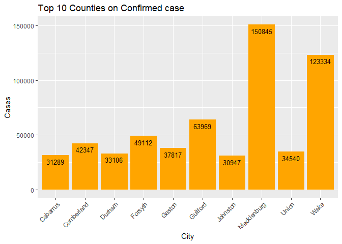
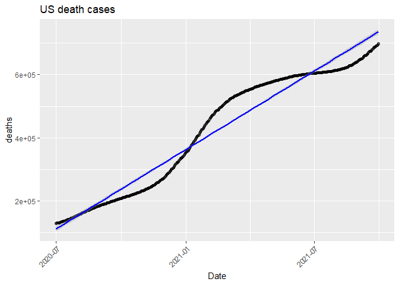
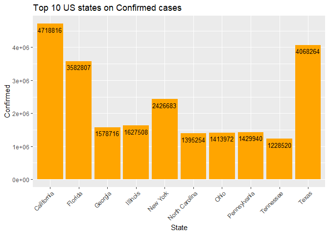
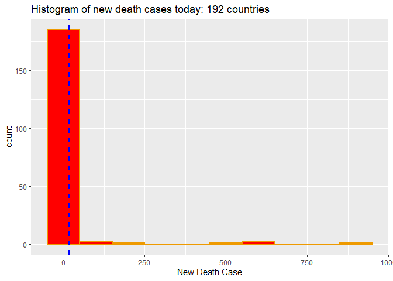
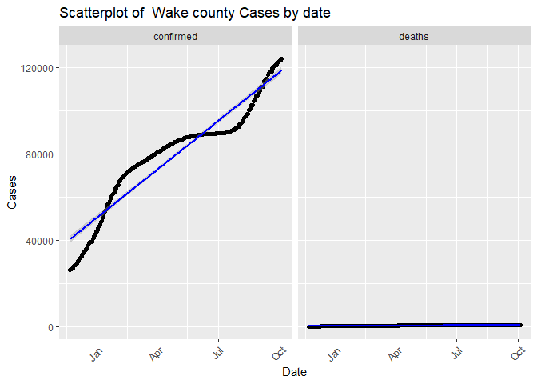
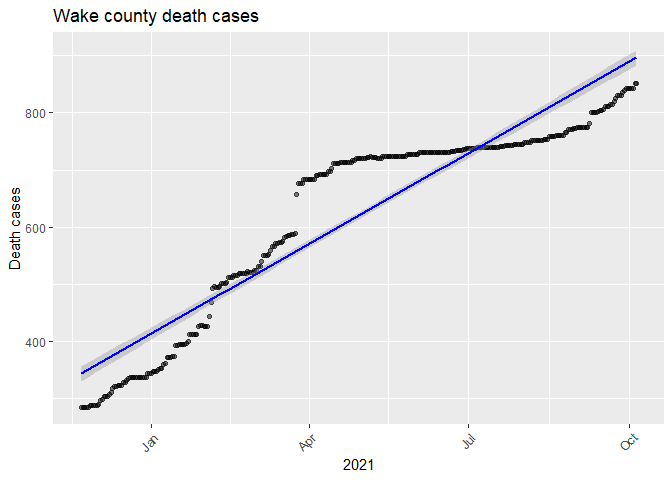
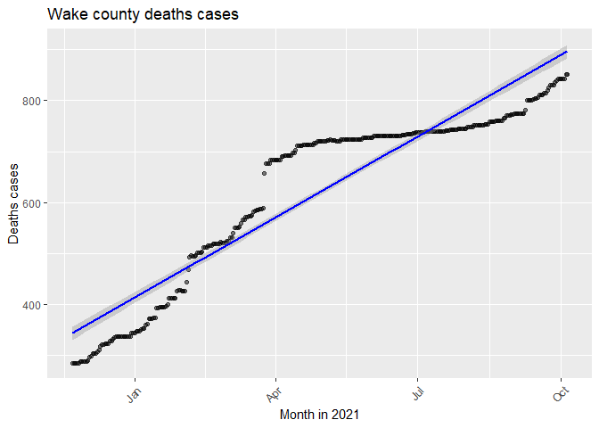

covid-vignette-api
================
Min-Jung Jung
10/05/2021

-   [Reqired pakages](#reqired-pakages)
-   [Functions to contact the Covid19 Data
    API](#functions-to-contact-the-covid19-data-api)
    -   [Base url](#base-url)
    -   [`countryName`](#countryname)
    -   [`covidSummary`](#covidsummary)
    -   [`confirmedCases`](#confirmedcases)
    -   [`deathCases`](#deathcases)
    -   [`recoveredCases`](#recoveredcases)
    -   [`confirmedCasesState`](#confirmedcasesstate)
    -   [`deathsCasesState`](#deathscasesstate)
    -   [`liveConfirmedCases`](#liveconfirmedcases)
    -   [`dateManipulation`](#datemanipulation)
    -   [`riskStatusManipulation`](#riskstatusmanipulation)
-   [Exploratory Data Analysis](#exploratory-data-analysis)
-   [Wrap-Up](#wrap-up)

This project is to create a vignette about contacting an API. I created
functions to download data via interacting endpoints. I will show this
process with the COVID19 API.

# Reqired pakages

I used the following packages to set up functions, data manipulation,
and analysis with COVID19 API:

-   [`ggplot2`](https://ggplot2.tidyverse.org/): for creating graphics.
-   [`tidyverse`](https://www.tidyverse.org/): for data manipulation and
    visualization.
-   [`jsonlite`](https://cran.r-project.org/web/packages/jsonlite/): to
    pull data from the COVID19 APIs.
-   [`knitr`](https://cran.r-project.org/web/packages/knitr/index.html):
    to generate tables.  
-   [`httr`](https://cran.r-project.org/web/packages/httr/vignettes/quickstart.html):
    to map closely to the underlying http protocol.
-   [`lubridate`](https://cran.r-project.org/web/packages/lubridate/index.html):
    for date conversion.

# Functions to contact the Covid19 Data API

To access the [Covid
Data](https://documenter.getpostman.com/view/10808728/SzS8rjbc), we need
to get a URL with the name of the table and attributes we want to pull
from it.

Here is the base URL that I am going to use throughout defining the
functions.

## Base url

``` r
base_url = "https://api.covid19api.com"
```

I wrote several functions to contact the COVID19 API via different
endpoints.

## `countryName`

This function is to generate `data.frame` of the country name and Slug.
In order to import different countries’ datasets, I needed to type the
correct country name in the URL. COVID19 API uses Slug instead of
country name. Therefore, I can use this table to find the correct name
of the country for the URL.

``` r
# Create function to find country name and slug.
countryName <- function(){
  full_url = paste0(base_url,"/countries")
  country <- content(GET(url=full_url),"text")
  countrylist <- fromJSON(country)
  return(countrylist)
}
# This table will guide users to find the specific country and slug.
countryName <- countryName()
```

## `covidSummary`

This function interacts with the `Summary` endpoint. It returned a
`list` of 5 variables showing information such as the world total of
confirmed case numbers and the world total death numbers. One of the
variables was the country, which I brought out and returned a
`data.frame` with the most recent data of confirmed cases, death cases,
and recovered cases for each country.

``` r
covidSummary <- function(){
   full_url = paste0(base_url,"/summary")
   covid_summary_text <- content(GET(url=full_url),"text")
   covid_cases_summary_json <- fromJSON(covid_summary_text)
   # Select Country variable from json output. 
   covid_cases_summary1 <- data.frame(covid_cases_summary_json$Countries) 
   return(covid_cases_summary1)
}

covidSummary <- covidSummary()
```

## `confirmedCases`

This function interacts with the `By Country Total` endpoint. This
function returns a `data.frame` of daily confirmed case numbers by a
specific country during the specified dates (7/01/2020 - 09/30/2021).
Users can select the country to get a different country’s dataset. I
chose 4 variables to display. Users can use the countryName table to
find countries to look up.

``` r
confirmedCases <- function(country){
  country <- tolower(country)
  country <- sub(" ", "-", country)

  full_url = paste0(base_url,"/total/country/",country,
                    "/status/confirmed?from=2020-07-01T00:00:00Z&to=2021-09-30T00:00:00Z")
  confirmed_cases_text = content(GET(url=full_url),"text")
  confirmed_cases_json = fromJSON(confirmed_cases_text)
  covid_confirmed_cases <- confirmed_cases_json

  if(country %in% countryName$Slug){
    covid_confirmed_cases <- covid_confirmed_cases %>% 
                           select(Country, Cases, Status, Date) # I choose 4 columns to display.
  } else { 
      message <- paste("ERROR: Argument for country was not found in the Slug column.", 
                       "Use countryName() to find the country you are looking",
                       "for and use Slug.")
    stop(message)
  }
return(covid_confirmed_cases)
}

# 1.User(s) can select different countries.
confirmed_cases <- confirmedCases("United States")
```

## `deathCases`

This function interacts with the `By Country Total` endpoint with
modification of status changed to deaths. This function returns a
`data.frame` of the number of daily death cases by a specific country
during the specified dates (7/01/2020 - 09/30/2021). Users can select
country to get a different country’s dataset. I chose 4 variables to
display. Users can use the countryName table to find countries you want
to look up.

``` r
deathCases <- function(country){
  country <- tolower(country)
  country <- sub(" ", "-", country)
 
  full_url = paste0(base_url,"/total/country/",country,
                    "/status/deaths?from=2020-07-01T00:00:00Z&to=2021-09-30T00:00:00Z")
  deaths_cases_text = content(GET(url=full_url),"text")
  deaths_cases_json = fromJSON(deaths_cases_text)

  if(country %in% countryName$Slug){
    covid_deaths_cases <- deaths_cases_json  %>% 
                          select(Country, Cases, Status, Date) 
  } else {
    message <- paste("ERROR: Argument for country was not found in the Slug column.", 
                     "Use countryName() to find the country you are looking",
                     "for and use Slug.")
    stop(message)
  }
return(covid_deaths_cases)
}

# 2. User(s) can select different countries.
death_cases <- deathCases("United States")
```

## `recoveredCases`

This function interacts with the `By Country Total` endpoint with
modification of status changed to recovered. This function returns a
`data.frame` of daily recovered case numbers by specific countries
during the specified dates (7/01/2020 - 09/30/2021). Users can select
the country to get different countries’ datasets. I chose 4 variables to
display. Users can use the countryName table to find countries to look
up.

``` r
recoveredCases <- function(country){
  country <- tolower(country)
  country <- sub(" ", "-", country)

  full_url = paste0(base_url,"/total/country/",country,
                      "/status/recovered?from=2020-07-01T00:00:00Z&to=2021-09-30T00:00:00Z")
  recovered_cases_text = content(GET(url=full_url),"text")
  recovered_cases_json = fromJSON(recovered_cases_text)

  if(country %in% countryName$Slug){
    covid_recovered_cases <- recovered_cases_json  %>% 
                             select(Country, Cases, Status, Date)
  } else {
      message <- paste("ERROR: Argument for country was not found in the Slug column.", 
                       "Use countryName() to find the country you are looking",
                       "for and use Slug.")
      stop(message)
  }
return(covid_recovered_cases)
}

# 3.User(s) can select different countries.
recovered_cases <- recoveredCases("United States")
```

``` r
# Data manipulation

# 4.I created one dataset with two data.frame datasets created by using confirmedCases and deathCases functions by row merging.
country_all_cases <- rbind(confirmed_cases, death_cases)
```

## `confirmedCasesState`

This function interacts with the `Day One Live` endpoint with
modification of status changed to confirmed. This function returns a
`data.frame` of daily confirmed case numbers by specific states from
11/22/2020 to present. Users can select state names (encompassing states
and other locations) to get different states’ datasets. I selected 6
variables to display.

``` r
confirmedCasesState <- function(state_name){

# There are state names with one word and more than two words. You can simply type the full name of the state with a space between or type the abbreviated name (i.e. NC, GA, VA).  
  
  state_name <- tolower(state_name)
  
  full_url = paste0(base_url,
                    "/dayone/country/united-states/status/confirmed/live?province=",
                    state_name)
  # This function will insert %20 in the space between two words or more state name.
  URLencode(full_url)
  covid_cases_by_states_text = content(GET(url=URLencode(full_url)),"text")
  covid_cases_by_states_json = fromJSON(covid_cases_by_states_text)
  covid_cases_by_states <- covid_cases_by_states_json %>% 
                           select(Country, Province, City, Cases, Status, Date) 
  return(covid_cases_by_states)
}

# 5.User(s) can select different state names.
state_confirmedData <- confirmedCasesState("North Carolina")

# 5-1.When states have different county level information, the last row is the sum of all confirmed case numbers of the specified state's counties.
# I am using North Carolina which has county level information. 
# Therefore, I deleted the last row to keep only the county level data rather than also including the sum total for all counties together.
state_confirmedData1 <- state_confirmedData %>% filter(row_number() <= n()-1)
```

## `deathsCasesState`

This function interacts with the `Day One Live` endpoint with
modification of status changed to deaths. This function returns a
`data.frame` of the number of daily death cases by specific states from
11/22/2020 to present. Users can select the state name to get different
states’ datasets. I chose only 6 variables to display.

``` r
deathsCasesState <- function(state_name){
  # There are state names with one word and with more than two words. 
  # You can simply type the full name of state with a space between or type the abbreviated name (i.e. NC, GA, VA).  
  # I set it up to be lower case.  
  state_name <- tolower(state_name)

  full_url = paste0(base_url,
                    "/dayone/country/united-states/status/deaths/live?province=",
                    state_name)
  # This function will insert %20 in the space between two words or more state name.
  URLencode(full_url)
  covid_cases_by_states_text = content(GET(url=URLencode(full_url)),"text")
  covid_cases_by_states_json = fromJSON(covid_cases_by_states_text)

  covid_cases_by_states <- covid_cases_by_states_json %>% 
                           select(Country, Province, City, Cases, Status, Date) 
  return(covid_cases_by_states)
}

# 6.User(s) can select different state names.
state_deathData <- deathsCasesState("North Carolina")

# 6-1.When states have different county level information, the last row is the sum of all confirmed case numbers of the specified state's counties.
# I am using North Carolina which has county level information. 
# Therefore, I deleted the last row to keep only the county level data rather than also including the sum total for all counties together.
state_deathData1 <- state_deathData %>% filter(row_number() <= n()-1)
```

``` r
# Data manipulation

# 7.I created this data set for the EDA by merging of two data sets generated by using confirmedCasesState and deathsCasesState functions.
state_all_cases <- rbind(state_confirmedData1, state_deathData1)
```

## `liveConfirmedCases`

This function interacts with the `Live By Country And Status After Date`
endpoint, which I modified to the date of 07/01/2021. This function
returns a `data.frame` of daily confirmed cases of specified countries
from a set date to present. Users can select a country name to get
different country’s dataset. I chose 6 variables to display.

``` r
liveConfirmedCases <- function(country){
  country <- tolower(country)
  country <- sub(" ", "-", country)

  full_url = paste0(base_url,"/live/country/",country,
                    "/status/confirmed/date/2021-07-01T00:00:00Z")
  covid_cases_live_text = content(GET(url=full_url),"text")
  covid_cases_live_json = fromJSON(covid_cases_live_text)
  covid_state_cases <- covid_cases_live_json

  if(country %in% countryName$Slug){
    covid_state_cases <- covid_state_cases %>% 
                         select(Country, Province, Confirmed, Deaths, Active, Date) 
  } else {
      message <- paste("ERROR: Argument for country was not found in the Slug column.", 
                       "Use countryName() to find the country you are looking",
                       "for and use Slug.")
      stop(message)
  }
return(covid_state_cases)
}

# 8.User(s) can select different countries.
country_liveCases <- liveConfirmedCases("United States")
```

## `dateManipulation`

This function helps to manipulate the date column (character format) to
date formation and creates one variable with time span with every
quarter.

``` r
dateManipulation <- function(dataset){
  dataset$Date <- as.Date(dataset$Date)
  dataset <- dataset %>% 
    mutate("Time_span" = if_else(Date <= as.Date("2020-09-30"), "2020Q3",
                          if_else(Date <= as.Date("2020-12-31"), "2020Q4",
                           if_else(Date <= as.Date("2021-03-31"), "2021Q1", 
                            if_else(Date <= as.Date("2021-06-30"), "2021Q2", 
                             if_else(Date <=   as.Date("2021-09-30"),"2021Q3", "2021Q4"))))
                          )
    )
  dataset$Time_span <- as.factor(dataset$Time_span)
  return(dataset)
}              

# 9.Data manipulation using `dateManipulation` function

# Confirmed cases data
confirmed_month <- dateManipulation(confirmed_cases)

# 10. US all cases (confirmed and death) data
us_all_cases_month <- dateManipulation(country_all_cases)

# 11. NC all cases (confirmed and death) data
state_all_cases_month <- dateManipulation(state_all_cases)
```

## `riskStatusManipulation`

This function helps to manipulate the data by creating three variables:
death rate, death rate status, and risk status. The US [death
rates](https://coronavirus.jhu.edu/data/mortality) is about 1.6 %. I
wanted to check on how US states display death rates. Also, I created a
death rate status variable based on the death rate and divided it into 4
categories. Lastly, I created a risk status variable based on the
confirmed case numbers at the state level.

``` r
# I created this function for data summaries and visualization.
riskStatusManipulation <- function(dataset){
  dataset <- dataset %>% 
    mutate("DeathRate"= (Deaths/Confirmed)*100, 
           "DeathRateStatus"= if_else(DeathRate > 2, "High",
                               if_else(DeathRate > 1, "Medium", 
                                if_else(DeathRate >0.5, "Low", "Very Low"))
                               ), 
           "RiskStatus" = if_else(Confirmed > 1250000, "Very High",
                           if_else(Confirmed > 750000, "High", 
                            if_else(Confirmed > 350000, "Medium", 
                             if_else(Confirmed > 150000, "Low", "Very Low")))
                           )
    )            
  return(dataset)
}
```

``` r
# Data manipulation

# I filtered the date to 10/01/2021 to only view the date's information.
us_newlive <- country_liveCases %>% filter(Date == "2021-10-01T00:00:00Z")

# 12.US live data using riskStatusManipulation function.
us_newlive_risk <- riskStatusManipulation(us_newlive) %>% as_tibble()
us_live_risk <- dateManipulation(us_newlive_risk)

# Overwrite RiskStatus column with factor version
us_live_risk$RiskStatus <- as.factor(us_live_risk$RiskStatus)
# Use ordered function on a factor to order the levels
us_live_risk$RiskStatus <- ordered(us_live_risk$RiskStatus, levels = c("Very Low", "Low", "Medium", "High", "Very High"))

# Overwrite DeathRateStatus column with factor version
us_live_risk$DeathRateStatus <- as.factor(us_live_risk$DeathRateStatus)
# Use ordered function on a factor to order the levels
us_live_risk$DeathRateStatus <- ordered(us_live_risk$DeathRateStatus, levels = c("Low", "Medium", "High"))
```

# Exploratory Data Analysis

I pulled the data using functions I created interacting with endpoints.
After using manipulation functions and merging different datasets, I
mainly selected four data sets for the exploratory analysis.

-   `country_live_risk`: Confirmed and death cases by 55 states on
    10/01/2021 in the US.
-   `state_all_cases_month`: Confirmed cases in 101 NC Counties from
    11/22/2020 to present.
-   `confirmed_month`: US confirmed cases from 07/01/2020 to 09/30/2021.
-   `us_all_cases_month`: US confirmed and death cases merged from
    07/01/2020 to 09/30/2021.

Let’s talk about the Covid-19 pandemic in the U.S and how confirmed
cases and death cases change over time. In order to see the change
patterns of both confirmed and death cases, I created a scatter plot by
date.

``` r
# Reshaping data
us_all_cases_month_wide <- us_all_cases_month %>%
                            pivot_wider(names_from = "Status",
                                        values_from = "Cases")

# Scatter plot confirmed cases in US
ggplot(data = us_all_cases_month_wide, aes(x = Date, 
                                           y = confirmed)) +
  geom_point(alpha = 0.50) + 
  theme(axis.text.x = element_text(angle = 45, hjust = 1)) + 
  ggtitle("US confirmed cases") + 
  geom_smooth(method = lm, color = "blue")  
```

<!-- -->

``` r
# Scatter plot death cases in US
ggplot(data = us_all_cases_month_wide, aes(x = Date, 
                                           y = deaths)) +
  geom_point(alpha = 0.50) + 
  theme(axis.text.x = element_text(angle = 45, hjust = 1)) +
  ggtitle("US death cases") + 
  geom_smooth(method = lm, color = "blue")  
```

<!-- -->

In the “confirmed cases” scatter plot, we see that the cases increased
rapidly at the end of 2020 and beginning of 2021, and then their rate of
increase slowed down. However, the rate of cases started increasing
again in August 2021. It may have been related to mask policies,
vaccination, or seasonal changes, but the fact is that covid cases are
increasing. Similar to confirmed cases, death cases also show a similar
pattern. Death cases are increasing over time, but this started slowing
down around March of 2021. It looks like death cases started increasing
again around September. It will be interesting to see if we have a
similar pattern to the winter of 2020.

Now, I wanted to see how the confirmed cases are increasing by every
quarter using side-by-side box plots.

``` r
# Box plot
us_confirmed_states<- us_all_cases_month %>% 
                        filter(Status == "confirmed") 
#Box plot for confirmed cases by time line.
ggplot(us_confirmed_states, aes(x = Time_span, 
                                y = Cases, 
                                fill = Time_span)) +
  geom_boxplot() +
  scale_x_discrete("Time Span") +
  ggtitle("US Covid confirmed cases comparison by time span") +
  scale_fill_brewer(palette = "Dark2") +
  scale_fill_discrete(name = "Time Span", 
                      labels = c("2020Q3" = "2020 Q3", 
                                 "2020Q4" = "2020 Q4", 
                                 "2021Q1" = "2021 Q1", 
                                 "2021Q2" = "2021 Q2", 
                                 "2021Q3" = "2021 Q3")
                                ) 
```

<!-- -->

Similar to the scatter plot of confirmed cases, the median line of 2021
quarter 1 is a lot higher than 2020 quarter 4. Also, the interquartile
range of 2020 quarter 4 is big, which means that during 2020 quarter 4,
case numbers rapidly increased.

Now, let’s look at how death cases are increasing by quarter.

``` r
#Setting the data set with only death status
us_deaths_states<- us_all_cases_month %>% 
                    filter(Status == "deaths") 
#Box plot for death cases by timeline
ggplot(us_deaths_states, aes(x = Time_span, 
                                y = Cases, 
                                fill = Time_span)
                            ) +
  geom_boxplot() +
  scale_x_discrete("Time Span") +
  ggtitle("US Covid death cases comparison by time span") +
  scale_fill_brewer(palette = "BuPu") +
  scale_fill_discrete(name = "Time Span", 
                      labels = c("2020Q3" = "2020 Q3", 
                                 "2020Q4" = "2020 Q4", 
                                 "2021Q1" = "2021 Q1", 
                                 "2021Q2" = "2021 Q2", 
                                 "2021Q3" = "2021 Q3")
                                ) 
```

<!-- -->

I also created side by side box plots for the death cases, and death
cases increased rapidly between the last quarter of 2020 and the first
quarter of 2021. This is a similar pattern to the confirmed cases.

Now, let’s move down to the state level, beginning with discussing some
summary statistics.

``` r
# Summary table for US states
us_bystate <- us_live_risk %>% 
                summarise(Min = min(Confirmed), 
                          Median = median(Confirmed),
                          Average = mean(Confirmed),
                          Max = max(Confirmed),
                          IQR = IQR(Confirmed)
                          )

# Display a table of the summary stats.
kable(us_bystate, caption = "Summary Stats by US states", digits = 2)
```

| Min | Median |  Average |     Max |    IQR |
|----:|-------:|---------:|--------:|-------:|
| 269 | 508494 | 790137.1 | 4718816 | 753095 |

Summary Stats by US states

First, the Summary Stats by US states table using `us_live_risk` data
shows interesting information. The average confirmed cases (790,137.1)
is higher than the median score (508494), and the IQR score is also not
extremely high. However, the difference between minimum (269) and
maximum (4,718,816) numbers is extremely big. If I didn’t check the
Minimum score or Maximum score, I would miss the gap between the two end
values.

``` r
# Summary stats for two categorical variables
Summary_us_risk <- us_live_risk %>% 
                    group_by(RiskStatus) %>% 
                    summarise(Average = mean(Confirmed),
                              Median = median(Confirmed), 
                              IQR = IQR(Confirmed)
                              )

# Display a table of the summary stats.
kable(Summary_us_risk, caption = "Summary stats by risk status", digits = 2)
```

| RiskStatus |    Average |    Median |        IQR |
|:-----------|-----------:|----------:|-----------:|
| Very Low   |   78554.15 |   89989.0 |   86058.00 |
| Low        |  231486.12 |  246741.5 |   80623.25 |
| Medium     |  556041.43 |  520417.0 |  206787.50 |
| High       |  959809.55 |  866776.0 |  303044.00 |
| Very High  | 2471328.89 | 1627508.0 | 2152867.00 |

Summary stats by risk status

The “Summary stats by risk status” table shows the average, median, and
IQR scores of each risk state. I created a variable called RiskStatus
based on the mean and median score. The five status set points for the
number of confirmed cases go from “Very Low” (under 150,000 cases) to
“Very High”(higher than 1,250,000 cases). Similar to the first summary
table, this table also shows interesting results on very high status
scores. The average score is significantly higher than the median score,
and the IQR score in the very high category is also large. This means
that states with confirmed cases higher than 1,250,000 are more spread
out, but the majority are still around the median scores.

``` r
# Arrange data by descending order
us_live_risk1 <- us_live_risk %>% 
                  arrange(desc(Confirmed))

# Select 10 top rows
top10states <- us_live_risk1[1:10,]

# Top 10 states by risk status
state_highrisk <- table(top10states$Province, top10states$RiskStatus)
kable(state_highrisk, 
      caption = "Top 10 states by risk status")
```

|                | Very Low | Low | Medium | High | Very High |
|:---------------|---------:|----:|-------:|-----:|----------:|
| California     |        0 |   0 |      0 |    0 |         1 |
| Florida        |        0 |   0 |      0 |    0 |         1 |
| Georgia        |        0 |   0 |      0 |    0 |         1 |
| Illinois       |        0 |   0 |      0 |    0 |         1 |
| New York       |        0 |   0 |      0 |    0 |         1 |
| North Carolina |        0 |   0 |      0 |    0 |         1 |
| Ohio           |        0 |   0 |      0 |    0 |         1 |
| Pennsylvania   |        0 |   0 |      0 |    0 |         1 |
| Tennessee      |        0 |   0 |      0 |    1 |         0 |
| Texas          |        0 |   0 |      0 |    0 |         1 |

Top 10 states by risk status

The “Top 10 States of risk status” contingency table shows where the top
10 states with the most confirmed cases belong in terms of their risk
status. Nine out of 10 states are in the very high risk group, and North
Carolina is one of the states in the high risk group. One thing we
should remember is that this grouping is not based on the population. It
directly looks at the confirmed cases only. Therefore, if considering
state populations, risk categories may change.

``` r
#Bar plot for top 10 states
ggplot(data=top10states, aes(x = Province, 
                             y = Confirmed)) +
  geom_bar(stat = "identity", fill = "orange") +
  labs(x = "States", 
       title = "Top 10 US states on confirmed cases") +
  geom_text(aes(label = Confirmed), 
            vjust = 1.6, 
            color = "black", 
            size = 3.5) +
  theme(axis.text.x = element_text(angle = 45, hjust = 1))
```

<!-- -->

While the “Top 10 States of risk status” contingency table shows where
each state belongs in terms of risk category, the bar plot shows the
number of confirmed cases. We now know that California is the top state
with the most confirmed cases, followed by Texas and Florida. The
“Summary stats by risk status” table shows that the mean of the high
risk group (top 9 states) is much higher than the median. With such a
high number of confirmed cases in those three states (CA, FL, and TX),
it is likely that they are causing this difference by pulling the mean
higher compared to the other states in that group.

Now, let’s look at both confirmed cases and death cases and their
relationship. Are deaths higher in the states with higher confirmed
cases? We can use the correlation score to see the relationship.

``` r
# Correlation summary
corr_us <- cor(us_live_risk$Confirmed, us_live_risk$Deaths)

# Display correlation summary
kable(corr_us, col.names = "Correlation", digits = 2)
```

| Correlation |
|------------:|
|        0.98 |

``` r
#Scatter plot: confirmed cases by death cases
ggplot(data = us_live_risk, aes(x = Confirmed, 
                                y = Deaths)) +
  geom_point() + 
  theme(axis.text.x = element_text(angle = 45,hjust = 1)) + 
  ggtitle("Correlation between death and confirmed cases") + 
  geom_smooth(method = lm, color = "blue")  
```

<!-- -->

The correlation between confirmed cases and death cases is 0.98, which
is really high being close to 1. The scatter plot shows the pattern of
the relationship, as well. Based on the results, we know that the higher
the confirmed cases, the higher the death cases as well. Also, the top
10 confirmed case states are more likely to show higher death cases.

The bar plot below shows the top 10 states on death cases.

``` r
# Sub setting top 10 states of death cases.
# Descending order
us_live_death1 <- us_live_risk %>% 
                    arrange(desc(Deaths))

# Filter top 10 states
top10statesdeath <- us_live_death1[1:10,]

# Bar plot for top 10 states by death cases.
ggplot(data=top10statesdeath, aes(x = Province, 
                                  y = Deaths)) +
  geom_bar(stat = "identity", fill = "orange") +
  labs(x = "State", title = "Top 10 US states on death cases") +
  geom_text(aes(label = Deaths), vjust = 1.6, color = "black", size = 3.5) +
  theme(axis.text.x = element_text(angle = 45, hjust = 1))
```

<!-- -->

As the correlation between confirmed cases and death cases suggested,
California is again the top state showing the highest number of deaths,
followed by Texas, New York, and Florida. Interestingly, death cases in
New York are similar to Florida, which suggests that the death rate in
New York is higher because confirmed cases of Florida are much higher
than New York. Let’s move on to see the top 10 states with high death
rate.

``` r
# Sub setting top 10 states by death rate.
# Descending order
us_live_deathrate <- us_live_risk %>% 
                      arrange(desc(DeathRate))

# Filter top 10 states and select Province and DeathRate column. 
top10statesDeathRate <- us_live_deathrate[1:10,] %>% 
                          select (Province, DeathRate)

# Display top 10 states by death rate.
kable(top10statesDeathRate, 
      col.names = c("States", "Death Rate"),
      caption = "Top 10 states on death rate", digits = 2)
```

| States               | Death Rate |
|:---------------------|-----------:|
| New Jersey           |       2.38 |
| Massachusetts        |       2.29 |
| New York             |       2.28 |
| Connecticut          |       2.21 |
| Pennsylvania         |       2.06 |
| Mississippi          |       1.97 |
| Maryland             |       1.96 |
| Michigan             |       1.94 |
| District of Columbia |       1.92 |
| New Mexico           |       1.90 |

Top 10 states on death rate

The above table shows the top 10 states for death rates. Surprisingly,
California and Texas are not on this top 10 list. New Jersey,
Massachusetts, and New York states ranked in the top 3. These results
show more dynamics between confirmed cases and death cases, and the
death rates do not always go by the number of cases. Then, it will be
interesting to see the relationship between death rate and confirmed
cases. I created a `DeathRateStatus` variable to see how many states are
in high, medium, and low death rate groups. Therefore, instead of
directly comparing the two numbers, I used categorical variables
(RiskStatus and DeathRateStatus) to see how many states belong to each
group in the contingency table.

``` r
# Contingency table 

# United Status
usDeathRate_status <- table(us_live_risk$RiskStatus, us_live_risk$DeathRateStatus)

# change row names.
rownames(usDeathRate_status) <- c("Very Low risk", "Low risk", 
                                  "Medium risk", "High risk", 
                                  "Very High risk")

# Display contingency table.
kable(usDeathRate_status, 
      col.names = c('Low deathrate', 'Medium deathrate', 'High deathrate'),
      caption = "Risk status vs Death rate status in US")
```

|                | Low deathrate | Medium deathrate | High deathrate |
|:---------------|--------------:|-----------------:|---------------:|
| Very Low risk  |             4 |                9 |              0 |
| Low risk       |             1 |                7 |              0 |
| Medium risk    |             1 |               12 |              1 |
| High risk      |             0 |                9 |              2 |
| Very High risk |             0 |                7 |              2 |

Risk status vs Death rate status in US

When looking at the contingency table with confirmed case risk groups
and death rate groups, it still shows consistent results. The very high
risk category in terms of confirmed cases grouped in the medium and high
death rate categories. Similarly, the very low and low risk category in
terms of the confirmed cases grouped in the low and medium death rate
categories.

This bar plot shows the contingency table more visually.

``` r
#Bar plot of risk status by death rate status in US states

ggplot(data = us_live_risk, aes(x = RiskStatus)) +
  geom_bar(aes(fill = as.factor(DeathRateStatus))) + 
  labs(x = "Risk Status", 
       title = "Risk status by death rate status in US states") +
  theme(axis.text.x = element_text(angle = 45, hjust=1)) +
  scale_fill_discrete(name = "Death Rate Status") 
```

<!-- -->

The graph shows that the low death rate states are mainly in medium to
low and very low risk groups (low confirmed cases), and high death rate
states are in the medium to high and very high risk groups (high
confirmed cases).

Lastly, I wanted to see how confirmed cases and death cases are changing
in wake county.

``` r
# sub setting rows of Wake county
Wake_cases <- state_all_cases_month %>% 
                filter(City =="Wake") 

# Making status column to two columns (deaths and confirmed)
wake_cases_wide <- Wake_cases %>% 
                    pivot_wider(names_from = "Status", values_from = "Cases")

# Scatter plot of confirmed cases for wake county
ggplot(data = wake_cases_wide, aes(x = Date, y = confirmed)) +
  geom_point(alpha=0.50) + 
  theme(axis.text.x = element_text(angle = 45, hjust=1)) + 
  ggtitle("Wake county confirmed cases") +
  geom_smooth(method = lm, color = "blue") +
  labs(x = "2021", y = "Confirmed cases")
```

<!-- -->

``` r
# Scatter plot of death cases for wake county
ggplot(data = wake_cases_wide, aes(x = Date, y = deaths)) +
  geom_point(alpha=0.50) + 
  theme(axis.text.x = element_text(angle = 45, hjust=1)) + 
  ggtitle("Wake county death cases") +
  geom_smooth(method = lm, color = "blue") +
  labs(x = "2021", y = "Death cases")
```

<!-- -->

Looking at the scatter plots, the confirmed cases scatter plot reveals
that in the beginning of 2021 the cases increased rapidly. Then the
cases increased rapidly again starting in August of 2021. One possible
explanation for the rapid increase in August is due to wake county
schools starting. Looking at the death cases scatter plot, the death
cases also increased as confirmed cases increased. There was an
especially big jump in the death cases in March, from under 600 cases to
almost 700 cases. However, Since April it has been slowing down, which
is good news. Since flu season is coming and the cases appear to be
increasing again, we will need to pay attention to how the pattern will
change.

These histograms can also show how quickly confirmed cases and death
cases are changing by frequency of the same case numbers.

``` r
# Histogram plot

# Wake county confirmed cases in 2021
wake_confirmed_cases <- state_all_cases_month %>% 
                          filter(Status == "confirmed") %>% 
                          filter(City == "Wake")

# Wake county death cases in 2021
wake_deaths_cases <- state_all_cases_month %>% 
                        filter(Status == "deaths") %>% 
                        filter(City == "Wake")

# Histogram of confirmed cases in 2021
ggplot(wake_confirmed_cases, aes(Cases)) + 
  geom_histogram(color = "brown4", fill = "brown1") +
  labs(x = "Confirmed Cases", 
       title = "Confrimed cases in Wake county in 2021")
```

<!-- -->

``` r
# Histogram of death cases in 2021
ggplot(wake_deaths_cases, aes(Cases)) + 
  geom_histogram(color = "darkorange4", fill = "darkorange1") +
  labs(x = "Death Cases", 
       title = "Death cases in Wake county in 2021")
```

<!-- -->

The confirmed histogram shows how many confirmed cases were in Wake
County by number of counts (days), so the longer the number of cases
remained the same, the larger the bar on the histogram, which means the
slower the increase in number of cases. In other words, in the confirmed
histogram, the highest bar is at 80,000 confirmed cases. The time period
when the confirmed cases were 80,000 was most frequent, and we can
interpret this as during those 62 counts (62 days), the confirmed cases
increased slowly, which occurred around the second quarter of the year.
However, confirmed cases are rapidly increasing again because the
histogram shows that later this year, the frequency of confirmed cases
at a given number count was much lower, meaning that the number of
counts with that number of cases was smaller. This shows that the cases
changed more quickly.

In the deaths histogram, death cases stagnated between 730 and 750,
which means that there were a higher number of days in which the total
death cases remained about the same. In other words, death cases are
more slowly increasing in the later months of 2021. It is good to know
that in the midst of the more quickly increasing of confirmed cases,
death cases are slowing down in Wake county.

# Wrap-Up

In this vignette, I built several functions to interact with some of the
COVID19 API’s endpoints to retrieve data for the exploratory analysis. I
used tables, numerical summaries, and four different types of graphs to
explain what I found. With an analysis, I found that Covid confirmed
cases are still increasing along with death cases, but there are
variations between states in the U.S. Sadly, North Carolina is one of
the top 10 states of confirmed cases. Also, confirmed cases are
increasing fast in wake county.

I selectively focused on the US cases in this vignette because US is the
top country of all the confirmed cases, but it will be very interesting
to see how other countries are doing navigating functions I created
here.
