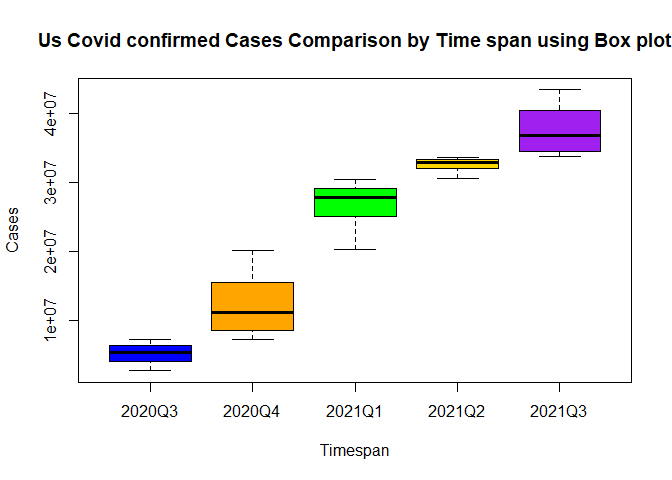
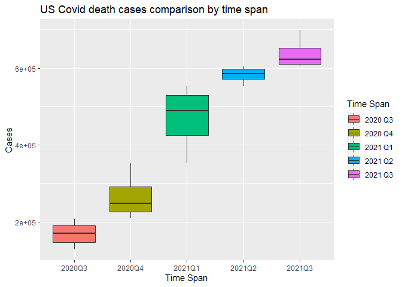
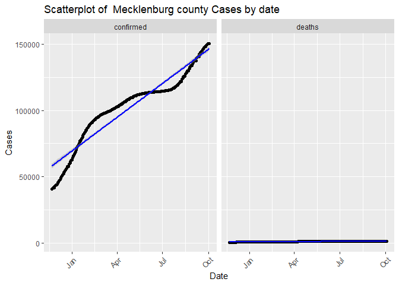

covid-vignette-api
================
Min-Jung Jung
9/20/2021

-   [Reqired pakages](#reqired-pakages)
-   [Contact the Covid19 Data API](#contact-the-covid19-data-api)
    -   [Base url](#base-url)
    -   [`countryName`](#countryname)
    -   [`covidSummary`](#covidsummary)
    -   [`confirmedCases`](#confirmedcases)
-   [`deathCases`](#deathcases)
-   [`recoveredCases`](#recoveredcases)
    -   [`confirmedCasesState`](#confirmedcasesstate)
    -   [`deathsCasesState`](#deathscasesstate)
    -   [`liveConfirmedCases`](#liveconfirmedcases)
    -   [`dateManipulation`](#datemanipulation)
    -   [`riskStatusManipulation`](#riskstatusmanipulation)
-   [Exploratory Data Analysis](#exploratory-data-analysis)
    -   [Graphical Summaries](#graphical-summaries)

This project is to create a vignette about contacting an API. I created
functions to download data via interacting endpoints. I will show this
process with COVID API.

# Reqired pakages

I used following packages to set up function, data manipulation, and
analysis with COVID API: \* [`ggplot2`](https://ggplot2.tidyverse.org/):
for creating graphics.

-   [`tidyverse`](https://www.tidyverse.org/): for data manipulation and
    visualization.
-   [`jsonlite`](https://cran.r-project.org/web/packages/jsonlite/): to
    pull data from the Covid 19 APIs.
-   [`knitr`](https://cran.r-project.org/web/packages/knitr/index.html):
    to generate tables.  
-   [`httr`](https://cran.r-project.org/web/packages/httr/vignettes/quickstart.html):
    to map closely to the underlying http protocol.
-   [`lubridate`](https://cran.r-project.org/web/packages/lubridate/index.html):
    for date conversion.

# Contact the Covid19 Data API

To access the [Covid
Data](https://documenter.getpostman.com/view/10808728/SzS8rjbc), we need
to get a URL with the name of the table and attributes we want to pull
from it.

Here is the base URL that I am going to use through out defining the
functions.

## Base url

``` r
base_url = "https://api.covid19api.com"
```

I wrote one function for set up,Contacting Covid19 API via different
endpoints.

## `countryName`

This function is to generate `data.frame` of country name and Slug. In
order to import different country dataset, I need to type the correct
country name in URL. COVID19 AIP uses Slug instead of country name.
Therefore, I can use the this table to find the correct name of the
country for the URL.

``` r
countryName <- function(){
  full_url = paste0(base_url,"/countries")
  country <- content(GET(url=full_url),"text")
  countrylist <- fromJSON(country)
  countrylist1 <- as_tibble(data.frame(Country = countrylist$Country,
                                       Slug = countrylist$Slug))
  return(countrylist1)
}
# This table will guide users to find specific country and slug.
countryName <- countryName()
```

    ## No encoding supplied: defaulting to UTF-8.

## `covidSummary`

This function interacts with the `Summary` endpoint. It returned a
`list` of 5 variables showing like world total confirmed case numbers,
and world total deaths case numbers. One of the variable was the
country, which I called it out and returned a `data.frame` with most
recent data of confirmed cases, death cases, recovered cases for each
country.

``` r
covidSummary <- function(){
   full_url = paste0(base_url,"/summary")
   covid_summary_text <- content(GET(url=full_url),"text")
   covid_cases_summary_json <- fromJSON(covid_summary_text)
   # Select Country variable from json output. 
   covid_cases_summary1 <- data.frame(covid_cases_summary_json$Countries) 
   return(covid_cases_summary1)
}
```

## `confirmedCases`

This function interacts with the `By Country Total` endpoint. This
function returns a `data.frame` of daily confirmed cases number by
specific country during the specified dates (7/01/2020 - 09/30/2021).
Users can select country to get different country dataset. I choose only
4 variables to display, which I am going to mainly use. Users can use
the countryName table to find countries you want to look up.

``` r
confirmedCases <- function(country){
  # If you type in country name as slug, it will return the data correctly. 
  if(country %in% countryName$Slug){
    full_url = paste0(base_url,"/total/country/",country,"/status/confirmed?from=2020-07-01T00:00:00Z&to=2021-09-30T00:00:00Z")
    confirmed_cases_text = content(GET(url=full_url),"text")
    confirmed_cases_json = fromJSON(confirmed_cases_text)
  # I choose 4 columns to display.
    covid_confirmed_cases <- confirmed_cases_json %>% 
                           select(Country, Cases, Status, Date)  
  return(covid_confirmed_cases)
  }
  # Otherwise, it will throw an error.
  else {
    message <- paste("ERROR: Argument for country was not found in the Slug.", 
                    "Look up countryName to find the country you are looking",
                    "for and use Slug.")
    stop(message)
  }
}

# 1.User(s) can select different countries.
confirmed_cases <- confirmedCases("united-states")
```

# `deathCases`

This function interacts with the `By Country Total` endpoint with
modification of status changed to deaths. This function returns a
`data.frame` of daily deaths cases number by specific country during the
specified dates (7/01/2020 - 09/30/2021). Users can select country to
get different country dataset. I choose only 4 variables to display,
which I am going to mainly use. Users can use the countryName table to
find countries you want to look up.

``` r
deathCases <- function(country){
  # If you type in country name as slug, it will return the data correctly. 
  if(country %in% countryName$Slug){
    full_url = paste0(base_url,"/total/country/",country,"/status/deaths?from=2020-07-01T00:00:00Z&to=2021-09-30T00:00:00Z")
    deaths_cases_text = content(GET(url=full_url),"text")
    deaths_cases_json = fromJSON(deaths_cases_text)
    covid_deaths_cases <- deaths_cases_json  %>% select(Country, Cases, Status, Date) 
  return(covid_deaths_cases)
  }
  # Otherwise, it will throw an error.
  else {
    message <- paste("ERROR: Argument for country was not found in the Slug.", 
                     "Look up countryName to find the country you are looking",
                     "for and use Slug.")
    stop(message)
  }
}

# 2. User(s) can select different countries.
death_cases <- deathCases("united-states")
```

# `recoveredCases`

This function interacts with the `By Country Total` endpoint with
modification of status changed to recovered.This function returns a
`data.frame` of daily recovered cases number by specific country during
the specified dates (7/01/2020 - 09/30/2021). Users can select country
to get different country dataset. I choose only 4 variables to display,
which I am going to mainly use. Users can use the countryName table to
find countries you want to look up.

``` r
recoveredCases <- function(country){
  # If you type in country name as slug, it will return the data correctly. 
  if(country %in% countryName$Slug){
    full_url = paste0(base_url,"/total/country/", country,"/status/recovered?from=2020-07-01T00:00:00Z&to=2021-09-30T00:00:00Z")
    recovered_cases_text = content(GET(url=full_url),"text")
    recovered_cases_json = fromJSON(recovered_cases_text)
    covid_recovered_cases <- recovered_cases_json  %>% 
                             select(Country, Cases, Status, Date)
  return(covid_recovered_cases)
  }
  # Otherwise, it will throw an error.
  else {
      message <- paste("ERROR: Argument for country was not found in the Slug.", 
                       "Look up countryName to find the country you are looking",
                       "for and use Slug.")
      stop(message)
  }
}

# 3.User(s) can select different countries.
recovered_cases <- recoveredCases("united-states")
```

``` r
# Data manipulation

# 4.I created one dataset with two data.frame datasets by row merging.
us_all_cases <- rbind(confirmed_cases, death_cases)
```

## `confirmedCasesState`

This function interacts with the `Day One Live` endpoint with
modification of status changed to confirmed. This function returns a
`data.frame` of daily confirmed cases number by specific state from
11/22/2020 to present. Users can select state name to get different
state dataset. I choose only 6 variables to display, which I am going to
mainly use.

``` r
confirmedCasesState <- function(state_name){
  # There are state name with one words and more than two words. 
  # For one word state name, I set it up to be lower case.  
  state_name <- tolower(state_name)
  two_word_states = list("new hampshire", "new jersey", "new mexico",
                         "new york","north carolina","north dakota",
                         "south carolina","south dakota", 
                         "distrct of columbia", "puerto rico",
                         "Northern Mariana Islands", "Virgin Islands", 
                         "Rhode Island")
  # For two or more words state name, user will type two words state name with space.   # I set it the function to insert %20 automatically using URLendoe().
  if (state_name %in% two_word_states){
    full_url = paste0(base_url,"/dayone/country/united-states/status/confirmed/live?province=",state_name)
  # This function will insert %20 in the space between two words or more state name.
    URLencode(full_url)
    covid_cases_by_states_text = content(GET(url=URLencode(full_url)),"text")
    covid_cases_by_states_json = fromJSON(covid_cases_by_states_text)
  }
  # Otherwise, one word state name will work. 
  else{
    full_url = paste0(base_url,"/dayone/country/united-states/status/confirmed/live?province=",state_name)
    covid_cases_by_states_text = content(GET(url=full_url),"text")
    covid_cases_by_states_json = fromJSON(covid_cases_by_states_text)
  }
    covid_cases_by_states <- covid_cases_by_states_json %>% 
                           select(Country, Province, City, Cases, Status, Date) 
  return(covid_cases_by_states)
}

# 5.User(s) can select different state names.
nc_confirmedData <- confirmedCasesState("North Carolina")
```

    ## No encoding supplied: defaulting to UTF-8.

``` r
# 6.Last row was the sum of all confirmed case number of 55 states.
# I deleted the last row to keep the state level data only.
nc_confirmedData1 <- nc_confirmedData %>% filter(row_number() <= n()-1)
```

## `deathsCasesState`

This function interacts with the `Day One Live` endpoint with
modification of status changed to deaths. This function returns a
`data.frame` of daily deaths cases number by specific state from
11/22/2020 to present. Users can select state name to get different
state dataset. I choose only 6 variables to display, which I am going to
mainly use.

``` r
deathsCasesState <- function(state_name){
# There are state name with one words and more than two words. 
# For one word state name, I set it up to be lower case.  
  state_name <- tolower(state_name)
# For two or more words state name, user will type two words state name with space. 
# I set it the function to insert %20 automatically using URLendoe().
  two_word_states = list("new hampshire", "new jersey", "new mexico",
                         "new york","north carolina","north dakota",
                         "south carolina","south dakota", 
                         "distrct of columbia", "puerto rico",
                         "Northern Mariana Islands", "Virgin Islands", 
                         "Rhode Island")

  if (state_name %in% two_word_states){
     full_url = paste0(base_url,"/dayone/country/united-states/status/deaths/live?province=",state_name)
     URLencode(full_url)
    covid_cases_by_states_text = content(GET(url=URLencode(full_url)),"text")
    covid_cases_by_states_json = fromJSON(covid_cases_by_states_text)
  }
    else{
    full_url = paste0(base_url,"/dayone/country/united-states/status/deaths/live?province=",state_name)
    covid_cases_by_states_text = content(GET(url=full_url),"text")
    covid_cases_by_states_json = fromJSON(covid_cases_by_states_text)
    }
     covid_cases_by_states <- covid_cases_by_states_json %>% select(Country, Province, City, Cases, Status, Date) 
  return(covid_cases_by_states)
}

# 7.User(s) can select different state names.
nc_deathData <- deathsCasesState("North Carolina")
```

    ## No encoding supplied: defaulting to UTF-8.

``` r
# 8.Last row was the sum of all confirmed case number of 55 states.
# I deleted the last row to keep the state level data only.
nc_deathData1 <- nc_deathData %>% filter(row_number() <= n()-1)
```

``` r
# Data manipulation

# 9.I created this dataset with two data.frame datasets by row merging.
nc_all_cases <- rbind(nc_confirmedData1, nc_deathData1)
```

## `liveConfirmedCases`

This function interacts with the `Live By Country And Status After Date`
endpoint of modification of date as 07/01/2021. This function returns a
`data.frame` of daily confirmed cases of specified country from set date
to present. Users can select country name to get different country
dataset. I choose only 6 variables to display, which I am going to
mainly use.

``` r
liveConfirmedCases <- function(country){
  # If you type in country name as slug, it will return the data correctly. 
  if(country %in% countryName$Slug){
    full_url = paste0(base_url,"/live/country/",country,"/status/confirmed/date/2021-07-01T00:00:00Z")
    covid_cases_live_text = content(GET(url=full_url),"text")
    covid_cases_live_json = fromJSON(covid_cases_live_text)
    covid_state_cases <- covid_cases_live_json %>% 
                         select(Country, Province, Confirmed, Deaths, Active, Date) 
    return(covid_state_cases)
  }
  # Otherwise, it will throw an error.
  else {
      message <- paste("ERROR: Argument for country was not found in the Slug.", 
                       "Look up countryName to find the country you are looking",
                       "for and use Slug.")
      stop(message)
  }
}

# 10.User(s) can select different countries.
us_liveCases <- liveConfirmedCases("united-states")
```

## `dateManipulation`

This function helps to manipulate date column(character format) to date
formation and create one variable with time span with every quarter.

``` r
dateManipulation <- function(dataset){
  dataset$Date <- as.Date(dataset$Date)
  dataset <- dataset %>% 
    mutate("Time_span" = if_else(Date <= as.Date("2020-09-30"), "2020Q3",
                          if_else(Date <= as.Date("2020-12-31"), "2020Q4",
                           if_else(Date <= as.Date("2021-03-31"), "2021Q1", 
                            if_else(Date <= as.Date("2021-06-30"), "2021Q2", 
                             if_else(Date <=   as.Date("2021-09-30"),"2021Q3","2021Q4")))))
    )
  dataset$Time_span <- as.factor(dataset$Time_span)
  return(dataset)
}              

# 11.data manipulation using `dateManipulation` function
# confirmed case data
confirmed_month <- dateManipulation(confirmed_cases)
# 12.US all cases (confirmed and death) data
us_all_cases_month <- dateManipulation(us_all_cases)
# 13.NC all cases (confirmed and death) data
nc_all_cases_month<- dateManipulation(nc_all_cases)
```

## `riskStatusManipulation`

This function helps to manipulate data with creating three variables.
Death rate, death rate status and risk status are the three variables.
US [death rates](https://coronavirus.jhu.edu/data/mortality) is about
1.6 %. I wanted to check how US states display its death rate. Also, I
created Death Rate status variable based on the death rate into 4
categories. Lastly, I created risk status variable based on the
confirmed cases number in state level.

``` r
#I created this function for data summaries and visualization.
riskStatusManipulation <- function(dataset){
  dataset <- dataset %>% 
    mutate("DeathRate"= (Deaths/Confirmed)*100, 
           "DeathRateStatus"= if_else(DeathRate > 2, "4.High",
                               if_else(DeathRate > 1, "3.Medium", 
                                if_else(DeathRate >0.5, "2.Low", "1.Very low"))), 
           "RiskStatus" = if_else(Confirmed > 1250000, "5.Veryhigh",
                           if_else(Confirmed > 750000, "4.High", 
                            if_else(Confirmed > 350000, "3.Medium", 
                             if_else(Confirmed > 150000, "2.Low", "1.Very Low"))))
    )            
  return(dataset)
}
```

``` r
#need to change the name of file later.
us_newlive <- us_liveCases %>% filter(Date == "2021-10-01T00:00:00Z")
# 14.US live data using riskStatusManipulation function.
us_newlive_risk <- riskStatusManipulation(us_newlive) %>% as_tibble()
us_live_risk <- dateManipulation(us_newlive_risk)
```

# Exploratory Data Analysis

I want to begin with discussing about some summary statistics.

``` r
#Summary table for us states
us_bystate <- us_live_risk %>% summarise(Min = min(Confirmed), Max = max(Confirmed), Avg = mean(Confirmed), Med = median(Confirmed), IQR = IQR(Confirmed))
us_bystate
```

    ## # A tibble: 1 x 5
    ##     Min     Max     Avg    Med    IQR
    ##   <int>   <int>   <dbl>  <int>  <dbl>
    ## 1   269 4718816 790137. 508494 753095

``` r
#summary by status(deaths vs confirmed)
Summary_us_all <- us_all_cases_month %>% group_by(Status) %>% summarise(Avg = mean(Cases), Med = median(Cases), IQR = IQR(Cases)) 
Summary_us_all
```

    ## # A tibble: 2 x 4
    ##   Status          Avg      Med      IQR
    ##   <chr>         <dbl>    <int>    <dbl>
    ## 1 confirmed 22878859. 27762171 24926891
    ## 2 deaths      423587.   487599   373278

``` r
#two categorical variables
Summary_us_risk <- us_live_risk %>% group_by(RiskStatus) %>% summarise(Avg = mean(Confirmed), Med = median(Confirmed), IQR = IQR(Confirmed), Var = var(Confirmed)) 
Summary_us_risk
```

    ## # A tibble: 5 x 5
    ##   RiskStatus      Avg      Med      IQR     Var
    ##   <chr>         <dbl>    <dbl>    <dbl>   <dbl>
    ## 1 1.Very Low   78554.   89989    86058  2.60e 9
    ## 2 2.Low       231486.  246742.   80623. 3.52e 9
    ## 3 3.Medium    556041.  520417   206788. 1.48e10
    ## 4 4.High      959810.  866776   303044  2.72e10
    ## 5 5.Veryhigh 2471329. 1627508  2152867  1.71e12

``` r
#two categorical variables
Summary_us_DR <- us_live_risk %>% group_by(DeathRateStatus) %>% summarise(Avg = mean(Confirmed), Med = median(Confirmed), IQR = IQR(Confirmed), Var = var(Confirmed))
Summary_us_DR
```

    ## # A tibble: 3 x 5
    ##   DeathRateStatus      Avg      Med     IQR     Var
    ##   <chr>              <dbl>    <dbl>   <dbl>   <dbl>
    ## 1 2.Low            167124.   96936. 183455  3.65e10
    ## 2 3.Medium         823666   573052. 711804. 1.02e12
    ## 3 4.High          1242698. 1154570  617989  5.89e11

I pulled the data using functions I created interacting with endpoints.

First, let’s look at the contingency table with confirmed cases Risk
status and death rate status. Lower death rate risk states are also
relatively in lower risk status. Similarly, high death rate risk states
are also more likely in the high risk status. It is not too surprising
results. However looking at the medium death rate risk status column,
confrimed cases are almost evenly spread out. In other words, the group
of states with moderate death rate does not show clear pattern.
Therefore, I wanted to check the correlation relationship between the
two variables.

``` r
# Contingency table 
#United Status
usDeathRate_status <- table(us_live_risk$RiskStatus, us_live_risk$DeathRateStatus)
usDeathRate_status
```

    ##             
    ##              2.Low 3.Medium 4.High
    ##   1.Very Low     4        9      0
    ##   2.Low          1        7      0
    ##   3.Medium       1       12      1
    ##   4.High         0        9      2
    ##   5.Veryhigh     0        7      2

Looking at the correlation r score and the scatter plot by death cases
and confirmed cases shows the similar pattern with higher risky group of
states and higher death rate risky state group.

``` r
#correlation summary
corr_us <- cor(us_live_risk$Confirmed, us_live_risk$Deaths)
corr_us
```

    ## [1] 0.975353

``` r
#Scatter plot: confirmed cases by death cases
ggplot(data = us_live_risk, aes(x = Confirmed, y = Deaths))+
  geom_point() + theme(axis.text.x = element_text(angle = 45,hjust=1)) + 
  ggtitle("Scatterplot of correlation between death Cases and confirmed cases") + geom_smooth(method = lm, color = "blue")  
```

<!-- -->

``` r
us_live_risk1 <- us_live_risk %>% arrange(desc(Confirmed))
us_live_risk2 <- us_live_risk1[1:10,]
#Top10 states by death rate status
state_deathrate <- table(us_live_risk2$Province, us_live_risk2$DeathRateStatus)
state_deathrate
```

    ##                 
    ##                  3.Medium 4.High
    ##   California            1      0
    ##   Florida               1      0
    ##   Georgia               1      0
    ##   Illinois              1      0
    ##   New York              0      1
    ##   North Carolina        1      0
    ##   Ohio                  1      0
    ##   Pennsylvania          0      1
    ##   Tennessee             1      0
    ##   Texas                 1      0

## Graphical Summaries

``` r
#Scatter plot US COVID-19 confirmed cases by time
ggplot(data = confirmed_month, aes(x = Date, y = Cases))+
  geom_point() + theme(axis.text.x = element_text(angle = 45,hjust=1)) + 
  ggtitle("Scatterplot of Confirmed Covid Cases by Confirmed Covid Cases") + geom_smooth(method = lm, color = "blue")  
```

<!-- -->

``` r
#Subsetting data by specific date and confirmed status
top_states<- nc_all_cases_month %>% filter(Status == "confirmed") %>% filter(Date == "2021-10-01") %>% arrange(desc(Cases))
top_10counties <- top_states[1:10,] #Only using top 10 confirmed counties
#Bar plot for top 10 counties
ggplot(data=top_10counties, aes(x=City, y=Cases)) +
  geom_bar(stat="identity", fill="orange") +
  labs(x = "City", title = "Top 10 Counties on Confirmed case") + geom_text(aes(label=Cases), vjust=1.6, color="black", size=3.5) +
  theme(axis.text.x = element_text(angle = 45, hjust=1))
```

<!-- -->

``` r
#Bar plot of risk status in 55 states

ggplot(data = us_live_risk, aes(x=RiskStatus)) +
  geom_bar(aes(fill = as.factor(DeathRateStatus))) + labs(x = " Risk Status", title = "Bar plot of Risk status in 55 states") + theme(axis.text.x = element_text(angle = 45, hjust=1)) + scale_fill_discrete(name = "DeathRate Status")
```

<!-- -->

``` r
# Scatter plot for US
ggplot(data = us_all_cases_month, aes(x = Date, y = Cases))+
  geom_point() + facet_wrap(~ Status) + theme(axis.text.x = element_text(angle = 45,hjust=1)) + 
  ggtitle("Scatterplot of U.S. Cases by date") + geom_smooth(method = lm, color = "blue")  
```

<!-- -->

``` r
# subsetting rows by two counties
Wake_cases <- nc_all_cases_month %>% filter(City=="Wake") 
Mecklenburg_cases <- nc_all_cases_month %>% filter(City=="Mecklenburg") 

# Scatter plots for wake and Meck country
ggplot(data = Wake_cases, aes(x = Date, y = Cases))+
  geom_point() + facet_wrap(~ Status) + theme(axis.text.x = element_text(angle = 45,hjust=1)) + 
  ggtitle("Scatterplot of  Wake county Cases by date") + geom_smooth(method = lm, color = "blue")  
```

<!-- -->

``` r
ggplot(data = Mecklenburg_cases, aes(x = Date, y = Cases))+
  geom_point() + facet_wrap(~ Status) + theme(axis.text.x = element_text(angle = 45,hjust=1)) + 
  ggtitle("Scatterplot of  Mecklenburg county Cases by date") + geom_smooth(method = lm, color = "blue") 
```

<!-- -->

``` r
# Box plot
us_confirmed_states<- us_all_cases_month %>% filter(Status == "confirmed") 
#Box plot for confirmed cases by time line.
boxplot(Cases~Time_span,data=us_confirmed_states, main="Us Covid confirmed Cases Comparison by Time span using Box plot",xlab="Timespan", ylab="Cases",col=(c("blue","orange","green","gold","purple")))
```

<!-- -->

``` r
#Setting the data set with only deaths status
us_deaths_states<- us_all_cases_month %>% filter(Status == "deaths") #Box plot for death cases by timeline
boxplot(Cases~Time_span,data=us_deaths_states, main="Us Covid death Cases Comparison by Time span using Box plot",xlab="Timespan", ylab="Cases",col=(c("blue","orange","green","gold","purple")))
```

<!-- -->

``` r
# Histogram plot

#need to change title and name of the x axis

ncst_confirmed_cases <- nc_all_cases_month %>% filter(Status == "confirmed") %>% filter(City == "Wake")
ncst_deaths_cases <- nc_all_cases_month %>% filter(Status == "deaths") %>% filter(City == "Wake")

ggplot(ncst_confirmed_cases, aes(Cases)) + geom_histogram(color = "blue", fill = "lightblue")
```

<!-- -->

``` r
ggplot(ncst_deaths_cases, aes(Cases)) + geom_histogram(color = "blue", fill = "lightblue")
```

<!-- -->
