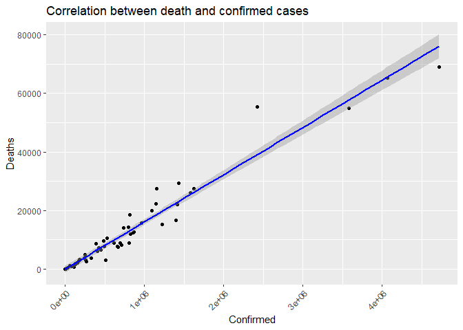
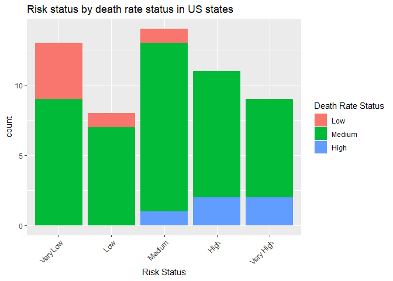

covid-vignette-api
================
Min-Jung Jung
9/20/2021

-   [Reqired pakages](#reqired-pakages)
-   [JSON Data](#json-data)
-   [Packages used for reading JSON data in
    R](#packages-used-for-reading-json-data-in-r)
-   [Contact the Covid Data API](#contact-the-covid-data-api)
    -   [country name](#country-name)
    -   [`Confirmed Cases by different contries` from March 1st, 2020 to
        September 21st,
        2021](#confirmed-cases-by-different-contries-from-march-1st-2020-to-september-21st-2021)
    -   [`Death Cases by different contries` from March 1st, 2020 to
        September 21st,
        2021](#death-cases-by-different-contries-from-march-1st-2020-to-september-21st-2021)
    -   [`Recovered Cases by different contries` from March 1st, 2020 to
        September 21st,
        2021](#recovered-cases-by-different-contries-from-march-1st-2020-to-september-21st-2021)
    -   [`U.S.A cases by state`](#usa-cases-by-state)
    -   [`Summary cases by Countries`](#summary-cases-by-countries)
-   [Exploratory Data Analysis](#exploratory-data-analysis)
    -   [Contigency Tables/ Numerical
        Summaries](#contigency-tables-numerical-summaries)
    -   [Graphical Summaries](#graphical-summaries)
-   [Bar plot](#bar-plot)
-   [Histogram](#histogram)

This project is to create a vignette about contacting an API. I created
functions to download data via interacting endpoints. I will show this
process with COVID API.

# Reqired pakages

I used following packages to set up function, data manipulation, and
analysis with COVID API:

-   `knitr`: to generate pretty tables of date using the `kable()`
    function.  
-   `tidyverse`: to manipulate data, generate plots (via `ggplot2`), and
    to use piping/chaining.
-   `rmarkdown`: to knit output files manually using the `render()`
    function.  
-   `jsonlite`: to pull data from various endpoints of the Covid 19
    APIs.

# JSON Data

JSON, also known as [*Java Script Object
Notation*](https://www.json.org/json-en.html) is a text based format for
storing and/or transporting data. JSON is used across the internet and
databases because of its text based format for storing data. In
addition, JSON can represent 2D data, [hierarchical
data](https://en.wikipedia.org/wiki/Hierarchical_database_model), and
use key-value pairs.

Since JSON is a text based format, we need to load in R packages that
can handle the text based format.

# Packages used for reading JSON data in R

Here are R packages that can be used to work with JSON data:

-   `rjson`
-   `RJSONIO`
-   `jsonlite`

For this project, `rjson` and `jsonlite` is used.

Couple resources for understanding the functionality of `rjson` and
`jsonlite`:

1.  <https://cran.r-project.org/web/packages/rjson/rjson.pdf>

2.  <https://cran.r-project.org/web/packages/jsonlite/jsonlite.pdf>

# Contact the Covid Data API

To access the [Covid
Data](https://documenter.getpostman.com/view/10808728/SzS8rjbc), we need
to get a URL with the name of the table and attributes we want to pull
from it.

In addition, I wrote 6 more functions that take different endpoints.

\#Base url

``` r
base_url = "https://api.covid19api.com"
```

## country name

\#This function is to generate data.frame of country name and Slug.

``` r
country_Name <- function(){
  country <- GET("https://api.covid19api.com/countries")
  countrylist <- fromJSON(rawToChar(country$content))
  countrylist1 <- as_tibble(data.frame(Country = countrylist$Country, Slug = countrylist$Slug))
  return(countrylist1)
}

countryName <- country_Name()
countryName
```

    ## # A tibble: 248 x 2
    ##    Country                   Slug                     
    ##    <chr>                     <chr>                    
    ##  1 Poland                    poland                   
    ##  2 Comoros                   comoros                  
    ##  3 Djibouti                  djibouti                 
    ##  4 Turks and Caicos Islands  turks-and-caicos-islands 
    ##  5 Bulgaria                  bulgaria                 
    ##  6 Honduras                  honduras                 
    ##  7 San Marino                san-marino               
    ##  8 Niue                      niue                     
    ##  9 Tuvalu                    tuvalu                   
    ## 10 US Minor Outlying Islands us-minor-outlying-islands
    ## # ... with 238 more rows

## `Confirmed Cases by different contries` from March 1st, 2020 to September 21st, 2021

\#This function interacts with the `By Country Total` endpoint.

``` r
get_confirmed_cases <- function(country){
     if(country %in% countryName$Slug){
  full_url = paste0(base_url,"/total/country/",country,"/status/confirmed?from=2020-03-01T00:00:00Z&to=2021-09-30T00:00:00Z")
  confirmed_cases_text = content(GET(url=full_url),"text")
  confirmed_cases_json = fromJSON(confirmed_cases_text)
      covid_confirmed_cases <- confirmed_cases_json %>% select(Country, Cases, Status, Date) #%>% rename(ConfirmedCases =  Cases) 
  return(covid_confirmed_cases)
     }
        else {
      message <- paste("ERROR: Argument for country was not found in the Slug.", 
                       "Look up countryName to find the country you are looking for and use Slug.")
      stop(message)
    }
}
```

## `Death Cases by different contries` from March 1st, 2020 to September 21st, 2021

\#This function interacts with the `By Country Total` endpoint, but
modified the status as deaths.

``` r
get_deaths_cases <- function(country){
    if(country %in% countryName$Slug){
  full_url = paste0(base_url,"/total/country/",country,"/status/deaths?from=2020-03-01T00:00:00Z&to=2021-09-30T00:00:00Z")
  deaths_cases_text = content(GET(url=full_url),"text")
  deaths_cases_json = fromJSON(deaths_cases_text)
       covid_deaths_cases <- deaths_cases_json  %>% select(Country, Cases, Status, Date) #%>% rename(DeathsCases =  Cases) 
  return(covid_deaths_cases)
    }
        else {
      message <- paste("ERROR: Argument for country was not found in the Slug.", 
                       "Look up countryName to find the country you are looking for and use Slug.")
      stop(message)
    }
}
```

## `Recovered Cases by different contries` from March 1st, 2020 to September 21st, 2021

\#This function interacts with the `By Country Total` endpoint, but
modified the status as recovered.

``` r
get_recovered_cases <- function(country){
  if(country %in% countryName$Slug){
  full_url = paste0(base_url,"/total/country/", country,"/status/recovered?from=2020-03-01T00:00:00Z&to=2021-09-30T00:00:00Z")
  recovered_cases_text = content(GET(url=full_url),"text")
  recovered_cases_json = fromJSON(recovered_cases_text)
       covid_recovered_cases <- recovered_cases_json  %>% select(Country, Cases, Status, Date) #%>% rename(RecoveredCases =  Cases)
  return(covid_recovered_cases)
  }
      else {
      message <- paste("ERROR: Argument for country was not found in the Slug.", 
                       "Look up countryName to find the country you are looking for and use Slug.")
      stop(message)
    }
}
```

## `U.S.A cases by state`

\#This function interacts with the `Day One Live` endpoint. confrimed
cases only

``` r
get_cases_bystate <- function(state_name){
  state_name <- tolower(state_name)
  two_word_states = list("new hampshire", "new jersey", "new mexico","new york","north carolina","north dakota","south carolina","south dakota", "distrct of columbia", "puerto rico","Northern Mariana Islands", "Virgin Islands", "Rhode Island")
  if (state_name %in% two_word_states){
     full_url = paste0(base_url,"/dayone/country/united-states/status/confirmed/live?province=",state_name)
     URLencode(full_url)
    covid_cases_by_states_text = content(GET(url=URLencode(full_url)),"text")
    covid_cases_by_states_json = fromJSON(covid_cases_by_states_text)
  }
    else{
    full_url = paste0(base_url,"/dayone/country/united-states/status/confirmed/live?province=",state_name)
    covid_cases_by_states_text = content(GET(url=full_url),"text")
    covid_cases_by_states_json = fromJSON(covid_cases_by_states_text)
    }
     covid_cases_by_states <- covid_cases_by_states_json %>% select(Country, Province, City, Cases, Status, Date) 
  return(covid_cases_by_states)
}

nc_stateData <- get_cases_bystate("North Carolina")
```

## `Summary cases by Countries`

``` r
covid_summary_cases <- function(){
   full_url = paste0(base_url,"/summary")
   covid_summary_text <- content(GET(url=full_url),"text")
   covid_cases_summary_json <- fromJSON(covid_summary_text)
   covid_cases_summary1 <- data.frame(covid_cases_summary_json$Countries)  
   covid_cases_summary2 <- as_tibble(covid_cases_summary1)
   return(covid_cases_summary2)
}

covidSum <- covid_summary_cases()
```

``` r
get_live_cases <- function(country){
       if(country %in% countryName$Slug){
   full_url = paste0(base_url,"/live/country/",country,"/status/confirmed/date/2021-07-01T00:00:00Z")
    covid_cases_live_text = content(GET(url=full_url),"text")
    covid_cases_live_json = fromJSON(covid_cases_live_text)
      covid_state_cases <- covid_cases_live_json  %>% select(Country, Province, Confirmed, Deaths, Active, Date) #%>% rename(RecoveredCases =  Cases)
      return(covid_state_cases)
       }
      else {
      message <- paste("ERROR: Argument for country was not found in the Slug.", 
                       "Look up countryName to find the country you are looking for and use Slug.")
      stop(message)
    }
}

us_liveCases <- get_live_cases("united-states")
```

``` r
#As of July 28,2012 CDC covid case map
#https://twitter.com/cdcgov/status/1288609081696169990

#we can create a function that will manipulate our data to prepare for data summaries and visualization
newcolumnData <- function(dataset){
  dataset <- dataset %>% 
            mutate("DeathRate"= (Deaths/Confirmed)*100, 
                   "DeathRateStatus"= if_else(DeathRate > 10, "serious",
                                  if_else(DeathRate > 5, "high", 
                                          if_else(DeathRate >2, "medium", "low"))), 
                   "RiskStatus" = if_else(Confirmed > 174973, "Veryhigh",
                                    if_else(Confirmed > 82530, "high", 
                                      if_else(Confirmed > 39337, "mediumhigh", 
                                        if_else(Confirmed > 18725, "medium", 
                                          if_else(Confirmed > 6173, "mediumlow","low")))))
                                  )            
  return(dataset)
}
```

``` r
new_live_07_28_2021 <- us_liveCases %>% filter(Date == "2021-07-28T00:00:00Z")

newcolumnData1 <- newcolumnData(new_live_07_28_2021) %>% as_tibble()
newcolumnData1
```

    ## # A tibble: 55 x 9
    ##    Country                  Province             Confirmed Deaths  Active Date                 DeathRate DeathRateStatus RiskStatus
    ##    <chr>                    <chr>                    <int>  <int>   <int> <chr>                    <dbl> <chr>           <chr>     
    ##  1 United States of America Mississippi             338079   7523  330556 2021-07-28T00:00:00Z      2.23 medium          Veryhigh  
    ##  2 United States of America Vermont                  24760    259   24501 2021-07-28T00:00:00Z      1.05 low             medium    
    ##  3 United States of America North Dakota            111331   1569  109762 2021-07-28T00:00:00Z      1.41 low             high      
    ##  4 United States of America South Carolina          611594   9883  601711 2021-07-28T00:00:00Z      1.62 low             Veryhigh  
    ##  5 United States of America Minnesota               610839   7749  603090 2021-07-28T00:00:00Z      1.27 low             Veryhigh  
    ##  6 United States of America New Jersey             1035027  26586 1008441 2021-07-28T00:00:00Z      2.57 medium          Veryhigh  
    ##  7 United States of America South Dakota            124960   2043  122917 2021-07-28T00:00:00Z      1.63 low             high      
    ##  8 United States of America Washington              470332   6096  464236 2021-07-28T00:00:00Z      1.30 low             Veryhigh  
    ##  9 United States of America Massachusetts           717284  18065  699219 2021-07-28T00:00:00Z      2.52 medium          Veryhigh  
    ## 10 United States of America District of Columbia     50228   1147   49081 2021-07-28T00:00:00Z      2.28 medium          mediumhigh
    ## # ... with 45 more rows

``` r
#https://ourworldindata.org/grapher/biweekly-confirmed-covid-19-cases
#we can create a function that will manipulate our data to prepare for data summaries and visualization
newAddData_state <- function(dataset){
  dataset1 <- dataset %>% 
            mutate("TotalDeathRate"= (TotalDeaths/TotalConfirmed)*100, 
                   "TotalDeathRateStatus"= if_else(TotalDeathRate > 10, "serious",
                                  if_else(TotalDeathRate > 5, "high", 
                                          if_else(TotalDeathRate >2, "medium", "low"))), 
                   "Active" = (TotalConfirmed-TotalDeaths), 
                   "RiskStatus" = if_else(TotalConfirmed > 100000, "Veryhigh",
                                    if_else(TotalConfirmed > 50000, "high", 
                                      if_else(TotalConfirmed > 10000, "mediumhigh", 
                                        if_else(TotalConfirmed > 1000, "medium", 
                                          if_else(TotalConfirmed > 100, "mediumlow","low")))))
            )

  return(dataset1)
}
```

``` r
#countryName <- country_Name()

indiaConfirmed <- get_confirmed_cases("india")

usConfirmed <- get_confirmed_cases("united-states")
brazilConfirmed <- get_confirmed_cases("brazil")
ukConfirmed <- get_confirmed_cases("united-kingdom")
russiaConfirmed <- get_confirmed_cases("russia")

indiaDeaths <- get_deaths_cases("india")

usDeaths <- get_deaths_cases("united-states") 

inRecovered <- get_recovered_cases("india")
usRecovered <- get_recovered_cases("united-states")

#stateCases <- get_cases_bystate("North Carolina")

#covidSummary <- covid_summary_cases()

#us_liveCase <- get_live_cases("united-states")

in_liveCase <- get_live_cases("india") 

newCovidSummary <- newAddData_state(covidSum)
```

# Exploratory Data Analysis

## Contigency Tables/ Numerical Summaries

``` r
# combining three datasets

#confirm_subset <- usConfirmed %>% select(Country, Cases,Status, Date)
#death_subset <- usDeaths %>% select(Country, Cases,Status)
#recover_subset <- usRecovered %>% select(Country, Cases,Status) 
five_confirm <- rbind(usConfirmed, brazilConfirmed, indiaConfirmed, ukConfirmed, russiaConfirmed)


five_com1 <- five_confirm %>% filter(Date == "2021-09-30T00:00:00Z")
five_com1
```

    ##                    Country    Cases    Status                 Date
    ## 1 United States of America 43460343 confirmed 2021-09-30T00:00:00Z
    ## 2                   Brazil 21427073 confirmed 2021-09-30T00:00:00Z
    ## 3                    India 33766707 confirmed 2021-09-30T00:00:00Z
    ## 4           United Kingdom  7843887 confirmed 2021-09-30T00:00:00Z
    ## 5       Russian Federation  7401104 confirmed 2021-09-30T00:00:00Z

``` r
five_confirm_table <- table(five_com1$Country)
five_confirm_table
```

    ## 
    ##                   Brazil                    India       Russian Federation           United Kingdom United States of America 
    ##                        1                        1                        1                        1                        1

``` r
# Contingency table

#Worldwide

TotalDeathRate_status <- table(newCovidSummary$TotalDeathRateStatus) 

TotalDeathRate_status1 <- TotalDeathRate_status[c(4,1,3,2)]

kable(TotalDeathRate_status1) #col.names = c("Total DeathRate Status", "Count"))
```

| Var1    | Freq |
|:--------|-----:|
| serious |    2 |
| high    |    8 |
| medium  |   64 |
| low     |  118 |

``` r
TotalRisk_status <- table(newCovidSummary$RiskStatus) 

TotalRisk_status1 <- TotalRisk_status[c(5,1,4,3,2)]

kable(TotalRisk_status1) #col.names = c("Risk Status", "Count"))
```

| Var1       | Freq |
|:-----------|-----:|
| Veryhigh   |  112 |
| high       |   12 |
| mediumhigh |   38 |
| medium     |   22 |
| low        |    8 |

``` r
# Contingency table 
#United Status
usDeathRate_status <- table(newcolumnData1$RiskStatus, newcolumnData1$DeathRateStatus)
kable(usDeathRate_status)
```

|            | low | medium |
|:-----------|----:|-------:|
| high       |   8 |      0 |
| low        |   2 |      0 |
| medium     |   1 |      0 |
| mediumhigh |   4 |      1 |
| mediumlow  |   1 |      0 |
| Veryhigh   |  28 |     10 |

``` r
Summarydata_World <- newCovidSummary %>% group_by(RiskStatus) %>% summarise(Avg = mean(TotalConfirmed), Med = median((TotalConfirmed), IQR = IQR(TotalConfirmed), Var = var(TotalConfirmed)) )

Summarydata_World
```

    ## # A tibble: 5 x 3
    ##   RiskStatus        Avg     Med
    ##   <chr>           <dbl>   <dbl>
    ## 1 high         70952.    67701 
    ## 2 low              8.25      4 
    ## 3 medium        5263.     5139 
    ## 4 mediumhigh   23387.    21058.
    ## 5 Veryhigh   2073425.   507360.

``` r
newCovidSummary %>% group_by(TotalDeathRateStatus) %>% summarise(Avg = mean(TotalConfirmed), Med = median(TotalConfirmed))
```

    ## # A tibble: 4 x 3
    ##   TotalDeathRateStatus      Avg     Med
    ##   <chr>                   <dbl>   <dbl>
    ## 1 high                  846671. 172156.
    ## 2 low                  1233025. 158949 
    ## 3 medium               1278127. 219596.
    ## 4 serious                 4572.   4572.

``` r
newCovidSummary %>% group_by(TotalDeathRateStatus) %>% summarise(Avg = mean(TotalDeathRate), Med = median(TotalDeathRate), Var = var(TotalDeathRate), IQR = IQR(TotalDeathRate))
```

    ## # A tibble: 4 x 5
    ##   TotalDeathRateStatus   Avg   Med    Var   IQR
    ##   <chr>                <dbl> <dbl>  <dbl> <dbl>
    ## 1 high                  6.71  6.48  1.76  1.92 
    ## 2 low                   1.06  1.15  0.281 0.807
    ## 3 medium                2.89  2.75  0.498 1.12 
    ## 4 serious              22.0  22.0  18.2   3.01

``` r
cor(newCovidSummary$TotalConfirmed, newCovidSummary$TotalDeaths)
```

    ## [1] 0.9308892

``` r
# kable(stateCases)

# kable(confirmed)
# kable(deaths)
# kable(recovered)
# kable(caseSum)
# kable(liveCase)
```

## Graphical Summaries

# Bar plot

top\_state\_09\_30\_2021 &lt;- country\_liveCase %&gt;% filter(Date ==
“2021-09-30T00:00:00Z”) %&gt;% arrange(desc(Active))
top\_10\_state\_09\_30\_2021 &lt;- top\_state\_09\_30\_2021\[1:10,\]

ggplot(data=top\_10\_state\_09\_30\_2021, aes(x=Province, y=Active)) +
geom\_bar(stat=“identity”, fill=“green”)

geom\_text(aes(label=Cases), vjust=1.6, color=“black”, size=3.5)+
theme\_minimal()+ ggtitle(“Top 10 North Carolina Cities Confirmed Covid
Cases on September 23rd, 2021.”)

``` r
ggplot(data=newCovidSummary, aes(x=RiskStatus)) +
  geom_bar(aes(fill = as.factor(TotalDeathRateStatus))) + labs(x = " Risk Status", title = "Bar plot of Risk status in 192 countries") + theme(axis.text.x = element_text(angle = 45, hjust=1)) + scale_fill_discrete(name = "DeathRate Status")
```

<!-- -->

``` r
ggplot(data=newcolumnData1, aes(x=RiskStatus)) +
  geom_bar(aes(fill = as.factor(DeathRateStatus))) + labs(x = " Risk Status", title = "Bar plot of Risk status in 52 states in the U.S") + theme(axis.text.x = element_text(angle = 45, hjust=1)) + scale_fill_discrete(name = "DeathRate Status")
```

<!-- -->

``` r
# Bar plot
top_country<- newCovidSummary %>% arrange(desc(TotalConfirmed))
top_10_country <- top_country[1:10,]

ggplot(data=top_10_country, aes(x=Country, y=TotalConfirmed)) +
  geom_bar(stat="identity", fill="yellowgreen") + geom_text(aes(label=TotalConfirmed), vjust=1.6, color="black", size=3.5) + theme(axis.text.x = element_text(angle = 45, hjust=1)) + labs(x = "Country", title = "Top 10 countries on Total Confirmed case")
```

<!-- -->

``` r
# Bar plot
top_country<- newCovidSummary %>% arrange(desc(NewDeaths))
top_10_country <- top_country[1:10,]

ggplot(data=top_10_country, aes(x=Country, y=NewDeaths)) +
  geom_bar(stat="identity", fill="orange") +
  labs(x = "Country", title = "Top 10 countries on newDeath case") + geom_text(aes(label=NewDeaths), vjust=1.6, color="black", size=3.5) +
  theme(axis.text.x = element_text(angle = 45, hjust=1))
```

<!-- -->

``` r
# Bar plot
top_city_09_30_2021 <- nc_stateData %>% filter(Date == "2021-09-30T00:00:00Z") %>% arrange(desc(Cases))
top_10_city_09_30_2021 <- top_city_09_30_2021[1:10,]

ggplot(data=top_10_city_09_30_2021, aes(x=City, y=Cases)) +
  geom_bar(stat="identity", fill="steelblue") + geom_text(aes(label=Cases), vjust=1.6, color="white", size=3.5) +
  theme(axis.text.x = element_text(angle = 45, hjust=1)) + labs(x = "NC CITY", title = "Top 10 City in North Carolina on Confirmed case")
```

<!-- -->

geom\_text(aes(label=Cases), vjust=1.6, color=“white”, size=3.5)+
stat=“identity”, theme\_minimal()

-   ggtitle(“Top 10 North Carolina Cities Confirmed Covid Cases on
    September 30, 2020.”) stateCases

# Histogram

``` r
top_country<- newCovidSummary %>% arrange(desc(TotalConfirmed))
top_20_country <- top_country[1:20,]
```

``` r
ggplot(newCovidSummary, aes(x=NewDeaths)) + geom_histogram(color="orange2", fill="red", size = 1, binwidth=100)+geom_vline(aes(xintercept=mean(NewDeaths)),color="blue", linetype="dashed", size=1) + labs(x = "New Death Case", title = "Histogram of new death cases today: 192 countries")
```

<!-- -->

``` r
#Blue line is the mean line.
```

``` r
# Histogram
ggplot(top_city_09_30_2021, aes(x=Cases)) + geom_histogram(color="darkblue",fill="red",binwidth=1000)+geom_vline(aes(xintercept=mean(Cases)),color="blue", linetype="dashed", size=1)+ggtitle("Histogram of Confirmed Cases in North Carolina Cities on September 30, 2021")
```

<!-- -->

``` r
#Blue line is the mean line.
```

``` r
# Box plot
us_subset <- usConfirmed %>% select(Country, Cases,Status)
in_subset <- indiaConfirmed %>% select(Country, Cases,Status)
us_in <- rbind(us_subset, in_subset)

boxplot(Cases~Country,data=us_in, main="United States and India Covid Cases Comparison using Box plot",xlab="Country", ylab="Cases",col=(c("gold","darkgreen")))
```

<!-- -->

``` r
uscaselive <- us_liveCases  %>% 
  select(Country, Province, Active, Date) 
incaselive <- in_liveCase %>%
  select(Country, Province, Active, Date)
uslive_inlive <- rbind(uscaselive, incaselive )

boxplot(Active~Country,data=uslive_inlive, main="United States and India Covid live Cases Comparison using Box plot",xlab="Country", ylab="Active",col=(c("gold","darkgreen")))
```

<!-- -->

``` r
# Box plot
Summary_world <- newCovidSummary %>% select(Country, TotalConfirmed, RiskStatus)

boxplot(TotalConfirmed~RiskStatus,data=Summary_world, main="World Covid Cases Box plot",
   xlab="RiskStatus", ylab="TotalConfirmed",col=(c("darkgreen")))
```

<!-- -->

``` r
# Scatter plot
covid_cases_by_states2 <- nc_stateData

covid_cases_by_states2 <- aggregate(list(Cases=covid_cases_by_states2$Cases),
                              by=list(Date=cut(as.POSIXct(covid_cases_by_states2$Date),"month")),sum)

ggplot(data = covid_cases_by_states2, aes(x = Date, y = Cases))+
  geom_point() + theme(axis.text.x = element_text(angle = 45,hjust=1)) + 
  ggtitle("Scatterplot of Confirmed Covid Cases in North Carolina Cities from November 2020 to September 2021") 
```

<!-- -->

``` r
# Scatter plot country summary
ggplot(data = newCovidSummary, aes(x = TotalConfirmed, y = TotalDeaths))+
  geom_point() + theme(axis.text.x = element_text(angle = 45,hjust=1)) + 
  ggtitle("Scatterplot of Confirmed Covid Cases by Death Covid Cases") + geom_smooth(method = lm, color = "blue")  
```

    ## `geom_smooth()` using formula 'y ~ x'

<!-- -->
