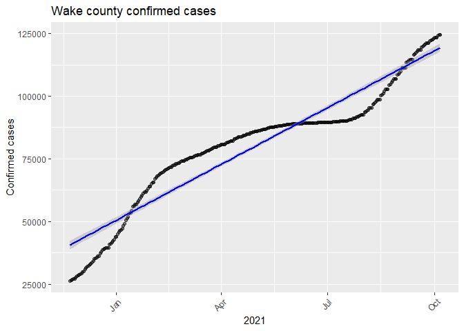
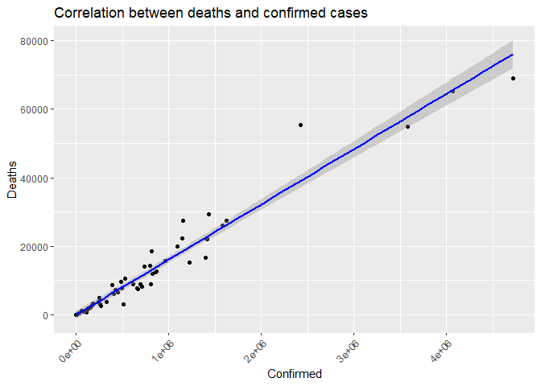

covid-vignette-api
================
Min-Jung Jung
10/01/2021

-   [Reqired pakages](#reqired-pakages)
-   [Functions to contact the Covid19 Data
    API](#functions-to-contact-the-covid19-data-api)
    -   [Base url](#base-url)
    -   [`countryName`](#countryname)
    -   [`covidSummary`](#covidsummary)
    -   [`confirmedCases`](#confirmedcases)
    -   [`deathCases`](#deathcases)
    -   [`recoveredCases`](#recoveredcases)
    -   [`confirmedCasesState`](#confirmedcasesstate)
    -   [`deathsCasesState`](#deathscasesstate)
    -   [`liveConfirmedCases`](#liveconfirmedcases)
    -   [`dateManipulation`](#datemanipulation)
    -   [`riskStatusManipulation`](#riskstatusmanipulation)
-   [Exploratory Data Analysis](#exploratory-data-analysis)
-   [Wrap-Up](#wrap-up)

This project is to create a vignette about contacting an API. I created
functions to download data via interacting endpoints. I will show this
process with COVID API.

# Reqired pakages

I used following packages to set up function, data manipulation, and
analysis with COVID API:

-   [`ggplot2`](https://ggplot2.tidyverse.org/): for creating graphics.
-   [`tidyverse`](https://www.tidyverse.org/): for data manipulation and
    visualization.
-   [`jsonlite`](https://cran.r-project.org/web/packages/jsonlite/): to
    pull data from the Covid 19 APIs.
-   [`knitr`](https://cran.r-project.org/web/packages/knitr/index.html):
    to generate tables.  
-   [`httr`](https://cran.r-project.org/web/packages/httr/vignettes/quickstart.html):
    to map closely to the underlying http protocol.
-   [`lubridate`](https://cran.r-project.org/web/packages/lubridate/index.html):
    for date conversion.

# Functions to contact the Covid19 Data API

To access the [Covid
Data](https://documenter.getpostman.com/view/10808728/SzS8rjbc), we need
to get a URL with the name of the table and attributes we want to pull
from it.

Here is the base URL that I am going to use throughout defining the
functions.

## Base url

``` r
base_url = "https://api.covid19api.com"
```

I wrote several functions to contact the Covid19 API via different
endpoints.

## `countryName`

This function is to generate `data.frame` of country name and Slug. In
order to import different countries’ datasets, I needed to type the
correct country name in URL. COVID19 AIP uses Slug instead of country
name. Therefore, I can use the this table to find the correct name of
the country for the URL.

``` r
countryName <- function(){
  full_url = paste0(base_url,"/countries")
  country <- content(GET(url=full_url),"text")
  countrylist <- fromJSON(country)
  countrylist1 <- as_tibble(data.frame(Country = countrylist$Country,
                                       Slug = countrylist$Slug))
  return(countrylist1)
}
# This table will guide users to find specific country and slug.
countryName <- countryName()
```

## `covidSummary`

This function interacts with the `Summary` endpoint. It returned a
`list` of 5 variables showing information such as the world total of
confirmed case numbers and the world total death numbers. One of the
variables was the country, which I brought out and returned a
`data.frame` with the most recent data of confirmed cases, death cases,
and recovered cases for each country.

``` r
covidSummary <- function(){
   full_url = paste0(base_url,"/summary")
   covid_summary_text <- content(GET(url=full_url),"text")
   covid_cases_summary_json <- fromJSON(covid_summary_text)
   # Select Country variable from json output. 
   covid_cases_summary1 <- data.frame(covid_cases_summary_json$Countries) 
   return(covid_cases_summary1)
}
```

## `confirmedCases`

This function interacts with the `By Country Total` endpoint. This
function returns a `data.frame` of daily confirmed case numbers by a
specific country during the specified dates (7/01/2020 - 09/30/2021).
Users can select the country to get a different country’s dataset. I
chose only 4 variables to display, which I am going to mainly use. Users
can use the countryName table to find countries to look up.

``` r
confirmedCases <- function(country){
  # If you type in country name as slug, it will return the data correctly. 
  if(country %in% countryName$Slug){
    full_url = paste0(base_url,"/total/country/",country,
                      "/status/confirmed?from=2020-07-01T00:00:00Z&to=2021-09-30T00:00:00Z")
    confirmed_cases_text = content(GET(url=full_url),"text")
    confirmed_cases_json = fromJSON(confirmed_cases_text)
  # I choose 4 columns to display.
    covid_confirmed_cases <- confirmed_cases_json %>% 
                           select(Country, Cases, Status, Date)  
    return(covid_confirmed_cases)
  }
  # Otherwise, it will throw an error.
  else {
    message <- paste("ERROR: Argument for country was not found in the Slug.", 
                    "Look up countryName to find the country you are looking",
                    "for and use Slug.")
    stop(message)
  }
}

# 1.User(s) can select different countries.
confirmed_cases <- confirmedCases("united-states")
```

## `deathCases`

This function interacts with the `By Country Total` endpoint with
modification of status changed to deaths. This function returns a
`data.frame` of daily deaths cases number by specific country during the
specified dates (7/01/2020 - 09/30/2021). Users can select country to
get different country dataset. I choose only 4 variables to display,
which I am going to mainly use. Users can use the countryName table to
find countries you want to look up.

``` r
deathCases <- function(country){
  # If you type in country name as slug, it will return the data correctly. 
  if(country %in% countryName$Slug){
    full_url = paste0(base_url,"/total/country/",country,
                      "/status/deaths?from=2020-07-01T00:00:00Z&to=2021-09-30T00:00:00Z")
    deaths_cases_text = content(GET(url=full_url),"text")
    deaths_cases_json = fromJSON(deaths_cases_text)
    covid_deaths_cases <- deaths_cases_json  %>% 
                            select(Country, Cases, Status, Date) 
    return(covid_deaths_cases)
  }
  # Otherwise, it will throw an error.
  else {
    message <- paste("ERROR: Argument for country was not found in the Slug.", 
                     "Look up countryName to find the country you are looking",
                     "for and use Slug.")
    stop(message)
  }
}

# 2. User(s) can select different countries.
death_cases <- deathCases("united-states")
```

## `recoveredCases`

This function interacts with the `By Country Total` endpoint with
modification of status changed to recovered.This function returns a
`data.frame` of daily recovered case numbers by specific countries
during the specified dates (7/01/2020 - 09/30/2021). Users can select
the country to get different countries’ datasets. I chose only 4
variables to display, which I am going to primarily use. Users can use
the countryName table to find countries to look up.

``` r
recoveredCases <- function(country){
  # If you type in country name as slug, it will return the data correctly. 
  if(country %in% countryName$Slug){
    full_url = paste0(base_url,"/total/country/", country,
                      "/status/recovered?from=2020-07-01T00:00:00Z&to=2021-09-30T00:00:00Z")
    recovered_cases_text = content(GET(url=full_url),"text")
    recovered_cases_json = fromJSON(recovered_cases_text)
    covid_recovered_cases <- recovered_cases_json  %>% 
                             select(Country, Cases, Status, Date)
    return(covid_recovered_cases)
  }
  # Otherwise, it will throw an error.
  else {
      message <- paste("ERROR: Argument for country was not found in the Slug.", 
                       "Look up countryName to find the country you are looking",
                       "for and use Slug.")
      stop(message)
  }
}

# 3.User(s) can select different countries.
recovered_cases <- recoveredCases("united-states")
```

``` r
# Data manipulation

# 4.I created one dataset with two data.frame datasets by row merging.
us_all_cases <- rbind(confirmed_cases, death_cases)
```

## `confirmedCasesState`

This function interacts with the `Day One Live` endpoint with
modification of status changed to confirmed. This function returns a
`data.frame` of daily confirmed case numbers by specific states from
11/22/2020 to present. Users can select state names (encompassing states
and other locations) to get different states’ datasets. I chose only 6
variables to display, the ones I will mainly use.

``` r
confirmedCasesState <- function(state_name){
  # There are state names with one word and more than two words. 
  # For a one-word state name, I set it up to be lower case.  
  state_name <- tolower(state_name)
  two_word_states = list("new hampshire", "new jersey", "new mexico",
                         "new york","north carolina","north dakota",
                         "south carolina","south dakota", 
                         "distrct of columbia", "puerto rico",
                         "Northern Mariana Islands", "Virgin Islands", 
                         "Rhode Island")
  # For state names with two or more words, the user will type the state name with spaces.   
  # I set it the function to insert %20 automatically using URLendoe().
  if (state_name %in% two_word_states){
    full_url = paste0(base_url,
                      "/dayone/country/united-states/status/confirmed/live?province=",
                      state_name)
  # This function will insert %20 in the space between two words or more state name.
    URLencode(full_url)
    covid_cases_by_states_text = content(GET(url=URLencode(full_url)),"text")
    covid_cases_by_states_json = fromJSON(covid_cases_by_states_text)
  }
  # Otherwise, one word state name will work. 
  else{
    full_url = paste0(base_url,
                      "/dayone/country/united-states/status/confirmed/live?province=",
                      state_name)
    covid_cases_by_states_text = content(GET(url=full_url),"text")
    covid_cases_by_states_json = fromJSON(covid_cases_by_states_text)
  }
    covid_cases_by_states <- covid_cases_by_states_json %>% 
                           select(Country, Province, City, Cases, Status, Date) 
    return(covid_cases_by_states)
}

# 5.User(s) can select different state names.
nc_confirmedData <- confirmedCasesState("North Carolina")

# 5-1.Last row was the sum of all confirmed case numbers of 55 states.
# I deleted the last row to keep the state level data only.
nc_confirmedData1 <- nc_confirmedData %>% filter(row_number() <= n()-1)
```

## `deathsCasesState`

This function interacts with the `Day One Live` endpoint with
modification of status changed to deaths. This function returns a
`data.frame` of daily deaths case numbers by specific states from
11/22/2020 to present. Users can select state name to get different
state datasets. I chose only 6 variables to display, the ones I will
mainly use.

``` r
deathsCasesState <- function(state_name){
  # There are state names with one word and with two or more words. 
  # For one word state name, I set it up to be lower case.  
  state_name <- tolower(state_name)
  # For two or more words state name, user will type the names with spaces. 
  # I set it the function to insert %20 automatically using URLendoe().
  two_word_states = list("new hampshire", "new jersey", "new mexico",
                         "new york","north carolina","north dakota",
                         "south carolina","south dakota", 
                         "distrct of columbia", "puerto rico",
                         "Northern Mariana Islands", "Virgin Islands", 
                         "Rhode Island")

  if (state_name %in% two_word_states){
     full_url = paste0(base_url,
                       "/dayone/country/united-states/status/deaths/live?province=",
                       state_name)
     URLencode(full_url)
    covid_cases_by_states_text = content(GET(url=URLencode(full_url)),"text")
    covid_cases_by_states_json = fromJSON(covid_cases_by_states_text)
  }
    else{
    full_url = paste0(base_url,
                      "/dayone/country/united-states/status/deaths/live?province=",
                      state_name)
    covid_cases_by_states_text = content(GET(url=full_url),"text")
    covid_cases_by_states_json = fromJSON(covid_cases_by_states_text)
    }
     covid_cases_by_states <- covid_cases_by_states_json %>% 
                                select(Country, Province, City, Cases, Status, Date) 
    return(covid_cases_by_states)
}

# 6.User(s) can select different state names.
nc_deathData <- deathsCasesState("North Carolina")

# 6-1.Last row was the sum of all confirmed case number of 55 states.
# I deleted the last row to keep the state level data only.
nc_deathData1 <- nc_deathData %>% filter(row_number() <= n()-1)
```

``` r
# Data loading

# 7.I created this dataset with two data.frame datasets by row merging.
nc_all_cases <- rbind(nc_confirmedData1, nc_deathData1)
```

## `liveConfirmedCases`

This function interacts with the `Live By Country And Status After Date`
endpoint of modification of date as 07/01/2021. This function returns a
`data.frame` of daily confirmed cases of specified country from a set
date to present. Users can select country name to get different country
datasets. I chose only 6 variables to display, the ones I will mainly
use.

``` r
liveConfirmedCases <- function(country){
  # If you type in country name as slug, it will return the data correctly. 
  if(country %in% countryName$Slug){
    full_url = paste0(base_url,"/live/country/", country,
                      "/status/confirmed/date/2021-07-01T00:00:00Z")
    covid_cases_live_text = content(GET(url=full_url),"text")
    covid_cases_live_json = fromJSON(covid_cases_live_text)
    covid_state_cases <- covid_cases_live_json %>% 
                         select(Country, Province, Confirmed, Deaths, Active, Date) 
    return(covid_state_cases)
  }
  # Otherwise, it will throw an error.
  else {
      message <- paste("ERROR: Argument for country was not found in the Slug.", 
                       "Look up countryName to find the country you are looking",
                       "for and use Slug.")
      stop(message)
  }
}

# 8.User(s) can select different countries.
us_liveCases <- liveConfirmedCases("united-states")
```

## `dateManipulation`

This function helps to manipulate the date column(character format) to
date formation and creates one variable with time span with every
quarter.

``` r
dateManipulation <- function(dataset){
  dataset$Date <- as.Date(dataset$Date)
  dataset <- dataset %>% 
    mutate("Time_span" = if_else(Date <= as.Date("2020-09-30"), "2020Q3",
                          if_else(Date <= as.Date("2020-12-31"), "2020Q4",
                           if_else(Date <= as.Date("2021-03-31"), "2021Q1", 
                            if_else(Date <= as.Date("2021-06-30"), "2021Q2", 
                             if_else(Date <=   as.Date("2021-09-30"),"2021Q3", "2021Q4")))))
    )
  dataset$Time_span <- as.factor(dataset$Time_span)
  return(dataset)
}              

# 9.data manipulation using `dateManipulation` function

# confirmed case data
confirmed_month <- dateManipulation(confirmed_cases)

# 10.US all cases (confirmed and death) data
us_all_cases_month <- dateManipulation(us_all_cases)

# 11.NC all cases (confirmed and death) data
nc_all_cases_month <- dateManipulation(nc_all_cases)
```

## `riskStatusManipulation`

This function helps to manipulate data with creating three variables.
Death rate, death rate status, and risk status are the three variables.
US [death rates](https://coronavirus.jhu.edu/data/mortality) is about
1.6 %. I wanted to check on how US states display death rates. Also, I
created a Death Rate status variable based on the death rate and divided
it into 4 categories. Lastly, I created a risk status variable based on
the confirmed case numbers at the state level.

``` r
#I created this function for data summaries and visualization.
riskStatusManipulation <- function(dataset){
  dataset <- dataset %>% 
    mutate("DeathRate"= (Deaths/Confirmed)*100, 
           "DeathRateStatus"= if_else(DeathRate > 2, "4.High",
                               if_else(DeathRate > 1, "3.Medium", 
                                if_else(DeathRate >0.5, "2.Low", "1.Very Low"))
                               ), 
           "RiskStatus" = if_else(Confirmed > 1250000, "5.Very High",
                           if_else(Confirmed > 750000, "4.High", 
                            if_else(Confirmed > 350000, "3.Medium", 
                             if_else(Confirmed > 150000, "2.Low", "1.Very Low"))))
    )            
  return(dataset)
}
```

``` r
# I filtered date to 10/01/2021 to only view the date's information.
us_newlive <- us_liveCases %>% filter(Date == "2021-10-01T00:00:00Z")

# 12.US live data using riskStatusManipulation function.
us_newlive_risk <- riskStatusManipulation(us_newlive) %>% 
                    as_tibble()
us_live_risk <- dateManipulation(us_newlive_risk)
```

# Exploratory Data Analysis

I pulled the data using functions I created interacting with endpoints.
After using manipulation functions and merging different datasets, I
mainly selected four data sets for the exploratory analysis.

-   `us_live_risk`: Confirmed and death cases by 55 states on
    10/01/2021.
-   `nc_all_cases_month`: Confirmed cases in 101 NC Counties from
    11/22/2020 to present.
-   `confirmed_month`: US confirmed cases from 07/01/2020 to 09/30/2021.
-   `us_all_cases_month`: US confirmed and death cases merged from
    07/01/2020 to 09/30/2021.

Let’s talk about the Covid-19 pandemic in the U.S and how confirmed
cases and death cases change over time. In order to see the change
patterns of both confirmed and death cases, I created a scatterplot by
date.

``` r
# Scatter plot for US
ggplot(data = us_all_cases_month, aes(x = Date, 
                                      y = Cases)) +
  geom_point(alpha=0.50) + 
  facet_wrap(~ Status) + 
  theme(axis.text.x = element_text(angle = 45,hjust=1)) + 
  ggtitle("Scatterplot of US confirmed cases") + 
  geom_smooth(method = lm, color = "blue")  
```

<!-- -->

In the confirmed scatter plot, we see that the cases increased rapidly
at the end of 2020 and beginning of 2021, and then it slowed down.
However, it started rapidly increasing again since August 2021. It may
have been related to mask policies, vaccination, or seasonal changes,
but the fact is that covid cases are increasing. Compared to confirmed
cases, deaths seem to be increasing slowly in the plot. However, it is
not a really good comparison because the y axis scale is fitted to the
confirmed cases. I will need to look at the confirmed plots and death
plots separately.

``` r
us_all_cases_month_wide <- us_all_cases_month %>%
                            pivot_wider(names_from = "Status",
                                        values_from = "Cases")

ggplot(data = us_all_cases_month_wide, aes(x = Date, 
                                           y = deaths)) +
  geom_point(alpha=0.50) + 
  theme(axis.text.x = element_text(angle = 45,hjust=1)) +
  ggtitle("Scatterplot of  US deaths cases") + 
  geom_smooth(method = lm, color = "blue")  
```

<!-- -->

Bases on US death cases scatter plot, deaths cases are increasing over
time, but not as fast as confirmed cases. It is good to see this pattern
that even though many people are having a covid, they are less likely to
die.

Now, I wanted to see how the confirmed cases are increasing by every
quarter using side by side box plots.

``` r
# Box plot
us_confirmed_states<- us_all_cases_month %>% 
                        filter(Status == "confirmed") 
#Box plot for confirmed cases by time line.
ggplot(us_confirmed_states, aes(x = Time_span, 
                                y= Cases, 
                                fill=Time_span)) +
  geom_boxplot() +
  scale_x_discrete("Time Span") +
  ggtitle("US Covid confirmed cases comparison by time span") +
  scale_fill_brewer(palette="Dark2") +
  scale_fill_discrete(name = "Time Span", 
                      labels = c("2020Q3" = "2020 Q3", 
                                 "2020Q4" = "2020 Q4", 
                                 "2021Q1" = "2021 Q1", 
                                 "2021Q2" = "2021 Q2", 
                                 "2021Q3" = "2021 Q3")
                                ) 
```

<!-- -->

Similar to the scatter plot of confirmed cases, the median line of 2021
quarter 1 is a lot higher than 2020 quarter 4. Also, the interquartile
range of 2020 quarter 4 is big, which means that during 2020 quarter 4,
case numbers rapidly increased.

Now, let’s look at how death cases are increasing by quarter.

``` r
#Setting the data set with only deaths status
us_deaths_states<- us_all_cases_month %>% 
                    filter(Status == "deaths") 
#Box plot for death cases by timeline
ggplot(us_deaths_states, aes(x = Time_span, 
                                y= Cases, 
                                fill=Time_span)
                            ) +
  geom_boxplot() +
  scale_x_discrete("Time Span") +
  ggtitle("US Covid deaths cases comparison by time span") +
  scale_fill_brewer(palette="BuPu") +
  scale_fill_discrete(name = "Time Span", 
                      labels = c("2020Q3" = "2020 Q3", 
                                 "2020Q4" = "2020 Q4", 
                                 "2021Q1" = "2021 Q1", 
                                 "2021Q2" = "2021 Q2", 
                                 "2021Q3" = "2021 Q3")
                                ) 
```

<!-- -->

I also created side by side box plots for the death cases, and death
cases increased rapidly between the last quarter of 2020 and the first
quarter of 2021.

Now, let’s move down to the state level, beginning with discussing some
summary statistics.

``` r
# Summary table for US states
us_bystate <- us_live_risk %>% 
                summarise(Min = min(Confirmed), 
                          Median = median(Confirmed),
                          Average = mean(Confirmed),
                          Max = max(Confirmed),
                          IQR = IQR(Confirmed)
                          )

# Display a table of the summary stats.
kable(us_bystate, caption = " Summary Stat by US States")
```

| Min | Median |  Average |     Max |    IQR |
|----:|-------:|---------:|--------:|-------:|
| 269 | 508494 | 790137.1 | 4718816 | 753095 |

Summary Stat by US States

First, `us_bystate` summary table using `us_live_risk` data shows
interesting information. The average confirmed cases (790,137.1) is a
little bit higher than the median score (508494), and the IQR score is
also not extremely high. However, the difference between minimum (269)
and maximum (4,718,816) numbers is extremely big. If I didn’t check the
Minimum score or Maximum score, I would miss the gap between the two end
values.

``` r
# Summary stats for two categorical variables
Summary_us_risk <- us_live_risk %>% 
                    group_by(RiskStatus) %>% 
                    summarise(Average = mean(Confirmed),
                              Median = median(Confirmed), 
                              IQR = IQR(Confirmed)
                              )

# Display a table of the summary stats.
kable(Summary_us_risk, caption = " Summary Stat by Risk Status")
```

| RiskStatus  |    Average |    Median |        IQR |
|:------------|-----------:|----------:|-----------:|
| 1.Very Low  |   78554.15 |   89989.0 |   86058.00 |
| 2.Low       |  231486.12 |  246741.5 |   80623.25 |
| 3.Medium    |  556041.43 |  520417.0 |  206787.50 |
| 4.High      |  959809.55 |  866776.0 |  303044.00 |
| 5.Very High | 2471328.89 | 1627508.0 | 2152867.00 |

Summary Stat by Risk Status

`Summary_us_risk` table shows the average, median, and IQR scores of
each risk state. I created a variable called RiskStatus based on the
mean and median score. Five status set points of the number of confirmed
cases are from “Very Low” (under 150,000 cases) to “Very High”(higher
than 1,250,000 cases). Similar to the first summary table, this table
also shows interesting results on very high status scores. The average
score is significantly higher than the median score, and the IQR score
in the very high category is also large. This means that states with
confirmed cases higher than 1,250,000 are more spread out, but the
majority are still around the median scores.

``` r
# Arrange data by descender order
us_live_risk1 <- us_live_risk %>% 
                  arrange(desc(Confirmed))

# Select 10 top rows
top10states <- us_live_risk1[1:10,]

#Top10 states by risk status
state_highrisk <- table(top10states$Province, top10states$RiskStatus)
kable(state_highrisk, 
      col.names = c('High risk', 'VeryHigh risk'), 
      caption = "Top 10 States Risk Status")
```

|                | High risk | VeryHigh risk |
|:---------------|----------:|--------------:|
| California     |         0 |             1 |
| Florida        |         0 |             1 |
| Georgia        |         0 |             1 |
| Illinois       |         0 |             1 |
| New York       |         0 |             1 |
| North Carolina |         0 |             1 |
| Ohio           |         0 |             1 |
| Pennsylvania   |         0 |             1 |
| Tennessee      |         1 |             0 |
| Texas          |         0 |             1 |

Top 10 States Risk Status

`state_highrisk` contingency table shows where the top 10 states with
the most confirmed cases belong in terms of their risk status. Nine out
of 10 states are in the very high risk group, and North Carolina is one
of the states in the high risk group. One thing we should remember is
that this grouping is not based on the population. It directly looks at
the confirmed cases only. Therefore, if considering state populations,
risk categories may change.

``` r
#Bar plot for top 10 states
ggplot(data=top10states, aes(x=Province, 
                             y=Confirmed)) +
  geom_bar(stat="identity", fill="orange") +
  labs(x = "Top 10 States", 
       title = "Top 10 US states on confirmed cases") +
  geom_text(aes(label=Confirmed), 
            vjust=1.6, 
            color="black", 
            size=3.5) +
  theme(axis.text.x = element_text(angle = 45, hjust=1))
```

<!-- -->

While state\_highrisk contingency table shows where each states belongs
in terms of risk category, the bar plot shows the number of confirmed
cases. We now know that California is the top state with the most
confirmed cases followed by Texas, Florida, and New York.

Now, let’s look at both confirmed cases and death cases and their
relationship. Are deaths higher in the states with higher confirmed
cases? We can use the correlation score to see the relationship.

``` r
# Correlation summary
corr_us <- cor(us_live_risk$Confirmed, us_live_risk$Deaths)

# Display correlation summary
kable(corr_us, caption = "Correlation")
```

|        x |
|---------:|
| 0.975353 |

Correlation

``` r
#Scatter plot: confirmed cases by death cases
ggplot(data = us_live_risk, aes(x = Confirmed, 
                                y = Deaths)) +
  geom_point() + 
  theme(axis.text.x = element_text(angle = 45,hjust=1)) + 
  ggtitle("Scatterplot of correlation between death and confirmed cases") + 
  geom_smooth(method = lm, 
              color = "blue")  
```

<!-- -->

The correlation between confirmed cases and death cases is 0.975, which
is really high being close to 1. The scatter plot shows the pattern of
the relationship, as well. Based on the results, the top 10 confirmed
case states are more likely to show higher death cases.

The bar plot below shows the top 10 states on death cases.

``` r
# Sub setting top 10 states of deaths cases.
# Descender order
us_live_death1 <- us_live_risk %>% 
                    arrange(desc(Deaths))

# Filter top 10 states
top10statesdeath <- us_live_death1[1:10,]

# Bar plot for top 10 states by deaths cases.
ggplot(data=top10statesdeath, aes(x=Province, 
                                  y=Deaths)) +
  geom_bar(stat="identity", fill="orange") +
  labs(x = "State", title = "Top 10 US states on deaths cases") +
  geom_text(aes(label=Deaths), vjust=1.6, color="black", size=3.5) +
  theme(axis.text.x = element_text(angle = 45, hjust=1))
```

<!-- -->

As the prediction of the correlation between confirmed cases and death
cases, California is again the top state showing the highest number of
deaths followed by Texas, Florida, and New York. Interestingly, Death
cases in New York are similar to Florida, which infers that the death
rate in New York is higher. Let’s move on to see the death rate of the
top 10 states.

``` r
# Sub setting top 10 states by deaths rate.
# Descender order
us_live_deathrate <- us_live_risk %>% 
                      arrange(desc(DeathRate))

# Filter top 10 states and select Province and DeathRate columns. 
top10statesDeathRate <- us_live_deathrate[1:10,] %>% 
                          select (Province, DeathRate)

# Display top 10 states by death rate.
kable(top10statesDeathRate, 
      col.names = c("States", "Death Rate"),
      caption = "Death rate by top 10 states")
```

| States               | Death Rate |
|:---------------------|-----------:|
| New Jersey           |   2.375516 |
| Massachusetts        |   2.294104 |
| New York             |   2.281221 |
| Connecticut          |   2.210609 |
| Pennsylvania         |   2.056030 |
| Mississippi          |   1.965626 |
| Maryland             |   1.961528 |
| Michigan             |   1.943805 |
| District of Columbia |   1.919775 |
| New Mexico           |   1.897449 |

Death rate by top 10 states

`top10statesDeathRate` table shows top 10 states for death rates.
Surprisingly, California and Texas are not on this top 10 list. New
Jersey, Massachusetts, and New York states ranked in the top 3. These
results show more dynamics between confirmed cases and deaths cases, and
the death rates do not always go by the number of cases. Then, it will
be interesting to see the relationship between deathrate and confirmed
cases. I created `DeathRateStatus` variable to see how many states are
in high, medium, and low death rate groups. Therefore, instead of
directly comparing the two numbers, I used categorical variables
(RiskStatus and DeathRateStatus) to see how many states belong to each
group in the contingency table.

``` r
# Contingency table 
#United Status
usDeathRate_status <- table(us_live_risk$RiskStatus, us_live_risk$DeathRateStatus)

# change row names.
rownames(usDeathRate_status) <- c("VeryLow risk", "Low risk", 
                                  "Medium risk", "High risk", 
                                  "VeryHigh risk")

# Display contingency table.
kable(usDeathRate_status, 
      col.names = c('Low deathrate', 'Medium deathrate', 'High deathrate'),
      caption = "US states: Risk status by death rate")
```

|               | Low deathrate | Medium deathrate | High deathrate |
|:--------------|--------------:|-----------------:|---------------:|
| VeryLow risk  |             4 |                9 |              0 |
| Low risk      |             1 |                7 |              0 |
| Medium risk   |             1 |               12 |              1 |
| High risk     |             0 |                9 |              2 |
| VeryHigh risk |             0 |                7 |              2 |

US states: Risk status by death rate

When looking at the contingency table with confirmed cases risk groups
and death rate groups, it still shows consistent results. The very high
risk category in terms of confirmed cases grouped in the medium and high
death rate categories. Similarly, the very low and low risk category in
terms of the confirmed cases grouped in the low and medium death rate
categories.

This bar plot shows the contingency table more visually.

``` r
#Bar plot of risk status in 55 states

ggplot(data = us_live_risk, aes(x=RiskStatus)) +
  geom_bar(aes(fill = as.factor(DeathRateStatus))) + 
  labs(x = "Risk Status", 
       title = "Bar plot of risk status in 55 states") +
  theme(axis.text.x = element_text(angle = 45, hjust=1)) +
  scale_fill_discrete(name = "Death Rate Status", 
                      labels = c("2.Low" = "Low", "3.Medium" = "Medium", 
                                 "4.High" = "High")) +
  scale_x_discrete(labels = c("1.Very Low" = "Very Low","2.Low" = "Low",
                              "3.Medium" = "Medium", "4.High" = "High",
                              "5.Very High" = "Very High")
                   )
```

<!-- -->

You will see that the low death rate states are mainly in medium to low
and very low risk groups (low confirmed cases) and high death rate
states are in the medium to high and very high risk groups (high
confirmed cases).

Lastly, I wanted to see how confirmed cases and death cases are changing
in wake county.

``` r
# sub setting rows of Wake county
Wake_cases <- nc_all_cases_month %>% 
                filter(City =="Wake") 

# Making status column to two columns (deaths and confirmed)
wake_cases_wide <- Wake_cases %>% 
                    pivot_wider(names_from = "Status", values_from = "Cases")

# Scatter plots for wake county
ggplot(data = Wake_cases, aes(x = Date, y = Cases)) +
  geom_point(alpha=0.50) + 
  facet_wrap(~ Status) + 
  theme(axis.text.x = element_text(angle = 45,hjust=1)) + 
  ggtitle("Scatterplot of  Wake county Cases by date") +
  geom_smooth(method = lm, color = "blue") +
  labs(x = "Month in 2021")
```

<!-- -->

``` r
# Scatter plots of death cases for wake county
ggplot(data = wake_cases_wide, aes(x = Date, y = deaths)) +
  geom_point(alpha=0.50) + 
  theme(axis.text.x = element_text(angle = 45, hjust=1)) + 
  ggtitle("Scatterplot of  Wake county deaths cases") +
  geom_smooth(method = lm, 
              color = "blue") +
  labs(x = "Month in 2021", y = "Deaths cases")
```

<!-- -->

Looking at the multi-panel scatter plot, the confirmed scatterplot
reveals that in the beginning of 2021 the cases increased rapidly. Then
the cases increased rapidly again since September. Again, it is hard to
look at the pattern of death cases, so I needed to create a separate
scatter plot for this. Looking at the deaths cases scatter plot, the
deaths cases also increased as confirmed cases increased. However, Since
April 2021 it has been slow down, which is a good news. Since flue
season is coming, we will see how the pattern changes.

These histograms can also show how quickly confirmed cases and death
cases are changing by frequency of the same case numbers.

``` r
# Histogram plot

# Wake county confirmed cases in 2021
wake_confirmed_cases <- nc_all_cases_month %>% 
                          filter(Status == "confirmed") %>% 
                          filter(City == "Wake")

# Wake county deaths cases in 2021
wake_deaths_cases <- nc_all_cases_month %>% 
                        filter(Status == "deaths") %>% 
                        filter(City == "Wake")

# Histogram of confirmed cases in 2021
ggplot(wake_confirmed_cases, aes(Cases)) + 
  geom_histogram(color = "brown4", fill = "brown1") +
  labs(x = "Confirmed Cases", 
       title = "Confrimed cases in Wake county in 2021")
```

<!-- -->

``` r
# Histogram of deaths cases in 2021
ggplot(wake_deaths_cases, aes(Cases)) + 
  geom_histogram(color = "darkorange4", fill = "darkorange1") +
  labs(x = "Deaths Cases", 
       title = "Deaths cases in Wake county in 2021")
```

<!-- -->

The confirmed histogram shows how many confirmed cases were in Wake
County by number of counts (days), so the longer the number of cases
remained the same, the larger the bar on the histogram, which means the
slower the increase in number of cases. In other words, in the confirmed
histogram, the highest bar is at 80,000 confirmed cases. The time period
when the confirmed cases were 80,000 was most frequent, and we can
interpret this as during those 62 counts (62 days), the confirmed cases
increased slowly, which occurred around the second quarter of the year.
However, confirmed cases are rapidly increasing again because the
histogram shows that later this year, the frequency of confirmed cases
at a given number count was much lower, meaning that the number of
counts with that number of cases was smaller. This shows that the cases
changed more quickly.

In the deaths histogram, death cases stagnated between 730 and 750,
which means that there were a higher number of days in which the total
death cases remained about the same. In other words, death cases are
more slowly increasing in the later months of 2021. It is good to know
that in the midst of the more quickly increasing of confirmed cases,
death cases are slowing down in Wake county.

# Wrap-Up

In this vignette, I built several functions to interact with some of the
COVID19 API’s endpoints to retrieve data for the exploratory analysis. I
used tables, numerical summaries, and four different types of graphs to
explain what I found. With an analysis, I found that Covid confirmed
cases are still increasing with death cases, but there are variations
between states in the U.S. Sadly, North Carolina is one of the top 10
states of confirmed cases. Also, confirmed cases are increasing fast in
wake county.

I selectively focused on the US cases in this vignette because US is the
top country of all the confirmed cases, but it will be very interesting
to see how other countries are doing navigating functions I created
here.
